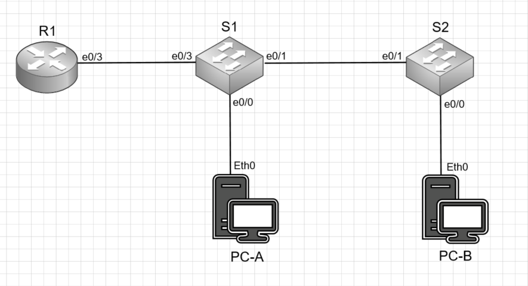

# Лабораторная работа №1 Router-on-a-Stick
#### Цель: 
Настройка DTP.Добавление сетей VLAN и назначение портов.
#### Описание:
В этой лабораторной работе необходимо настроить магистральные каналы между коммутаторами и маршрутизацию между подсетями с помощью "Роутера на палочке"

## Топология

Для выполнения лабораторной работы был собран стенд в соответствии со схемой:



## Таблица адресов

Данный стенд настроен в соответствии с таблицей адресов:

| Устройство      | Интерфейс          | IP адрес     | Маска подсети | Шлюз по умолчанию |
| --------------- | -------------------| -------------|---------------|-------------------|
| R1              | e0/3.3             | 192.168.3.1  | 255.255.255.0 | N/A               |
|                 | e0/3.4             | 192.168.4.1  | 255.255.255.0 | N/A               |
|                 | e0/3.8             | N/A          | N/A           | N/A               |
| S1              | VLAN 3             | 192.168.3.11 | 255.255.255.0 | 192.168.3.1       |
| S2              | VLAN 3             | 192.168.3.12 | 255.255.255.0 | 192.168.3.1       |
| PC-A            | NIC                | 192.168.3.3  | 255.255.255.0 | 192.168.3.1       |
| PC-B            | NIC                | 192.168.4.3  | 255.255.255.0 | 192.168.4.1       |


## Таблица VLAN

VLAN настроенные в лабораторной работе приведены в таблице:

| VLAN      | Имя        | Интерфейсы   |
| ----------|------------| -------------|
| 3         | Management | S1: VLAN 3   | 
|           |            | S2: VLAN 3   | 
|           |            | S1: e0/0     | 
| 4         | Operations | S2: e0/0     | 
| 7         | ParkingLot | S1: e0/2     | 
|           |            | S2: e0/2-3   | 
| 8         | Native     | N/A          | 

## Шаги

1) Создать сеть в соответствии с топологией и настройить основные параметры устройства
2) Создать VLAN в соответствии с таблицей и назначить их на порты коммутаторов
3) Настроить транковый интерфейс между коммутаторами и между коммутатором и маршрутизатором
4) Настроить маршрутизацию между VLAN на маршрутизаторе
5) Убедиться, что маршрутизация между VLAN работает

## Результаты шагов 1-4
 В качестве результатов шагов 1-4 ниже приведен вывод команды show running-config коммутаторов и маршрутизатора 

### Маршрутизатор R1:
```
Current configuration : 1304 bytes
!
version 15.4
service timestamps debug datetime msec
service timestamps log datetime msec
service password-encryption
!
hostname R1
!
boot-start-marker
boot-end-marker
!
!
enable password 7 13061E010803
!
no aaa new-model
clock timezone msk 3 0
mmi polling-interval 60
no mmi auto-configure
no mmi pvc
mmi snmp-timeout 180
!
no ip domain lookup
ip cef
no ipv6 cef
!
multilink bundle-name authenticated
!
redundancy
!
interface Ethernet0/0
 no ip address
 shutdown
!         
interface Ethernet0/1
 no ip address
 shutdown
!
interface Ethernet0/2
 no ip address
 shutdown
!
interface Ethernet0/3
 no ip address
!
interface Ethernet0/3.3
 description Management
 encapsulation dot1Q 3
 ip address 192.168.3.1 255.255.255.0
!
interface Ethernet0/3.4
 description Operations
 encapsulation dot1Q 4
 ip address 192.168.4.1 255.255.255.0
!
interface Ethernet0/3.8
 description Native
 encapsulation dot1Q 8
!
ip forward-protocol nd
!
no ip http server
no ip http secure-server
!
control-plane
!
banner motd ^CAnyone accessing the device that unauthorized access is prohibited^C
!
line con 0
 password 7 045802150C2E
 logging synchronous
 login
line aux 0
line vty 0 4
 password 7 070C285F4D06
 login
 transport input none
!
end
```

### Коммутатор S1:

```
Current configuration : 1472 bytes
!
! Last configuration change at 22:40:21 msk Mon Apr 4 2022
!
version 15.2
service timestamps debug datetime msec
service timestamps log datetime msec
service password-encryption
service compress-config
!
hostname S1
!
boot-start-marker
boot-end-marker
!
enable password 7 0822455D0A16
!
no aaa new-model
clock timezone msk 3 0
!
no ip domain-lookup
ip cef
no ipv6 cef
!
spanning-tree mode rapid-pvst
spanning-tree extend system-id
!
vlan internal allocation policy ascending
!
interface Ethernet0/0
 switchport access vlan 3
 switchport mode access
!
interface Ethernet0/1
 switchport trunk allowed vlan 3,4,8
 switchport trunk encapsulation dot1q
 switchport trunk native vlan 8
 switchport mode trunk
!
interface Ethernet0/2
 switchport access vlan 7
 switchport mode access
 shutdown
!
interface Ethernet0/3
 switchport trunk allowed vlan 3,4,8
 switchport trunk encapsulation dot1q
 switchport trunk native vlan 8
 switchport mode trunk
!
interface Vlan3
 ip address 192.168.3.11 255.255.255.0
!
interface Vlan4
 no ip address
!
interface Vlan8
 no ip address
!
ip default-gateway 192.168.3.1
ip forward-protocol nd
!
no ip http server
no ip http secure-server
!
control-plane
!
banner motd ^CAnyone accessing the device that unauthorized access is prohibited^C
!
line con 0
 password 7 070C285F4D06
 logging synchronous
 login
line aux 0
line vty 0
 password 7 045802150C2E
 login
line vty 1 4
 login
!
!
end
```

### Коммутатор S2:

```
! Last configuration change at 22:40:21 msk Mon Apr 4 2022
!
version 15.2
service timestamps debug datetime msec
service timestamps log datetime msec
service password-encryption
service compress-config
!
hostname S2
!
boot-start-marker
boot-end-marker
!
enable password 7 1511021F0725
!
no aaa new-model
clock timezone msk 3 0
!
no ip domain-lookup
ip cef
no ipv6 cef
!
spanning-tree mode rapid-pvst
spanning-tree extend system-id
!
vlan internal allocation policy ascending
!
interface Ethernet0/0
 switchport access vlan 4
 switchport mode access
!
interface Ethernet0/1
 switchport trunk allowed vlan 3,4,8
 switchport trunk encapsulation dot1q
 switchport trunk native vlan 8
 switchport mode trunk
!
interface Ethernet0/2
 switchport access vlan 7
 switchport mode access
 shutdown
!
interface Ethernet0/3
 switchport access vlan 7
 switchport mode access
 shutdown
!
interface Vlan3
 ip address 192.168.3.12 255.255.255.0
!
interface Vlan4
 no ip address
!
interface Vlan8
 no ip address
!
ip default-gateway 192.168.3.1
ip forward-protocol nd
!
no ip http server
no ip http secure-server
!         
control-plane
!
banner motd ^CAnyone accessing the DEVICE thet unauthorized access is PROHIBITED^C
!
line con 0
 password 7 14141B180F0B
 logging synchronous
 login
line aux 0
line vty 0
 password 7 02050D480809
 login
line vty 1 4
 login
!
end
```

## Результат шага 4
 В качестве результатов шагов 4 ниже приведен скриншоты пинга для:
 1) PC-A пингует шлюз по умолчанию
 2) PC-A пингует PC-B
 3) PC-A пингует S2


