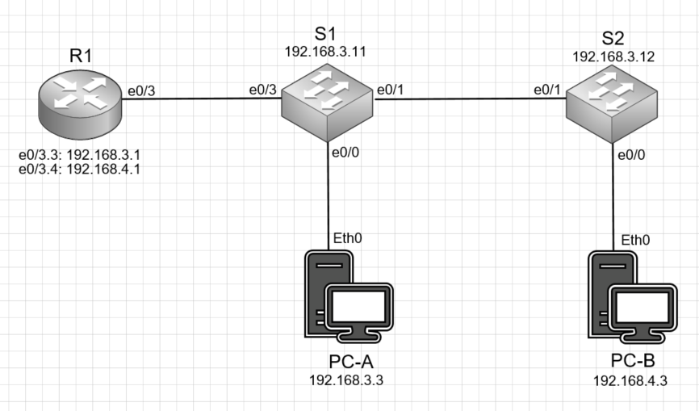

# Лабораторная работа №1 Router-on-a-Stick
#### Цель: 
Настройка DTP. Добавление сетей VLAN и назначение портов.
#### Описание:
В этой лабораторной работе необходимо настроить магистральные каналы между коммутаторами и маршрутизацию между подсетями с помощью "Роутера на палочке"

## Топология

Для выполнения лабораторной работы был собран стенд в соответствии со схемой:



## Таблица адресов

Данный стенд настроен в соответствии с таблицей адресов:

| Устройство      | Интерфейс          | IP адрес     | Маска подсети | Шлюз по умолчанию |
| --------------- | -------------------| -------------|---------------|-------------------|
| R1              | e0/3.3             | 192.168.3.1  | 255.255.255.0 | N/A               |
|                 | e0/3.4             | 192.168.4.1  | 255.255.255.0 | N/A               |
|                 | e0/3.8             | N/A          | N/A           | N/A               |
| S1              | VLAN 3             | 192.168.3.11 | 255.255.255.0 | 192.168.3.1       |
| S2              | VLAN 3             | 192.168.3.12 | 255.255.255.0 | 192.168.3.1       |
| PC-A            | NIC                | 192.168.3.3  | 255.255.255.0 | 192.168.3.1       |
| PC-B            | NIC                | 192.168.4.3  | 255.255.255.0 | 192.168.4.1       |


## Таблица VLAN

VLAN настроенные в лабораторной работе приведены в таблице:

| VLAN      | Имя        | Интерфейсы   |
| ----------|------------| -------------|
| 3         | Management | S1: VLAN 3   | 
|           |            | S2: VLAN 3   | 
|           |            | S1: e0/0     | 
| 4         | Operations | S2: e0/0     | 
| 7         | ParkingLot | S1: e0/2     | 
|           |            | S2: e0/2-3   | 
| 8         | Native     | N/A          | 

## Части

Лбораторная работа разбита на 6 частей:
1) Создать сеть в соответствии с топологией и настройить основные параметры устройства
2) Создать VLAN в соответствии с таблицей и назначить их на порты коммутаторов
3) Настроить транковый канал между коммутаторами и между коммутатором и маршрутизатором
4) Настроить маршрутизацию между VLAN на маршрутизаторе
5) Убедиться, что маршрутизация между VLAN работает

## Часть 1. Выполнение
В качестве 1 шага необходимо собрать присоединить устройства, как показано на схеме топологии. Как результат выполнения работы приведен скриншот лабораторной работы eve ng:


## Часть 2. Выполнение

### Базовая настройка маршрутизатора

В качестве базовой настройки маршрутизатора необходимо: настроить его имя, отключить DNS lookup, настроить пароль на вход в привелигерованный режим, настроить аутентификацию и пароль на вход через консоль, настроить аутентификацию и пароль при удаленном подключении, настроить хранение паролей в зашифрованном виде, создать баннер, установить время на маршрутизаторе и сохраненить действующую конфигурацию в стартовую.

После базовой настройки маршрутизатора в running-config маршрутизатора появятся настройки:
```
service password-encryption
!
hostname R1
!
!
enable password 7 13061E010803
!
clock timezone msk 3 0
!
no ip domain lookup
!
banner motd ^CAnyone accessing the device that unauthorized access is prohibited^C
!
line con 0
 password 7 045802150C2E
 logging synchronous
 login
line vty 0 4
 password 7 070C285F4D06
 login
 transport input none
```

### Базовая настройка коммутаторов

В качестве базовой настройки коммутаторов необходимо произвести аналогичные настройки как при базовой настройке маршрутизатора
После базовой настройки коммутато в конфигурации маршрутизатора появятся настройки:

#### Коммутатор S1:

```
service password-encryption
!
hostname S1
!
enable password 7 0822455D0A16
!
clock timezone msk 3 0
!
no ip domain-lookup
!
banner motd ^CAnyone accessing the device that unauthorized access is prohibited^C
!
line con 0
 password 7 070C285F4D06
 logging synchronous
 login
line vty 0
 password 7 045802150C2E
 login
```

#### Коммутатор S2:

```
service password-encryption
!
hostname S2
!
enable password 7 1511021F0725
!
clock timezone msk 3 0
!
no ip domain-lookup
!
banner motd ^CAnyone accessing the DEVICE thet unauthorized access is PROHIBITED^C
!
line con 0
 password 7 14141B180F0B
 logging synchronous
 login
line vty 0
 password 7 02050D480809
 login
```

### Базовая настройка PC

При базовой настройке АРМ необходимо задать ip адрес и шлюз по умолчанию для АРМ в соответствии с таблицей адресов. 

## Часть 2. Выполнение

### Создать VLAN на коммутаторах

Необходимо создать и задать имя VLAN в соответствии с таблицей VLAN, настроить интерфейс управления, назначить шлюз по умолчанию, все неиспользуемые порты перевести в ражим access, назначить в парковочный VLAN и отключить.

После настройки VLAN коммутаторов в running-config коммутаторов появятся настройки VLAN:

#### Коммутатор S1:
```
interface Ethernet0/2
 switchport access vlan 7
 switchport mode access
 shutdown
!
interface Vlan3
 description Management
 ip address 192.168.3.11 255.255.255.0
!
interface Vlan4
 description Operations
 no ip address
!
interface Vlan7
 description ParkingLot
 no ip address
 shutdown
!
interface Vlan8
 description Native
 no ip address
!
ip default-gateway 192.168.3.1
```

#### Коммутатор S2:
```
interface Ethernet0/2
 switchport access vlan 7
 switchport mode access
 shutdown
!
interface Ethernet0/3
 switchport access vlan 7
 switchport mode access
 shutdown
!
interface Vlan3
 description Management
 ip address 192.168.3.12 255.255.255.0
!
interface Vlan4
 description Operations
 no ip address
!
interface Vlan7
 description ParkingLot
 no ip address
 shutdown
!
interface Vlan8
 description Native
 no ip address
!
ip default-gateway 192.168.3.1
```

### Назначить VLAN на порты коммутаторов

Необходимо назначить VLAN на интерфейсы коммутаторов в соответствии с таблицей VLAN.

После настройки VLAN коммутаторов в running-config коммутаторов появятся настройки VLAN:

#### Коммутатор S1:

```
interface Ethernet0/0
 switchport access vlan 3
 switchport mode access
```

#### Коммутатор S2:

```
interface Ethernet0/0
 switchport access vlan 4
 switchport mode access
```

### Настроить транк интерфейс на коммутаторах

Необходимо настроить транковый режим портов на коммутаторах в сторону друг друга и в сторону маршрутизатора, настроить 8 VLAN как native vlan, назначить в качестве разкрешенных к передаче vlan 3, 4 и 8.   
В выводе команды show interfaces trunk коммутаторов появится:

#### Коммутатор S1:

```
S1#show interfaces trunk

Port        Mode             Encapsulation  Status        Native vlan
Et0/1       on               802.1q         trunking      8
Et0/3       on               802.1q         trunking      8

Port        Vlans allowed on trunk
Et0/1       3-4,8
Et0/3       3-4,8

Port        Vlans allowed and active in management domain
Et0/1       3-4,8
Et0/3       3-4,8

Port        Vlans in spanning tree forwarding state and not pruned
Et0/1       3-4,8
Et0/3       3-4,8
```

#### Коммутатор S2:

```
S2#show interfaces trunk

Port        Mode             Encapsulation  Status        Native vlan
Et0/1       on               802.1q         trunking      8

Port        Vlans allowed on trunk
Et0/1       3-4,8

Port        Vlans allowed and active in management domain
Et0/1       3-4,8

Port        Vlans in spanning tree forwarding state and not pruned
Et0/1       3-4,8
```

### Настроить vlan маршрутизацию на маршрутизаторе  

Включить интерфейс e0/3, создать подинтерфейсы, назначить на них ip адреса, описание и vlan по умолчанию в соответствии с таблицей адресов.   
В выводе команды show ip interface brief маршрутизатора появится:


#### Маршрутизатор R1:
```
R1#show ip interface brief 
Interface                  IP-Address      OK? Method Status                Protocol
Ethernet0/0                unassigned      YES NVRAM  administratively down down    
Ethernet0/1                unassigned      YES NVRAM  administratively down down    
Ethernet0/2                unassigned      YES NVRAM  administratively down down    
Ethernet0/3                unassigned      YES NVRAM  up                    up      
Ethernet0/3.3              192.168.3.1     YES NVRAM  up                    up      
Ethernet0/3.4              192.168.4.1     YES NVRAM  up                    up      
Ethernet0/3.8              unassigned      YES unset  up                    up   
```

## Результаты работы в частях 1-4
 В качестве результатов работы в частях 1-4 ниже приведен вывод команды show running-config коммутаторов и маршрутизатора, вывод команды show ip АРМов PC-A и PC-B 

### Маршрутизатор R1:
```
Current configuration : 1304 bytes
!
version 15.4
service timestamps debug datetime msec
service timestamps log datetime msec
service password-encryption
!
hostname R1
!
boot-start-marker
boot-end-marker
!
!
enable password 7 13061E010803
!
no aaa new-model
clock timezone msk 3 0
mmi polling-interval 60
no mmi auto-configure
no mmi pvc
mmi snmp-timeout 180
!
no ip domain lookup
ip cef
no ipv6 cef
!
multilink bundle-name authenticated
!
redundancy
!
interface Ethernet0/0
 no ip address
 shutdown
!         
interface Ethernet0/1
 no ip address
 shutdown
!
interface Ethernet0/2
 no ip address
 shutdown
!
interface Ethernet0/3
 no ip address
!
interface Ethernet0/3.3
 description Management
 encapsulation dot1Q 3
 ip address 192.168.3.1 255.255.255.0
!
interface Ethernet0/3.4
 description Operations
 encapsulation dot1Q 4
 ip address 192.168.4.1 255.255.255.0
!
interface Ethernet0/3.8
 description Native
 encapsulation dot1Q 8
!
ip forward-protocol nd
!
no ip http server
no ip http secure-server
!
control-plane
!
banner motd ^CAnyone accessing the device that unauthorized access is prohibited^C
!
line con 0
 password 7 045802150C2E
 logging synchronous
 login
line aux 0
line vty 0 4
 password 7 070C285F4D06
 login
 transport input none
!
end
```

### Коммутатор S1:

```
Current configuration : 1472 bytes
!
! Last configuration change at 22:40:21 msk Mon Apr 4 2022
!
version 15.2
service timestamps debug datetime msec
service timestamps log datetime msec
service password-encryption
service compress-config
!
hostname S1
!
boot-start-marker
boot-end-marker
!
enable password 7 0822455D0A16
!
no aaa new-model
clock timezone msk 3 0
!
no ip domain-lookup
ip cef
no ipv6 cef
!
spanning-tree mode rapid-pvst
spanning-tree extend system-id
!
vlan internal allocation policy ascending
!
interface Ethernet0/0
 switchport access vlan 3
 switchport mode access
!
interface Ethernet0/1
 switchport trunk allowed vlan 3,4,8
 switchport trunk encapsulation dot1q
 switchport trunk native vlan 8
 switchport mode trunk
!
interface Ethernet0/2
 switchport access vlan 7
 switchport mode access
 shutdown
!
interface Ethernet0/3
 switchport trunk allowed vlan 3,4,8
 switchport trunk encapsulation dot1q
 switchport trunk native vlan 8
 switchport mode trunk
!
interface Vlan3
 description Management
 ip address 192.168.3.11 255.255.255.0
!
interface Vlan4
 description Operations
 no ip address
!
interface Vlan7
 description ParkingLot
 no ip address
 shutdown
!
interface Vlan8
 description Native
 no ip address
!
ip default-gateway 192.168.3.1
ip forward-protocol nd
!
no ip http server
no ip http secure-server
!
control-plane
!
banner motd ^CAnyone accessing the device that unauthorized access is prohibited^C
!
line con 0
 password 7 070C285F4D06
 logging synchronous
 login
line aux 0
line vty 0
 password 7 045802150C2E
 login
line vty 1 4
 login
!
!
end
```

### Коммутатор S2:

```
! Last configuration change at 22:40:21 msk Mon Apr 4 2022
!
version 15.2
service timestamps debug datetime msec
service timestamps log datetime msec
service password-encryption
service compress-config
!
hostname S2
!
boot-start-marker
boot-end-marker
!
enable password 7 1511021F0725
!
no aaa new-model
clock timezone msk 3 0
!
no ip domain-lookup
ip cef
no ipv6 cef
!
spanning-tree mode rapid-pvst
spanning-tree extend system-id
!
vlan internal allocation policy ascending
!
interface Ethernet0/0
 switchport access vlan 4
 switchport mode access
!
interface Ethernet0/1
 switchport trunk allowed vlan 3,4,8
 switchport trunk encapsulation dot1q
 switchport trunk native vlan 8
 switchport mode trunk
!
interface Ethernet0/2
 switchport access vlan 7
 switchport mode access
 shutdown
!
interface Ethernet0/3
 switchport access vlan 7
 switchport mode access
 shutdown
!
interface Vlan3
 description Management
 ip address 192.168.3.12 255.255.255.0
!
interface Vlan4
 description Operations
 no ip address
!
interface Vlan7
 description ParkingLot
 no ip address
 shutdown
!
interface Vlan8
 description Native
 no ip address
!
ip default-gateway 192.168.3.1
ip forward-protocol nd
!
no ip http server
no ip http secure-server
!         
control-plane
!
banner motd ^CAnyone accessing the DEVICE thet unauthorized access is PROHIBITED^C
!
line con 0
 password 7 14141B180F0B
 logging synchronous
 login
line aux 0
line vty 0
 password 7 02050D480809
 login
line vty 1 4
 login
!
end
```

### АРМ PC-A:
```
NAME        : VPCS[1]
IP/MASK     : 192.168.3.3/24
GATEWAY     : 192.168.3.1
DNS         : 
MAC         : 00:50:79:66:68:04
LPORT       : 20000
RHOST:PORT  : 127.0.0.1:30000
MTU         : 1500
```

### АРМ PC-B:
```
NAME        : VPCS[1]
IP/MASK     : 192.168.4.3/24
GATEWAY     : 192.168.4.1
DNS         : 
MAC         : 00:50:79:66:68:05
LPORT       : 20000
RHOST:PORT  : 127.0.0.1:30000
MTU         : 1500
```

## Результаты части 5
 В качестве результатов части 5 приведены выводы команды ping для:
 1) PC-A - шлюз по умолчанию
 2) PC-A - PC-B
 3) PC-A - S2

### PC-A - шлюз по умолчанию:
```
84 bytes from 192.168.3.1 icmp_seq=1 ttl=255 time=0.389 ms
84 bytes from 192.168.3.1 icmp_seq=2 ttl=255 time=0.582 ms
84 bytes from 192.168.3.1 icmp_seq=3 ttl=255 time=0.599 ms
84 bytes from 192.168.3.1 icmp_seq=4 ttl=255 time=0.590 ms
84 bytes from 192.168.3.1 icmp_seq=5 ttl=255 time=0.587 ms
```

### PC-A - PC-B:
```
84 bytes from 192.168.4.3 icmp_seq=1 ttl=63 time=1.639 ms
84 bytes from 192.168.4.3 icmp_seq=2 ttl=63 time=0.852 ms
84 bytes from 192.168.4.3 icmp_seq=3 ttl=63 time=0.933 ms
84 bytes from 192.168.4.3 icmp_seq=4 ttl=63 time=0.978 ms
84 bytes from 192.168.4.3 icmp_seq=5 ttl=63 time=0.882 ms
```

### PC-A - S2:
```
84 bytes from 192.168.3.12 icmp_seq=1 ttl=255 time=0.351 ms
84 bytes from 192.168.3.12 icmp_seq=2 ttl=255 time=0.555 ms
84 bytes from 192.168.3.12 icmp_seq=3 ttl=255 time=0.507 ms
84 bytes from 192.168.3.12 icmp_seq=4 ttl=255 time=0.573 ms
84 bytes from 192.168.3.12 icmp_seq=5 ttl=255 time=0.533 ms
```

