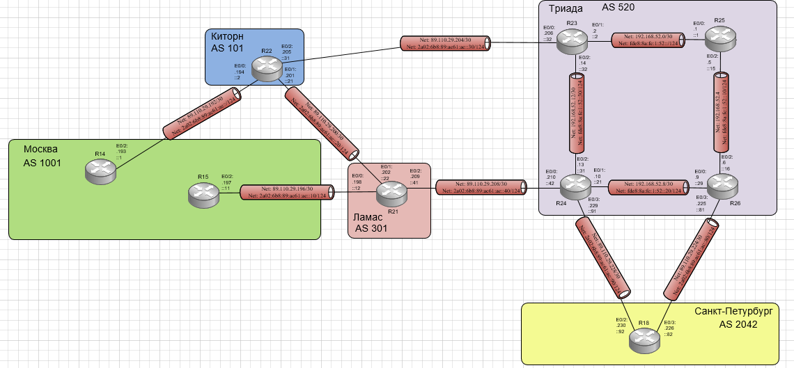

# Лабораторная работа №10 iBGP

#### Цель: 

Настроить iBGP в офисе Москва. Настроить iBGP в сети провайдера Триада

## Топология

Выполнение лабораторной работы будет происходить на созданном при выполнении лабораторной работы №4 стенде:



## Ход работы

Лабораторная работа разбита на 5 частей:
1) Настроить iBGP в офисе Москва между маршрутизаторами R14 и R15
2) Настроить iBGP в провайдере Триада
3) Настройть офис Москва так, чтобы приоритетным провайдером стал Ламас
4) Настройть офис С.-Петербург так, чтобы трафик до любого офиса распределялся по двум линкам одновременно

## Часть 1. Настроить iBGP в офисе Москва между маршрутизаторами R14 и R15

Необходимо включить на маршрутизаторах R14, R22, R15, R21 eBGP, назначить им router-id и настроить между R14 и R22, R15 и R21 соседство для ipv4 и ipv6.

В выводе running-config маршрутизаторов появятся настройки:

#### Маршрутизатор R14:

```

```

## Часть 2. Настроить iBGP в провайдере Триада

Необходимо включить на маршрутизаторе R25 iBGP. На маршрутизаторах R23, R24, R25, R26 добавить loopback интерфейс, добавить в качестве iBGP соседней все маршрутизаторы Триада, включить isis на loopback интерфейсе, настроить update-source для всех соседей на Loopback интерфейс.

В выводе running-config маршрутизаторов появятся настройки:

#### Маршрутизатор R23:

```
!
interface Loopback0
 ip address 23.23.23.23 255.255.255.255
 ip router isis 
!
router bgp 520
 bgp router-id 23.23.23.23
 bgp log-neighbor-changes
 neighbor 24.24.24.24 remote-as 520
 neighbor 24.24.24.24 update-source Loopback0
 neighbor 25.25.25.25 remote-as 520
 neighbor 25.25.25.25 update-source Loopback0
 neighbor 26.26.26.26 remote-as 520
 neighbor 26.26.26.26 update-source Loopback0
 neighbor 2A02:6B8:89:AC61:AC::31 remote-as 101
 neighbor 89.110.29.205 remote-as 101
 !
```

#### Маршрутизатор R24:

```
!
interface Loopback0
 ip address 24.24.24.24 255.255.255.255
 ip router isis 
!
router bgp 520
 bgp router-id 24.24.24.24
 bgp log-neighbor-changes
 neighbor 23.23.23.23 remote-as 520
 neighbor 23.23.23.23 update-source Loopback0
 neighbor 25.25.25.25 remote-as 520
 neighbor 25.25.25.25 update-source Loopback0
 neighbor 26.26.26.26 remote-as 520
 neighbor 26.26.26.26 update-source Loopback0
 neighbor 2A02:6B8:89:AC61:AC::41 remote-as 301
 neighbor 2A02:6B8:89:AC61:AC::92 remote-as 2042
 neighbor 89.110.29.209 remote-as 301
 neighbor 89.110.29.230 remote-as 2042
 !
```

#### Маршрутизатор R25:

```
!
interface Loopback0
 ip address 25.25.25.25 255.255.255.255
 ip router isis 
!
router bgp 520
 bgp router-id 25.25.25.25
 bgp log-neighbor-changes
 neighbor 23.23.23.23 remote-as 520
 neighbor 23.23.23.23 update-source Loopback0
 neighbor 24.24.24.24 remote-as 520
 neighbor 24.24.24.24 update-source Loopback0
 neighbor 26.26.26.26 remote-as 520
 neighbor 26.26.26.26 update-source Loopback0
!
```

#### Маршрутизатор R26:

```
!
interface Loopback0
 ip address 26.26.26.26 255.255.255.255
 ip router isis 
!
router bgp 520
 bgp router-id 26.26.26.26
 bgp log-neighbor-changes
 neighbor 23.23.23.23 remote-as 520
 neighbor 23.23.23.23 update-source Loopback0
 neighbor 24.24.24.24 remote-as 520
 neighbor 24.24.24.24 update-source Loopback0
 neighbor 25.25.25.25 remote-as 520
 neighbor 25.25.25.25 update-source Loopback0
 neighbor 2A02:6B8:89:AC61:AC::82 remote-as 2042
 neighbor 89.110.29.226 remote-as 2042
 !
```

Проверим корректность настройки командой show ip bgp summary:

#### Маршрутизатор R23:

```
R23#show ip bgp summary 
BGP router identifier 23.23.23.23, local AS number 520
BGP table version is 6, main routing table version 6
5 network entries using 700 bytes of memory
11 path entries using 880 bytes of memory
5/3 BGP path/bestpath attribute entries using 720 bytes of memory
4 BGP AS-PATH entries using 96 bytes of memory
0 BGP route-map cache entries using 0 bytes of memory
0 BGP filter-list cache entries using 0 bytes of memory
BGP using 2396 total bytes of memory
BGP activity 8/0 prefixes, 14/0 paths, scan interval 60 secs

Neighbor        V           AS MsgRcvd MsgSent   TblVer  InQ OutQ Up/Down  State/PfxRcd
24.24.24.24     4          520      27      27        6    0    0 00:17:54        4
25.25.25.25     4          520      24      25        6    0    0 00:18:21        0
26.26.26.26     4          520      24      27        6    0    0 00:17:37        1
2A02:6B8:89:AC61:AC::31
                4          101      86      83        6    0    0 01:09:47        3
89.110.29.205   4          101      84      82        6    0    0 01:09:44        3
```

#### Маршрутизатор R24:

```
R24#show ip bgp summary
BGP router identifier 24.24.24.24, local AS number 520
BGP table version is 6, main routing table version 6
5 network entries using 700 bytes of memory
11 path entries using 880 bytes of memory
6/4 BGP path/bestpath attribute entries using 864 bytes of memory
4 BGP AS-PATH entries using 96 bytes of memory
0 BGP route-map cache entries using 0 bytes of memory
0 BGP filter-list cache entries using 0 bytes of memory
BGP using 2540 total bytes of memory
BGP activity 9/0 prefixes, 15/0 paths, scan interval 60 secs

Neighbor        V           AS MsgRcvd MsgSent   TblVer  InQ OutQ Up/Down  State/PfxRcd
23.23.23.23     4          520      27      27        6    0    0 00:18:13        3
25.25.25.25     4          520      23      26        6    0    0 00:17:08        0
26.26.26.26     4          520      24      26        6    0    0 00:15:55        1
2A02:6B8:89:AC61:AC::41
                4          301      88      85        6    0    0 01:10:04        3
2A02:6B8:89:AC61:AC::92
Neighbor        V           AS MsgRcvd MsgSent   TblVer  InQ OutQ Up/Down  State/PfxRcd
                4         2042      66      68        6    0    0 00:49:17        0
89.110.29.209   4          301      82      82        6    0    0 01:10:03        3
89.110.29.230   4         2042      60      63        6    0    0 00:49:25        0
```

#### Маршрутизатор R25:

```
R25#show ip bgp summary 
BGP router identifier 25.25.25.25, local AS number 520
BGP table version is 3, main routing table version 3
5 network entries using 700 bytes of memory
8 path entries using 640 bytes of memory
5/1 BGP path/bestpath attribute entries using 720 bytes of memory
4 BGP AS-PATH entries using 96 bytes of memory
0 BGP route-map cache entries using 0 bytes of memory
0 BGP filter-list cache entries using 0 bytes of memory
BGP using 2156 total bytes of memory
BGP activity 5/0 prefixes, 8/0 paths, scan interval 60 secs

Neighbor        V           AS MsgRcvd MsgSent   TblVer  InQ OutQ Up/Down  State/PfxRcd
23.23.23.23     4          520      26      25        3    0    0 00:19:06        3
24.24.24.24     4          520      26      23        3    0    0 00:17:33        4
26.26.26.26     4          520      25      24        3    0    0 00:17:10        1
```

#### Маршрутизатор R26:

```
R26#show ip bgp summary 
BGP router identifier 26.26.26.26, local AS number 520
BGP table version is 3, main routing table version 3
5 network entries using 700 bytes of memory
8 path entries using 640 bytes of memory
6/2 BGP path/bestpath attribute entries using 864 bytes of memory
4 BGP AS-PATH entries using 96 bytes of memory
0 BGP route-map cache entries using 0 bytes of memory
0 BGP filter-list cache entries using 0 bytes of memory
BGP using 2300 total bytes of memory
BGP activity 6/0 prefixes, 9/0 paths, scan interval 60 secs

Neighbor        V           AS MsgRcvd MsgSent   TblVer  InQ OutQ Up/Down  State/PfxRcd
23.23.23.23     4          520      28      25        3    0    0 00:18:39        3
24.24.24.24     4          520      27      25        3    0    0 00:16:38        4
25.25.25.25     4          520      24      25        3    0    0 00:17:27        0
2A02:6B8:89:AC61:AC::82
                4         2042      65      64        3    0    0 00:49:59        0
89.110.29.226   4         2042      60      61        3    0    0 00:50:00        0
```


## Часть 3. Настройть офис Москва так, чтобы приоритетным провайдером стал Ламас

Необходимо включить на маршрутизаторах R14, R22, R15, R21 eBGP, назначить им router-id и настроить между R14 и R22, R15 и R21 соседство для ipv4 и ipv6.

В выводе running-config маршрутизаторов появятся настройки:

#### Маршрутизатор R14:

```

```

## Часть 4. Настройть офис С.-Петербург так, чтобы трафик до любого офиса распределялся по двум линкам одновременно

Необходимо настроить балансировку трафика на маршрутизаторе R18 между R24 И R26.

В выводе running-config маршрутизаторов появятся настройки:

#### Маршрутизатор R14:

```

```

```

```


