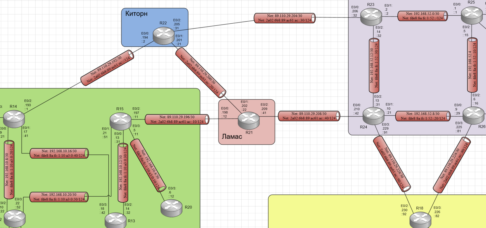

# Лабораторная работа №11 BGP. Фильтрация

#### Цель: 

Настроить фильтрацию для офиса Москва.
Настроить фильтрацию для офиса С.-Петербург.

## Топология

Выполнение лабораторной работы будет происходить на созданном при выполнении лабораторной работы №4 стенде:



## Ход работы

Лабораторная работа разбита на 4 части:
1) Настройка фильтрации в офисе Москва так, чтобы не появилось транзитного трафика(As-path)
2) Настройка фильтрации в офисе С.-Петербург так, чтобы не появилось транзитного трафика(Prefix-list)
3) Настройка провайдера Киторн так, чтобы в офис Москва отдавался только маршрут по умолчанию
4) Настройка провайдера Ламас так, чтобы в офис Москва отдавался только маршрут по умолчанию и префикс офиса С.-Петербург

При этом все внешние сети в лабораторной работе должны иметь IP связность.

## Часть 1. Настройка фильтрации в офисе Москва так, чтобы не появилось транзитного трафика(As-path)

На маршрутизаторах R14 и R15 необходимо создать и назначить на интерфейс в сторону провайдера as-path фильтр разрешающий анонсировать update только о своих внутренних подсетях. 

С помощью команды show ip  bgp neighbors A.B.C.D advertised-routes проверим какие маршруты в сторону провайдеров анонсируют R14 и R15:

#### Маршрутизатор R14:

```
R14#sh ip bgp neighbors 89.110.29.194 advertised-routes 
BGP table version is 16, local router ID is 14.14.14.14
Status codes: s suppressed, d damped, h history, * valid, > best, i - internal, 
              r RIB-failure, S Stale, m multipath, b backup-path, f RT-Filter, 
              x best-external, a additional-path, c RIB-compressed, 
Origin codes: i - IGP, e - EGP, ? - incomplete
RPKI validation codes: V valid, I invalid, N Not found

     Network          Next Hop            Metric LocPrf Weight Path
 *>i 80.80.1.128/26   15.15.15.15              0    250      0 301 520 ?
 r>i 89.110.29.192/30 15.15.15.15              0    250      0 301 101 i
 *>i 89.110.29.196/30 15.15.15.15              0    250      0 301 i
 *>i 89.110.29.200/30 15.15.15.15              0    250      0 301 101 i
 *>i 89.110.29.204/30 15.15.15.15              0    250      0 301 101 i
 *>i 89.110.29.208/30 15.15.15.15              0    250      0 301 i
 *>i 89.110.29.224/30 15.15.15.15              0    250      0 301 520 i
 *>i 89.110.29.228/30 15.15.15.15              0    250      0 301 520 i
 *>i 192.168.28.0     15.15.15.15              0    250      0 301 520 ?

Total number of prefixes 9 
```

#### Маршрутизатор R15:

```
R15#sh ip bgp neighbors 2a02:6b8:89:ac61:ac::12 advertised-routes   
BGP table version is 16, local router ID is 15.15.15.15
Status codes: s suppressed, d damped, h history, * valid, > best, i - internal, 
              r RIB-failure, S Stale, m multipath, b backup-path, f RT-Filter, 
              x best-external, a additional-path, c RIB-compressed, 
Origin codes: i - IGP, e - EGP, ? - incomplete
RPKI validation codes: V valid, I invalid, N Not found

     Network          Next Hop            Metric LocPrf Weight Path
 *>  80.80.1.128/26   89.110.29.198                 250      0 301 520 ?
 *>  89.110.29.192/30 89.110.29.198                 250      0 301 101 i
 r>  89.110.29.196/30 89.110.29.198            0    250      0 301 i
 *>  89.110.29.200/30 89.110.29.198                 250      0 301 101 i
 *>  89.110.29.204/30 89.110.29.198                 250      0 301 101 i
 *>  89.110.29.208/30 89.110.29.198            0    250      0 301 i
 *>  89.110.29.224/30 89.110.29.198                 250      0 301 520 i
 *>  89.110.29.228/30 89.110.29.198                 250      0 301 520 i
 *>  192.168.28.0     89.110.29.198                 250      0 301 520 ?

Total number of prefixes 9 
```

Настроим as-filter. В выводе running-config маршрутизаторов появятся настройки:

#### Маршрутизатор R14:

```
!
router bgp 1001
 bgp router-id 14.14.14.14
 bgp log-neighbor-changes
 neighbor 15.15.15.15 remote-as 1001
 neighbor 15.15.15.15 update-source Loopback0
 neighbor 2A02:6B8:89:AC61:AC::2 remote-as 101
 neighbor 89.110.29.194 remote-as 101
 !
 address-family ipv4
  neighbor 15.15.15.15 activate
  neighbor 15.15.15.15 next-hop-self
  neighbor 2A02:6B8:89:AC61:AC::2 activate
  neighbor 2A02:6B8:89:AC61:AC::2 filter-list 1 out
  neighbor 89.110.29.194 activate
  neighbor 89.110.29.194 filter-list 1 out
 exit-address-family
 !
 address-family ipv6
  neighbor 15.15.15.15 activate
  neighbor 2A02:6B8:89:AC61:AC::2 activate
 exit-address-family
!
ip as-path access-list 1 permit ^$
ip as-path access-list 1 deny .*
!
```

#### Маршрутизатор R15:

```
!
router bgp 1001
 bgp router-id 15.15.15.15
 bgp log-neighbor-changes
 neighbor 14.14.14.14 remote-as 1001
 neighbor 14.14.14.14 update-source Loopback0
 neighbor 2A02:6B8:89:AC61:AC::12 remote-as 301
 neighbor 89.110.29.198 remote-as 301
 !
 address-family ipv4
  neighbor 14.14.14.14 activate
  neighbor 14.14.14.14 next-hop-self
  neighbor 2A02:6B8:89:AC61:AC::12 activate
  neighbor 2A02:6B8:89:AC61:AC::12 filter-list 1 out
  neighbor 89.110.29.198 activate
  neighbor 89.110.29.198 route-map as301-in in
  neighbor 89.110.29.198 filter-list 1 out
 exit-address-family
 !
 address-family ipv6
  neighbor 14.14.14.14 activate
  neighbor 2A02:6B8:89:AC61:AC::12 activate
  neighbor 2A02:6B8:89:AC61:AC::12 route-map as301-in in
  neighbor 2A02:6B8:89:AC61:AC::12 filter-list 1 out
 exit-address-family
!
ip as-path access-list 1 permit ^$
ip as-path access-list 1 permit .*
!
```

С помощью команды show ip  bgp neighbors A.B.C.D advertised-routes снова проверим какие маршруты в сторону провайдеров анонсируют R14 и R15:

#### Маршрутизатор R14:

```
R14#sh ip bgp neighbors 89.110.29.194 advertised-routes 

Total number of prefixes 0  
```

#### Маршрутизатор R15:

```
R15#sh ip bgp neighbors 89.110.29.198 advertised-routes 

Total number of prefixes 0
```

## Часть 2. Настройка фильтрации в офисе С.-Петербург так, чтобы не появилось транзитного трафика(Prefix-list)

Необходимо настроить на маршрутизаторе R18 Prefix-list разрешающий анонсировать update только о своих внутренних подсетях.

С помощью команды show ip  bgp neighbors A.B.C.D advertised-routes проверим какие маршруты в сторону провайдеров анонсирует R18:

#### Маршрутизатор R18:

```
R18#sh ip bgp neighbors 89.110.29.229 advertised-routes 
BGP table version is 16, local router ID is 18.18.18.18
Status codes: s suppressed, d damped, h history, * valid, > best, i - internal, 
              r RIB-failure, S Stale, m multipath, b backup-path, f RT-Filter, 
              x best-external, a additional-path, c RIB-compressed, 
Origin codes: i - IGP, e - EGP, ? - incomplete
RPKI validation codes: V valid, I invalid, N Not found

     Network          Next Hop            Metric LocPrf Weight Path
 *>  80.80.1.128/26   89.110.29.229                          0 520 ?
 *>  89.110.29.192/30 89.110.29.225                          0 520 101 i
 *>  89.110.29.196/30 89.110.29.229                          0 520 301 i
 *>  89.110.29.200/30 89.110.29.225                          0 520 101 i
 *>  89.110.29.204/30 89.110.29.225                          0 520 101 i
 *>  89.110.29.208/30 89.110.29.229                          0 520 301 i
 r>  89.110.29.224/30 89.110.29.229                          0 520 i
 r>  89.110.29.228/30 89.110.29.229            0             0 520 i
 *>  192.168.28.0     89.110.29.229                          0 520 ?

Total number of prefixes 9 
R18#sh ip bgp neighbors 89.110.29.225 advertised-routes 
BGP table version is 16, local router ID is 18.18.18.18
Status codes: s suppressed, d damped, h history, * valid, > best, i - internal, 
              r RIB-failure, S Stale, m multipath, b backup-path, f RT-Filter, 
              x best-external, a additional-path, c RIB-compressed, 
Origin codes: i - IGP, e - EGP, ? - incomplete
RPKI validation codes: V valid, I invalid, N Not found

     Network          Next Hop            Metric LocPrf Weight Path
 *>  80.80.1.128/26   89.110.29.229                          0 520 ?
 *>  89.110.29.192/30 89.110.29.225                          0 520 101 i
 *>  89.110.29.196/30 89.110.29.229                          0 520 301 i
 *>  89.110.29.200/30 89.110.29.225                          0 520 101 i
 *>  89.110.29.204/30 89.110.29.225                          0 520 101 i
 *>  89.110.29.208/30 89.110.29.229                          0 520 301 i
 r>  89.110.29.224/30 89.110.29.229                          0 520 i
 r>  89.110.29.228/30 89.110.29.229            0             0 520 i
 *>  192.168.28.0     89.110.29.229                          0 520 ?

Total number of prefixes 9 
```

Настроим Prefix-list. В выводе running-config маршрутизаторов появятся настройки:

#### Маршрутизатор R18:

```
!
router bgp 2042
 bgp router-id 18.18.18.18
 bgp log-neighbor-changes
 neighbor 2A02:6B8:89:AC61:AC::81 remote-as 520
 neighbor 2A02:6B8:89:AC61:AC::91 remote-as 520
 neighbor 89.110.29.225 remote-as 520
 neighbor 89.110.29.229 remote-as 520
 !
 address-family ipv4
  neighbor 2A02:6B8:89:AC61:AC::81 activate
  neighbor 2A02:6B8:89:AC61:AC::91 activate
  neighbor 89.110.29.225 activate
  neighbor 89.110.29.225 prefix-list lab_out out
  neighbor 89.110.29.229 activate
  neighbor 89.110.29.229 prefix-list lab_out out
  maximum-paths 2
 exit-address-family
 !
 address-family ipv6
  maximum-paths 2
  neighbor 2A02:6B8:89:AC61:AC::81 activate
  neighbor 2A02:6B8:89:AC61:AC::91 activate
 exit-address-family
!
ip prefix-list lab_out seq 5 permit 192.168.18.128/30
ip prefix-list lab_out seq 10 permit 192.168.18.132/30
ip prefix-list lab_out seq 15 permit 192.168.18.136/30
ip prefix-list lab_out seq 20 permit 192.168.18.152/30
ip prefix-list lab_out seq 25 permit 192.168.18.144/30
ip prefix-list lab_out seq 30 permit 192.168.18.140/30
ip prefix-list lab_out seq 35 permit 192.168.18.148/30
ip prefix-list lab_out seq 40 permit 192.168.18.156/30
ip prefix-list lab_out seq 45 permit 192.168.18.0/25
ip prefix-list lab_out seq 50 permit 80.80.1.0/25
```

С помощью команды show ip  bgp neighbors A.B.C.D advertised-routes проверим какие маршруты в сторону провайдеров анонсирует R18:

#### Маршрутизатор R18:

```
R18#sh ip bgp neighbors 89.110.29.225 advertised-routes 

Total number of prefixes 0 
R18#sh ip bgp neighbors 89.110.29.229 advertised-routes 

Total number of prefixes 0 
```

## Часть 3. Настройка провайдера Киторн так, чтобы в офис Москва отдавался только маршрут по умолчанию

На маршрутизаторе R22 необходимо создать prefix-list куда попадает маршрут по умолчанию, создать route-map по этому prefix-list, назначить route-map и настроить default-originate на соседа R14.

С помощью команды show ip  bgp neighbors A.B.C.D advertised-routes проверим какие маршруты в сторону R14 анонсирует R22:

#### Маршрутизатор R22:

```
R22#sh ip bgp neighbors 89.110.29.193 advertised-routes 
BGP table version is 11, local router ID is 22.22.22.22
Status codes: s suppressed, d damped, h history, * valid, > best, i - internal, 
              r RIB-failure, S Stale, m multipath, b backup-path, f RT-Filter, 
              x best-external, a additional-path, c RIB-compressed, 
Origin codes: i - IGP, e - EGP, ? - incomplete
RPKI validation codes: V valid, I invalid, N Not found

     Network          Next Hop            Metric LocPrf Weight Path
 *>  80.80.1.128/26   89.110.29.206                          0 520 ?
 *>  89.110.29.192/30 0.0.0.0                  0         32768 i
 *>  89.110.29.196/30 89.110.29.202            0             0 301 i
 *>  89.110.29.200/30 0.0.0.0                  0         32768 i
 *>  89.110.29.204/30 0.0.0.0                  0         32768 i
 *>  89.110.29.208/30 89.110.29.202            0             0 301 i
 *>  89.110.29.224/30 89.110.29.206                          0 520 i
 *>  89.110.29.228/30 89.110.29.206                          0 520 i
 *>  192.168.28.0     89.110.29.206                          0 520 ?

Total number of prefixes 9 
```

Настроим route-map. В выводе running-config маршрутизаторов появятся настройки:

#### Маршрутизатор R22:

```
!
router bgp 101
 bgp router-id 22.22.22.22
 bgp log-neighbor-changes
 neighbor 2A02:6B8:89:AC61:AC::1 remote-as 1001
 neighbor 2A02:6B8:89:AC61:AC::22 remote-as 301
 neighbor 2A02:6B8:89:AC61:AC::32 remote-as 520
 neighbor 89.110.29.193 remote-as 1001
 neighbor 89.110.29.202 remote-as 301
 neighbor 89.110.29.206 remote-as 520
 !
 address-family ipv4
  network 89.110.29.192 mask 255.255.255.252
  network 89.110.29.200 mask 255.255.255.252
  network 89.110.29.204 mask 255.255.255.252
  neighbor 2A02:6B8:89:AC61:AC::1 activate
  neighbor 2A02:6B8:89:AC61:AC::22 activate
  neighbor 2A02:6B8:89:AC61:AC::32 activate
  neighbor 89.110.29.193 activate
  neighbor 89.110.29.193 default-originate
  neighbor 89.110.29.193 route-map map-out out
  neighbor 89.110.29.202 activate
  neighbor 89.110.29.206 activate
 exit-address-family
 !
 address-family ipv6
  network 2A02:6B8:89:AC61:AC::/124
  network 2A02:6B8:89:AC61:AC::20/124
  network 2A02:6B8:89:AC61:AC::30/124
  neighbor 2A02:6B8:89:AC61:AC::1 activate
  neighbor 2A02:6B8:89:AC61:AC::22 activate
  neighbor 2A02:6B8:89:AC61:AC::32 activate
 exit-address-family
!
ip prefix-list default seq 10 permit 0.0.0.0/0
!
route-map map-out permit 10
 match ip address prefix-list default
!
```

С помощью команды show ip  bgp neighbors A.B.C.D advertised-routes проверим какие маршруты в сторону R14 анонсирует R22:

#### Маршрутизатор R22:

```
R22#sh ip bgp neighbors 89.110.29.193 advertised-routes 
BGP table version is 12, local router ID is 22.22.22.22
Status codes: s suppressed, d damped, h history, * valid, > best, i - internal, 
              r RIB-failure, S Stale, m multipath, b backup-path, f RT-Filter, 
              x best-external, a additional-path, c RIB-compressed, 
Origin codes: i - IGP, e - EGP, ? - incomplete
RPKI validation codes: V valid, I invalid, N Not found

Originating default network 0.0.0.0

     Network          Next Hop            Metric LocPrf Weight Path

Total number of prefixes 0 
```

## Часть 4. Настройка провайдера Ламас так, чтобы в офис Москва отдавался только маршрут по умолчанию и префикс офиса С.-Петербург

Необходимо включить на маршрутизаторе R14 iBGP соседа R15, на маршрутизаторе R15 iBGP соседа R14. Настроить на R14 и R15 loopback интерфейсы и включить на них ospf,  настроить update-source на Loopback интерфейс для iBGP соседа и настроить next-hop-self.

В выводе running-config маршрутизаторов появятся настройки:

#### Маршрутизатор R21:

```

```
