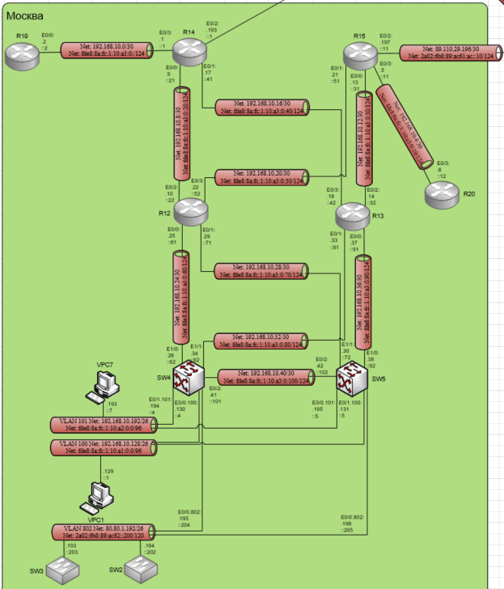
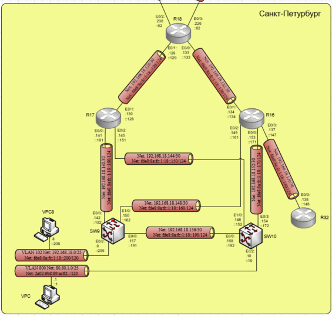
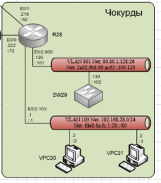

# Лабораторная работа №12 Основные протоколы сети интернет

#### Цель: 

Настроить DHCP в офисе Москва.

Настроить синхронизацию времени в офисе Москва.

Настроить NAT в офисе Москва, C.-Перетбруг и Чокурдах.

## Топология

Выполнение лабораторной работы будет происходить на созданном при выполнении лабораторной работы №4 стенде:





## Ход работы

Лабораторная работа разбита на 6 частей:
1) Настройка NAT(PAT) на R14 и R15. Трансляция должна осуществляться в адрес автономной системы AS1001.
2) Настройка NAT(PAT) на R18. Трансляция должна осуществляться в пул из 5 адресов автономной системы AS2042.
3) Настройка статического NAT для R20.
4) Настройка статического NAT для R19. Чтобы R19 был доступен с любого узла для удаленного управления.
5) Настройка для IPv4 DHCP сервера в офисе Москва на маршрутизаторах R12 и R13. VPC1 и VPC7 должны получать сетевые настройки по DHCP.
6) Настройка NTP сервера на R12 и R13. Все устройства в офисе Москва должны синхронизировать время с R12 и R13.

При этом все офисы в лабораторной работе должны иметь IP связность.

## Часть 1. Настройка NAT(PAT) на R14 и R15

На маршрутизаторах R14 и R15 необходимо настроить список доступа соответствующий внутренним частным адресам Москвы, настроим трансляцию из созданного списка доступа в внешний интерфейс роутера(трансляция в ip адрес внешнего интерфейса роутера), настроим внешние для nat интерфейсы и внутренние. 

В выводе running-config маршрутизаторов появятся настройки:

#### Маршрутизатор R14:

```
!
interface Ethernet0/0
 ip address 192.168.10.9 255.255.255.252
 ip nat inside
 ip virtual-reassembly in
 ip ospf 1 area 0
 ipv6 address FE80::14 link-local
 ipv6 address FDE8:8A:FC:1:10:A3:0:21/124
 ipv6 ospf 1 area 0
!
interface Ethernet0/1
 ip address 192.168.10.17 255.255.255.252
 ip nat inside
 ip virtual-reassembly in
 ip ospf 1 area 0
 ipv6 address FE80::14 link-local
 ipv6 address FDE8:8A:FC:1:10:A3:0:41/124
 ipv6 ospf 1 area 0
!
interface Ethernet0/2
 ip address 89.110.29.193 255.255.255.252
 ip nat outside
 ip virtual-reassembly in
 ipv6 address FE80::14 link-local
 ipv6 address 2A02:6B8:89:AC61:AC::1/124
!
interface Ethernet0/3
 ip address 192.168.10.1 255.255.255.252
 ip nat inside
 ip virtual-reassembly in
 ip ospf 1 area 101
 ipv6 address FE80::14 link-local
 ipv6 address FDE8:8A:FC:1:10:A3:0:1/124
 ipv6 ospf 1 area 101
!
ip nat inside source list 1 interface Ethernet0/2 overload
!
access-list 1 permit 192.168.10.0 0.0.0.255
```

#### Маршрутизатор R15:

```
!
interface Ethernet0/0
 ip address 192.168.10.13 255.255.255.252
 ip nat inside
 ip virtual-reassembly in
 ip ospf 1 area 0
 ipv6 address FE80::15 link-local
 ipv6 address FDE8:8A:FC:1:10:A3:0:31/124
 ipv6 ospf 1 area 0
!
interface Ethernet0/1
 ip address 192.168.10.21 255.255.255.252
 ip nat inside
 ip virtual-reassembly in
 ip ospf 1 area 0
 ipv6 address FE80::15 link-local
 ipv6 address FDE8:8A:FC:1:10:A3:0:51/124
 ipv6 ospf 1 area 0
!
interface Ethernet0/2
 ip address 89.110.29.197 255.255.255.252
 ip nat outside
 ip virtual-reassembly in
 ipv6 address FE80::15 link-local
 ipv6 address 2A02:6B8:89:AC61:AC::11/124
!
interface Ethernet0/3
 ip address 192.168.10.5 255.255.255.252
 ip nat inside
 ip virtual-reassembly in
 ip ospf 1 area 102
 ipv6 address FE80::15 link-local
 ipv6 address FDE8:8A:FC:1:10:A3:0:11/124
 ipv6 ospf 1 area 102
!
ip nat inside source list 2 interface Ethernet0/2 overload
!
access-list 2 permit 192.168.10.0 0.0.0.255
```

С помощью ping с R19 и R20 создадим трафик из внутренней сети во внешнию с использованием nat и проверим с помощью show ip nat statistics и show ip nat translations на R14 и R15 трансляции адресов:

#### Маршрутизатор R19:

```
R19#ping 89.110.29.206
Type escape sequence to abort.
Sending 5, 100-byte ICMP Echos to 89.110.29.206, timeout is 2 seconds:
!!!!!
Success rate is 100 percent (5/5), round-trip min/avg/max = 1/1/2 ms
```

#### Маршрутизатор R20:

```
R20#ping 89.110.29.206
Type escape sequence to abort.
Sending 5, 100-byte ICMP Echos to 89.110.29.206, timeout is 2 seconds:
!!!!!
Success rate is 100 percent (5/5), round-trip min/avg/max = 1/1/2 ms
```

#### Маршрутизатор R14:

```
R14#show ip nat statistics 
Total active translations: 1 (0 static, 1 dynamic; 1 extended)
Peak translations: 2, occurred 00:00:15 ago
Outside interfaces:
  Ethernet0/2
Inside interfaces: 
  Ethernet0/0, Ethernet0/1, Ethernet0/3
Hits: 35  Misses: 0
CEF Translated packets: 35, CEF Punted packets: 0
Expired translations: 3
Dynamic mappings:
-- Inside Source
[Id: 3] access-list 1 interface Ethernet0/2 refcount 1

Total doors: 0
Appl doors: 0
Normal doors: 0
Queued Packets: 0
R14#show ip nat translations 
Pro Inside global      Inside local       Outside local      Outside global
icmp 89.110.29.193:1   192.168.10.2:1     89.110.29.206:1    89.110.29.206:1
```

#### Маршрутизатор R15:

```
R15#show ip nat statistics 
Total active translations: 2 (0 static, 2 dynamic; 2 extended)
Peak translations: 2, occurred 00:29:59 ago
Outside interfaces:
  Ethernet0/2
Inside interfaces: 
  Ethernet0/0, Ethernet0/1, Ethernet0/3
Hits: 60  Misses: 0
CEF Translated packets: 60, CEF Punted packets: 0
Expired translations: 4
Dynamic mappings:
-- Inside Source
[Id: 4] access-list 2 interface Ethernet0/2 refcount 2

Total doors: 0
Appl doors: 0
Normal doors: 0
Queued Packets: 0
R15#show ip nat translations 
Pro Inside global      Inside local       Outside local      Outside global
icmp 89.110.29.197:6   192.168.10.6:6     89.110.29.206:6    89.110.29.206:6
```

## Часть 2. Настройка NAT(PAT) на R18

На маршрутизаторе R18 необходимо настроить список доступа соответствующий внутренним частным адресам Санкт-Петербурга, настроим трансляцию из созданного списка доступа в 5 адресов из пула внешних адресов Санкт-Петербурга(80.80.195.64/26), настроим внешние для nat интерфейсы и внутренние, добавим в распростроняемые с помощью bgp адреса пул nat адресов и настроим маршрут в пул nat адресов в null0. 

В выводе running-config маршрутизаторов появятся настройки:

#### Маршрутизатор R18:

```
!
interface Ethernet0/0
 ip address 192.168.18.133 255.255.255.252
 ip nat inside
 ip virtual-reassembly in
 ipv6 address FE80::18 link-local
 ipv6 address FDE8:8A:FC:1:18::133/124
!
interface Ethernet0/1
 ip address 192.168.18.129 255.255.255.252
 ip nat inside
 ip virtual-reassembly in
 ipv6 address FE80::18 link-local
 ipv6 address FDE8:8A:FC:1:18::129/124
!
interface Ethernet0/2
 ip address 89.110.29.230 255.255.255.252
 ip nat outside
 ip virtual-reassembly in
 ipv6 address FE80::18 link-local
 ipv6 address 2A02:6B8:89:AC61:AC::92/124
!
interface Ethernet0/3
 ip address 89.110.29.226 255.255.255.252
 ip nat outside
 ip virtual-reassembly in
 ipv6 address FE80::18 link-local
 ipv6 address 2A02:6B8:89:AC61:AC::82/124
!
router bgp 2042
 bgp router-id 18.18.18.18
 bgp log-neighbor-changes
 neighbor 2A02:6B8:89:AC61:AC::81 remote-as 520
 neighbor 2A02:6B8:89:AC61:AC::91 remote-as 520
 neighbor 89.110.29.225 remote-as 520
 neighbor 89.110.29.229 remote-as 520
 !
 address-family ipv4
  network 80.80.195.64 mask 255.255.255.192
  neighbor 2A02:6B8:89:AC61:AC::81 activate
  neighbor 2A02:6B8:89:AC61:AC::91 activate
  neighbor 89.110.29.225 activate
  neighbor 89.110.29.225 prefix-list lab_out out
  neighbor 89.110.29.229 activate
  neighbor 89.110.29.229 prefix-list lab_out out
  maximum-paths 2
 exit-address-family
 !
 address-family ipv6
  maximum-paths 2
  neighbor 2A02:6B8:89:AC61:AC::81 activate
  neighbor 2A02:6B8:89:AC61:AC::91 activate
 exit-address-family
!

ip nat pool NAT 80.80.195.65 80.80.195.69 netmask 255.255.255.192
ip nat inside source list 2 pool NAT overload
ip route 80.80.195.64 255.255.255.192 Null0
!
ip prefix-list lab_out seq 5 permit 80.80.195.64/26
!
access-list 2 permit 192.168.18.0 0.0.0.255
```

С помощью ping с R16 создадим трафик из внутренней сети во внешнию с использованием nat и проверим с помощью show ip nat statistics и show ip nat translations на R18 трансляции адресов:

#### Маршрутизатор R16:

```
R16#ping 89.110.29.229
Type escape sequence to abort.
Sending 5, 100-byte ICMP Echos to 89.110.29.229, timeout is 2 seconds:
!!!!!
Success rate is 100 percent (5/5), round-trip min/avg/max = 1/1/2 ms
```

#### Маршрутизатор R18:
```
R18#sh ip nat statistics 
Total active translations: 1 (0 static, 1 dynamic; 1 extended)
Peak translations: 1, occurred 23:32:17 ago
Outside interfaces:
  Ethernet0/2, Ethernet0/3
Inside interfaces: 
  Ethernet0/0, Ethernet0/1
Hits: 35  Misses: 0
CEF Translated packets: 35, CEF Punted packets: 0
Expired translations: 4
Dynamic mappings:
-- Inside Source
[Id: 1] access-list 2 pool NAT refcount 1
 pool NAT: netmask 255.255.255.192
start 80.80.195.65 end 80.80.195.69
type generic, total addresses 5, allocated 1 (20%), misses 0

Total doors: 0
Appl doors: 0
Normal doors: 0
Queued Packets: 0
R18#sh ip nat tr         
R18#sh ip nat translations 
Pro Inside global      Inside local       Outside local      Outside global
icmp 80.80.195.67:5    192.168.18.134:5   89.110.29.229:5    89.110.29.229:5
```

## Часть 3. Настройка статического NAT для R20

На маршрутизаторе R15 необходимо настроить трансляцию из адреса R20 во внешний адрес 80.80.195.2/26, добавим в распростроняемые с помощью bgp адреса пула внешних адресов 80.80.195.0/26 и настроим маршрут в пул nat адресов в null0. 

В выводе running-config маршрутизаторов появятся настройки: 

#### Маршрутизатор R15:

```
!
router bgp 1001
 bgp router-id 15.15.15.15
 bgp log-neighbor-changes
 neighbor 14.14.14.14 remote-as 1001
 neighbor 14.14.14.14 update-source Loopback0
 neighbor 2A02:6B8:89:AC61:AC::12 remote-as 301
 neighbor 89.110.29.198 remote-as 301
 !
 address-family ipv4
  network 80.80.195.0 mask 255.255.255.192
  neighbor 14.14.14.14 activate
  neighbor 14.14.14.14 next-hop-self
  neighbor 2A02:6B8:89:AC61:AC::12 activate
  neighbor 2A02:6B8:89:AC61:AC::12 filter-list 1 out
  neighbor 89.110.29.198 activate
  neighbor 89.110.29.198 prefix-list lab12 out
  neighbor 89.110.29.198 route-map as301-in in
 exit-address-family
!
ip nat inside source static 192.168.10.6 80.80.195.2
ip route 80.80.195.0 255.255.255.192 Null0
```

С помощью ping с R20 создадим трафик из внутренней сети во внешнию с использованием nat и проверим с помощью show ip nat statistics и show ip nat translations на R15 трансляции адресов:

#### Маршрутизатор R20:

```
R20#ping 89.110.29.198
Type escape sequence to abort.
Sending 5, 100-byte ICMP Echos to 89.110.29.198, timeout is 2 seconds:
!!!!!
Success rate is 100 percent (5/5), round-trip min/avg/max = 1/1/1 ms
```

#### Маршрутизатор R15:

```
R15#show ip nat statistics 
Aug  8 06:50:16.062: %IPRT-3-RIB_LOOP: Resolution loop formed by routes in RIB
R15#show ip nat statistics   
Total active translations: 2 (1 static, 1 dynamic; 1 extended)
Peak translations: 2, occurred 00:00:40 ago
Outside interfaces:
  Ethernet0/2
Inside interfaces: 
  Ethernet0/0, Ethernet0/1, Ethernet0/3
Hits: 10  Misses: 0
CEF Translated packets: 10, CEF Punted packets: 0
Expired translations: 0
Dynamic mappings:
-- Inside Source
[Id: 1] access-list 2 interface Ethernet0/2 refcount 0

Total doors: 0
Appl doors: 0
Normal doors: 0
Queued Packets: 0
R15#show ip nat translations 
Pro Inside global      Inside local       Outside local      Outside global
icmp 80.80.195.2:16    192.168.10.6:16    89.110.29.198:16   89.110.29.198:16
--- 80.80.195.2        192.168.10.6       ---                ---
```

## Часть 4. Настройка статического NAT для R19

На маршрутизаторе R14 необходимо настроить трансляцию из адреса R19 во внешний адрес 80.80.195.130/26 на порт 22 (проброс портов), добавим в распростроняемые с помощью bgp адреса пула внешних адресов 80.80.195.128/26 и настроим маршрут в пул nat адресов в null0. 

В выводе running-config маршрутизаторов появятся настройки: 

#### Маршрутизатор R14:

```
 !
router bgp 1001
 bgp router-id 14.14.14.14
 bgp log-neighbor-changes
 neighbor 15.15.15.15 remote-as 1001
 neighbor 15.15.15.15 update-source Loopback0
 neighbor 2A02:6B8:89:AC61:AC::2 remote-as 101
 neighbor 89.110.29.194 remote-as 101
 !
 address-family ipv4
  network 80.80.195.128 mask 255.255.255.192
  neighbor 15.15.15.15 activate
  neighbor 15.15.15.15 next-hop-self
  neighbor 2A02:6B8:89:AC61:AC::2 activate
  neighbor 2A02:6B8:89:AC61:AC::2 filter-list 1 in
  neighbor 89.110.29.194 activate
  neighbor 89.110.29.194 route-map map-in in
  neighbor 89.110.29.194 filter-list 1 out
 exit-address-family
 !
ip route 80.80.195.128 255.255.255.192 Null0

!
ip prefix-list default seq 10 permit 0.0.0.0/0
ip prefix-list default seq 20 permit 80.80.195.128/26
```

С помощью ping с АРМ VPC8 создадим трафик с 22 порта на маршрутизатор R19 с использованием nat и проверим с помощью show ip nat statistics и show ip nat translations на R14 трансляции адресов:

#### АРМ VPC8:

```
VPCS> ping 80.80.195.130 -3 -p 22

Connect   22@80.80.195.130 RST returned
Connect   22@80.80.195.130 RST returned
Connect   22@80.80.195.130 RST returned
Connect   22@80.80.195.130 RST returned
Connect   22@80.80.195.130 RST returned
```

#### Маршрутизатор R14:

```
R14#show ip nat statistics 
Total active translations: 2 (1 static, 1 dynamic; 2 extended)
Peak translations: 2, occurred 3d18h ago
Outside interfaces:
  Ethernet0/2
Inside interfaces: 
  Ethernet0/0, Ethernet0/1, Ethernet0/3
Hits: 55  Misses: 0
CEF Translated packets: 55, CEF Punted packets: 0
Expired translations: 5
Dynamic mappings:
-- Inside Source
[Id: 3] access-list 1 interface Ethernet0/2 refcount 0

Total doors: 0
Appl doors: 0
Normal doors: 0
Queued Packets: 0
R14#show ip nat translations 
Pro Inside global      Inside local       Outside local      Outside global
tcp 80.80.195.130:22   192.168.10.2:22    80.80.195.67:35759 80.80.195.67:35759
tcp 80.80.195.130:22   192.168.10.2:22    ---                ---
```

## Часть 5. Настройка для IPv4 DHCP сервера в офисе Москва на маршрутизаторах R12 и R13

На маршрутизаторах R12 и R13 необходимо создать пул ip адресов vlan 100 и 101, маршрут по умолчанию для пула и исключения из пула адресов.

В выводе running-config коммутаторов появятся настройки:

#### Маршрутизатор R12:

```
!
ip dhcp excluded-address 192.168.10.194 192.168.10.195
ip dhcp excluded-address 192.168.10.130 192.168.10.131
!
ip dhcp pool vlan101
 network 192.168.10.192 255.255.255.192
 default-router 192.168.10.195 
!
ip dhcp pool vlan100
 network 192.168.10.128 255.255.255.192
 default-router 192.168.10.131 
!  
```

#### Маршрутизатор R13:

```
!
ip dhcp excluded-address 192.168.10.194 192.168.10.195
ip dhcp excluded-address 192.168.10.130 192.168.10.131
!
ip dhcp pool vlan 101
 network 192.168.10.192 255.255.255.192
 default-router 192.168.10.195 
!
ip dhcp pool vlan 100
 network 192.168.10.128 255.255.255.192
 default-router 192.168.10.131 
!      
```

Настроим dhcp ретрансляцию на L3 коммутаторах SW4 и SW5. В выводе running-config коммутаторов появятся настройки:

#### L3 коммутатор SW4:

```
!         
interface Ethernet0/0
 no ip address
 ip ospf 1 area 10
!
interface Ethernet0/0.100
 description MSK_Client1
 encapsulation dot1Q 100
 ip address 192.168.10.130 255.255.255.192
 ip helper-address 192.168.10.25
 ip helper-address 192.168.10.33
 ip ospf 1 area 10
 ipv6 address FE80::4 link-local
 ipv6 address FDE8:8A:FC:1:10:A1:0:4/96
 ipv6 ospf 1 area 10
!
interface Ethernet0/1
 no ip address
!
interface Ethernet0/1.101
 description MSK_Client2
 encapsulation dot1Q 101
 ip address 192.168.10.194 255.255.255.192
 ip helper-address 192.168.10.33
 ip helper-address 192.168.10.25
 ip ospf 1 area 10
 ipv6 address FE80::4 link-local
 ipv6 address FDE8:8A:FC:1:10:A2:0:4/96
 ipv6 ospf 1 area 10
```

#### L3 коммутатор SW5:

```
!         
interface Ethernet0/0
 no ip address
!
interface Ethernet0/0.101
 description MSK_Client2
 encapsulation dot1Q 101
 ip address 192.168.10.195 255.255.255.192
 ip helper-address 192.168.10.29
 ip helper-address 192.168.10.37
 ip ospf 1 area 10
 ipv6 address FE80::5 link-local
 ipv6 address FDE8:8A:FC:1:10:A2:0:5/96
 ipv6 ospf 1 area 10
!
interface Ethernet0/1
 no ip address
!
interface Ethernet0/1.100
 description MSK_Client1
 encapsulation dot1Q 100
 ip address 192.168.10.131 255.255.255.192
 ip helper-address 192.168.10.37
 ip helper-address 192.168.10.29
 ip ospf 1 area 10
 ipv6 address FE80::5 link-local
 ipv6 address FDE8:8A:FC:1:10:A1:0:5/96
 ipv6 ospf 1 area 10
!
```

С помощью команды dhcp -r получим ip адрес на VPC1 и VPC7:

#### АРМ VPC1:

```
VPCS> dhcp -r
DDORA IP 192.168.10.129/26 GW 192.168.10.131

VPCS> sh ip

NAME        : VPCS[1]
IP/MASK     : 192.168.10.129/26
GATEWAY     : 192.168.10.131
DNS         : 
DHCP SERVER : 192.168.10.29
DHCP LEASE  : 86393, 86400/43200/75600
MAC         : 00:50:79:66:68:01
LPORT       : 20000
RHOST:PORT  : 127.0.0.1:30000
MTU         : 1500
```

#### АРМ VPC7:

```
VPCS> dhcp -r
DDORA IP 192.168.10.193/26 GW 192.168.10.195

VPCS>  sh ip

NAME        : VPCS[1]
IP/MASK     : 192.168.10.193/26
GATEWAY     : 192.168.10.195
DNS         : 
DHCP SERVER : 192.168.10.37
DHCP LEASE  : 86144, 86400/43200/75600
MAC         : 00:50:79:66:68:07
LPORT       : 20000
RHOST:PORT  : 127.0.0.1:30000
MTU         : 1500
```


## Часть 6. Настройка NTP сервера на R12 и R13

На маршрутизаторах R12 и R13 необходимо включить роутер в качестве NTP-сервера, обновление календаря (часов) роутера. На всех остальных маршрутизаторах и коммутаторах необходимо назначить в качестве ntp серверов R12 и R13.
С помощью команды show ip  bgp neighbors A.B.C.D advertised-routes проверим какие маршруты в сторону провайдеров анонсируют R14 и R15:

В выводе running-config маршрутизаторов появятся настройки:

#### Маршрутизатор R12:

```
ntp master 5
ntp update-calendar
```

#### Маршрутизатор R13:

```
ntp master 5
ntp update-calendar
```

#### Маршрутизатор R20:

```
ntp server 192.168.10.22
ntp server 192.168.10.14
```

#### Маршрутизатор R19:

```
ntp server 192.168.10.10
ntp server 192.168.10.18
```

#### Маршрутизатор R15:

```
ntp server 192.168.10.22
ntp server 192.168.10.14
```

#### Маршрутизатор R14:

```
ntp server 192.168.10.18
ntp server 192.168.10.10
```

#### Коммутатор SW4:

```
ntp server 192.168.10.25
ntp server 192.168.10.33
```

#### Коммутатор SW5:

```
ntp server 192.168.10.29
ntp server 192.168.10.37
```

#### Коммутатор SW3:

```
ntp server 192.168.10.25
ntp server 192.168.10.37
```

#### Коммутатор SW2:

```
ntp server 192.168.10.29
ntp server 192.168.10.37
```

С помощью команды show ntp packets проверим работоспособность ntp на R12 и R13:

#### Маршрутизатор R12:

```
R12#show ntp packets 
Ntp In packets   :  450 
Ntp Out packets           :  636 
Ntp bad version packets   :  0 
Ntp protocol error packets:  0 
```

#### Маршрутизатор R13:

```
R13#show ntp packets 
Ntp In packets   :  319 
Ntp Out packets           :  535 
Ntp bad version packets   :  0 
Ntp protocol error packets:  0 
```

С помощью команд show ntp associations и show ntp status проверим синхронизацию времени:

#### Маршрутизатор R20:

```
R20#show ntp associations 

  address         ref clock       st   when   poll reach  delay  offset   disp
+~192.168.10.22   127.127.1.1      5    254    512   377  0.000   0.000  3.846
*~192.168.10.14   127.127.1.1      5      2    512   377  0.000   0.000  3.068
 * sys.peer, # selected, + candidate, - outlyer, x falseticker, ~ configured
R20#show ntp status       
Clock is synchronized, stratum 6, reference is 192.168.10.14  
nominal freq is 250.0000 Hz, actual freq is 250.0000 Hz, precision is 2**10
ntp uptime is 228800 (1/100 of seconds), resolution is 4000
reference time is E68F9F03.958107C0 (15:13:55.584 msk Sat Jul 30 2022)
clock offset is 0.0000 msec, root delay is 1.00 msec
root dispersion is 18.84 msec, peer dispersion is 3.06 msec
loopfilter state is 'CTRL' (Normal Controlled Loop), drift is 0.000000002 s/s
system poll interval is 512, last update was 867 sec ago.
```

#### Маршрутизатор R19:

```
R19#show ntp status
Clock is synchronized, stratum 6, reference is 192.168.10.18  
nominal freq is 250.0000 Hz, actual freq is 250.0000 Hz, precision is 2**10
ntp uptime is 255600 (1/100 of seconds), resolution is 4000
reference time is E68F9FA5.6ED917B8 (15:16:37.433 msk Sat Jul 30 2022)
clock offset is 0.0000 msec, root delay is 1.00 msec
root dispersion is 19.97 msec, peer dispersion is 3.57 msec
loopfilter state is 'CTRL' (Normal Controlled Loop), drift is 0.000000004 s/s
system poll interval is 512, last update was 941 sec ago.
R19#show ntp associations 

  address         ref clock       st   when   poll reach  delay  offset   disp
+~192.168.10.10   127.127.1.1      5    339    512   377  1.000   0.500  3.415
*~192.168.10.18   127.127.1.1      5     26    512   377  0.000   0.000  3.577
 * sys.peer, # selected, + candidate, - outlyer, x falseticker, ~ configured
R19#show ntp status       
Clock is synchronized, stratum 6, reference is 192.168.10.18  
nominal freq is 250.0000 Hz, actual freq is 250.0000 Hz, precision is 2**10
ntp uptime is 255900 (1/100 of seconds), resolution is 4000
reference time is E68F9FA5.6ED917B8 (15:16:37.433 msk Sat Jul 30 2022)
clock offset is 0.0000 msec, root delay is 1.00 msec
root dispersion is 20.01 msec, peer dispersion is 3.57 msec
loopfilter state is 'CTRL' (Normal Controlled Loop), drift is 0.000000004 s/s
system poll interval is 512, last update was 943 sec ago.
```

#### Маршрутизатор R15:

```
R15#show ntp associations 

  address         ref clock       st   when   poll reach  delay  offset   disp
+~192.168.10.22   127.127.1.1      5     35    512   377  0.000   0.000  2.375
*~192.168.10.14   127.127.1.1      5    340    512   377  0.000   0.000  3.972
 * sys.peer, # selected, + candidate, - outlyer, x falseticker, ~ configured
R15#show ntp status
Clock is synchronized, stratum 6, reference is 192.168.10.14  
nominal freq is 250.0000 Hz, actual freq is 250.0000 Hz, precision is 2**10
ntp uptime is 263100 (1/100 of seconds), resolution is 4000
reference time is E68FA084.449BA6A0 (15:20:20.268 msk Sat Jul 30 2022)
clock offset is 0.0000 msec, root delay is 0.00 msec
root dispersion is 17.26 msec, peer dispersion is 3.97 msec
loopfilter state is 'CTRL' (Normal Controlled Loop), drift is 0.000000000 s/s
system poll interval is 512, last update was 750 sec ago.
```

#### Маршрутизатор R14:

```
R14#show ntp associations 

  address         ref clock       st   when   poll reach  delay  offset   disp
*~192.168.10.18   127.127.1.1      5      0    512   377  0.000   0.000  5.397
+~192.168.10.10   127.127.1.1      5    350    512   377  0.000   0.000  3.783
 * sys.peer, # selected, + candidate, - outlyer, x falseticker, ~ configured
R14#show ntp status
Clock is synchronized, stratum 6, reference is 192.168.10.18  
nominal freq is 250.0000 Hz, actual freq is 250.0000 Hz, precision is 2**10
ntp uptime is 283200 (1/100 of seconds), resolution is 4000
reference time is E68FA06B.50E56120 (15:19:55.316 msk Sat Jul 30 2022)
clock offset is 0.0000 msec, root delay is 0.00 msec
root dispersion is 18.14 msec, peer dispersion is 2.91 msec
loopfilter state is 'CTRL' (Normal Controlled Loop), drift is 0.000000000 s/s
system poll interval is 512, last update was 798 sec ago.
```

#### Коммутатор SW4:

```
SW4#show ntp associations 

  address         ref clock       st   when   poll reach  delay  offset   disp
*~192.168.10.25   127.127.1.1      5     51    512   377  0.000   0.000  2.402
+~192.168.10.33   127.127.1.1      5    116    512   377  0.000   0.000  3.339
 * sys.peer, # selected, + candidate, - outlyer, x falseticker, ~ configured
SW4#show ntp status
Clock is synchronized, stratum 6, reference is 192.168.10.25  
nominal freq is 250.0000 Hz, actual freq is 250.0000 Hz, precision is 2**10
ntp uptime is 290300 (1/100 of seconds), resolution is 4000
reference time is E68FA1EB.828F5D90 (15:26:19.510 msk Sat Jul 30 2022)
clock offset is 0.0000 msec, root delay is 0.00 msec
root dispersion is 12.82 msec, peer dispersion is 3.17 msec
loopfilter state is 'CTRL' (Normal Controlled Loop), drift is 0.000000000 s/s
system poll interval is 512, last update was 436 sec ago.
```

#### Коммутатор SW5:

```
SW5#show ntp associations 

  address         ref clock       st   when   poll reach  delay  offset   disp
*~192.168.10.29   127.127.1.1      5     15   1024   377  0.000   0.000  2.334
+~192.168.10.37   127.127.1.1      5     10    512   377  0.000   0.000  2.426
 * sys.peer, # selected, + candidate, - outlyer, x falseticker, ~ configured
SW5#show ntp status
Clock is synchronized, stratum 6, reference is 192.168.10.29  
nominal freq is 250.0000 Hz, actual freq is 250.0000 Hz, precision is 2**10
ntp uptime is 298200 (1/100 of seconds), resolution is 4000
reference time is E68FA3A1.61893858 (15:33:37.381 msk Sat Jul 30 2022)
clock offset is 0.0000 msec, root delay is 0.00 msec
root dispersion is 5.77 msec, peer dispersion is 2.33 msec
loopfilter state is 'CTRL' (Normal Controlled Loop), drift is 0.000000000 s/s
system poll interval is 1024, last update was 20 sec ago.
```

#### Коммутатор SW3:

```
SW3#show ntp associations 

  address         ref clock       st   when   poll reach  delay  offset   disp
*~192.168.10.25   127.127.1.1      5     86    256   377  1.000  -0.500  2.203
 ~192.168.10.37   .INIT.          16      -   1024     0  0.000   0.000 15937.
 * sys.peer, # selected, + candidate, - outlyer, x falseticker, ~ configured
SW3#show ntp status
Clock is synchronized, stratum 6, reference is 192.168.10.25  
nominal freq is 250.0000 Hz, actual freq is 250.0000 Hz, precision is 2**10
ntp uptime is 285400 (1/100 of seconds), resolution is 4000
reference time is E68FA36C.B78D51D8 (15:32:44.717 msk Sat Jul 30 2022)
clock offset is -0.5000 msec, root delay is 1.00 msec
root dispersion is 7.38 msec, peer dispersion is 2.20 msec
loopfilter state is 'CTRL' (Normal Controlled Loop), drift is -0.000000004 s/s
system poll interval is 256, last update was 91 sec ago.
```

#### Коммутатор SW2:

```
SW2#show ntp associations 

  address         ref clock       st   when   poll reach  delay  offset   disp
*~192.168.10.29   127.127.1.1      5     22    512   377  1.000  -0.500  2.202
 ~192.168.10.37   .INIT.          16      -   1024     0  0.000   0.000 15937.
 * sys.peer, # selected, + candidate, - outlyer, x falseticker, ~ configured
SW2#show ntp status       
Clock is synchronized, stratum 6, reference is 192.168.10.29  
nominal freq is 250.0000 Hz, actual freq is 250.0001 Hz, precision is 2**10
ntp uptime is 437400 (1/100 of seconds), resolution is 4000
reference time is E68FA3CE.3FBE7778 (15:34:22.249 msk Sat Jul 30 2022)
clock offset is -0.5000 msec, root delay is 1.00 msec
root dispersion is 6.38 msec, peer dispersion is 2.20 msec
loopfilter state is 'CTRL' (Normal Controlled Loop), drift is -0.000000550 s/s
system poll interval is 512, last update was 23 sec ago.
```


