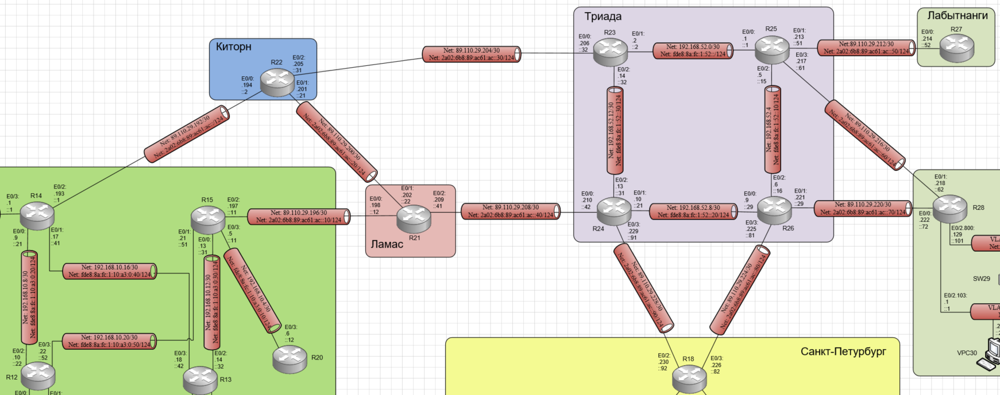

# Лабораторная работа №13 VPN. GRE. DmVPN

#### Цель: 

Настроить GRE между офисами Москва и С.-Петербург.
Настроить DMVPN между офисами Москва и Чокурдах, Лабытнанги.

## Топология

Выполнение лабораторной работы будет происходить на созданном при выполнении лабораторной работы №4 стенде:



## Ход работы

Лабораторная работа разбита на 2 частей:
1) Настройка GRE между офисами Москва и С.-Петербург.
2) Настройка DMVPN между Москва и Чокурдах, Лабытнанги.

При этом все офисы в лабораторной работе должны иметь IP связность.

## Часть 1. Настройка GRE между офисами Москва и С.-Петербург

На маршрутизаторах R14 и R15 необходимо создать и назначить на интерфейс в сторону провайдера as-path фильтр разрешающий анонсировать update только о своих внутренних подсетях. 

С помощью команды show ip  bgp neighbors A.B.C.D advertised-routes проверим какие маршруты в сторону провайдеров анонсируют R14 и R15:

#### Маршрутизатор R14:

```
 
```

#### Маршрутизатор R15:

```

```

Настроим as-filter. В выводе running-config маршрутизаторов появятся настройки:

#### Маршрутизатор R14:

```

```

#### Маршрутизатор R15:

```

```

С помощью команды show ip  bgp neighbors A.B.C.D advertised-routes снова проверим какие маршруты в сторону провайдеров анонсируют R14 и R15:

#### Маршрутизатор R14:

```

```

#### Маршрутизатор R15:

```

```


## Часть 2. Настройка DMVPN между Москва и Чокурдах, Лабытнанги

На маршрутизаторах R14 и R15 необходимо создать и назначить на интерфейс в сторону провайдера as-path фильтр разрешающий анонсировать update только о своих внутренних подсетях. 

С помощью команды show ip  bgp neighbors A.B.C.D advertised-routes проверим какие маршруты в сторону провайдеров анонсируют R14 и R15:

#### Маршрутизатор R14:

```
 
```

#### Маршрутизатор R15:

```

```

Настроим as-filter. В выводе running-config маршрутизаторов появятся настройки:

#### Маршрутизатор R14:

```

```

#### Маршрутизатор R15:

```

```

С помощью команды show ip  bgp neighbors A.B.C.D advertised-routes снова проверим какие маршруты в сторону провайдеров анонсируют R14 и R15:

#### Маршрутизатор R14:

```

```

#### Маршрутизатор R15:

```

```


