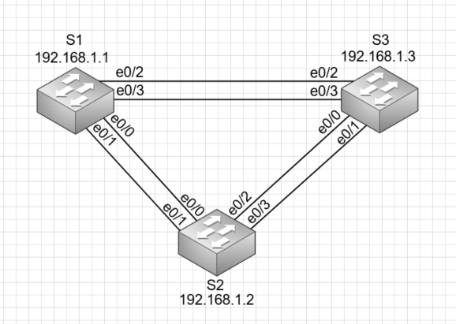
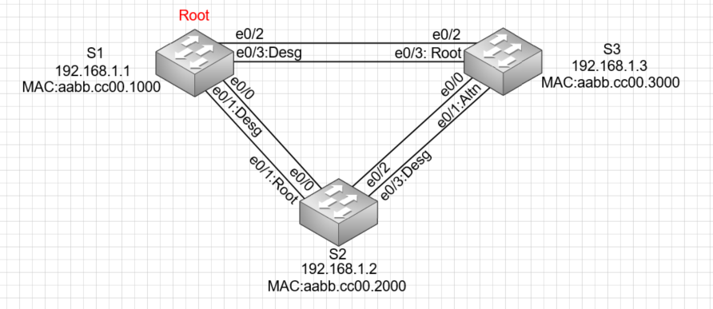

# Лабораторная работа №2 Развертывание коммутируемой сети с резервными каналами
## Цели 

1) Создание сети и настройка основных параметров устройства.
2) Выбор корневого моста.
3) Наблюдение за процессом выбора протоколом STP порта, исходя из стоимости портов.
4) Наблюдение за процессом выбора протоколом STP порта, исходя из приоритета портов.

## Топология

Для выполнения лабораторной работы был собран стенд в соответствии со схемой:



## Таблица адресов

Данный стенд настроен в соответствии с таблицей адресов:

| Устройство      | Интерфейс          | IP адрес     | Маска подсети | 
| --------------- | -------------------| -------------|---------------|
| S1              | VLAN 1             | 192.168.1.1  | 255.255.255.0 | 
| S2              | VLAN 1             | 192.168.1.2  | 255.255.255.0 | 
| S3              | VLAN 1             | 192.168.1.3  | 255.255.255.0 | 

## Часть 1

### Шаги

1) Создать сеть согласно топологии
2) Выполнить инициализацию и перезагрузку коммутаторов
3) Настроить базовые параметры каждого коммутатора
4) Проверить связь

### Результаты шагов 1-3
В качестве результатов шагов 1-3 ниже приведена часть вывод команды show running-config коммутаторов, соответствующиая настройкам указанным в пунке 3

#### Коммутатор S1:
```
service password-encryption
!
hostname S1
!
enable password 7 14141E0A1F17
!
no ip domain-lookup
!
interface Vlan1
 ip address 192.168.1.1 255.255.255.0
!
banner motd ^CUnauthorized access is prohibited^C
!
line con 0
 password 7 045802150C2E
 logging synchronous
 login
line vty 0
 password 7 05080F1C2243
 login
```

#### Коммутатор S2:
```
service password-encryption
!
hostname S2
!
enable password 7 070C2D4D5D1A
!
no ip domain-lookup
!
interface Vlan1
 ip address 192.168.1.2 255.255.255.0
!
banner motd ^CUnauthorized access is prohibited^C
!
line con 0
 password 7 094F471A1A0A
 logging synchronous
 login
line vty 0
 password 070C285F4D06
 login
```

#### Коммутатор S3:
```
service password-encryption
!
hostname S3
!
enable password 7 070C2D4D5D1A
!
no ip domain-lookup
!
interface Vlan1
 ip address 192.168.1.3 255.255.255.0
!
banner motd ^CUnauthorized access is prohibited^C
!
line con 0
 password 7 121A0C041104
 logging synchronous
 login
line vty 0
 password 0822455D0A16
 login
```

### Результаты шага 4
 В качестве результатов шага 4 приведена проверка способность коммутаторов обмениваться эхо-запросами:
 1) S1 - S2
 2) S1 - S3
 3) S2 - S3
 
#### S1 - S2:
```
S1#ping 192.168.1.2
Type escape sequence to abort.
Sending 5, 100-byte ICMP Echos to 192.168.1.2, timeout is 2 seconds:
!!!!!
Success rate is 100 percent (5/5), round-trip min/avg/max = 1/1/1 ms
```

#### S1 - S3:
```
S1#ping 192.168.1.3
Type escape sequence to abort.
Sending 5, 100-byte ICMP Echos to 192.168.1.3, timeout is 2 seconds:
.!!!!
Success rate is 80 percent (4/5), round-trip min/avg/max = 1/1/1 ms
```

#### S2 - S3:
```
S2#ping 192.168.1.3
Type escape sequence to abort.
Sending 5, 100-byte ICMP Echos to 192.168.1.3, timeout is 2 seconds:
!!!!!
Success rate is 100 percent (5/5), round-trip min/avg/max = 1/1/1 ms
```

## Часть 2

### Шаги

1) Отключить все порты на коммутаторах
2) Настроить подключенные порты в качестве транковых
3) Включить порты e0/1 и e0/3 на всех коммутаторах
4) Отобразить данные протокола spanning-tree

### Результаты шагов 1-3
В качестве результатов шагов 1-3 ниже приведена часть вывод команды show running-config коммутаторов, соответствующиая настройкам интерфейсов

#### Коммутатор S1:
```
interface Ethernet0/0
 switchport trunk allowed vlan 1
 switchport trunk encapsulation dot1q
 switchport mode trunk
 shutdown
!
interface Ethernet0/1
 switchport trunk allowed vlan 1
 switchport trunk encapsulation dot1q
 switchport mode trunk
!
interface Ethernet0/2
 switchport trunk allowed vlan 1
 switchport trunk encapsulation dot1q
 switchport mode trunk
 shutdown
!         
interface Ethernet0/3
 switchport trunk allowed vlan 1
 switchport trunk encapsulation dot1q
 switchport mode trunk
```

#### Коммутатор S2:
```
interface Ethernet0/0
 switchport trunk allowed vlan 1
 switchport trunk encapsulation dot1q
 switchport mode trunk
 shutdown
!
interface Ethernet0/1
 switchport trunk allowed vlan 1
 switchport trunk encapsulation dot1q
 switchport mode trunk
!
interface Ethernet0/2
 switchport trunk allowed vlan 1
 switchport trunk encapsulation dot1q
 switchport mode trunk
 shutdown
!         
interface Ethernet0/3
 switchport trunk allowed vlan 1
 switchport trunk encapsulation dot1q
 switchport mode trunk
```

#### Коммутатор S3:
```
interface Ethernet0/0
 switchport trunk allowed vlan 1
 switchport trunk encapsulation dot1q
 switchport mode trunk
 shutdown
!
interface Ethernet0/1
 switchport trunk allowed vlan 1
 switchport trunk encapsulation dot1q
 switchport mode trunk
!
interface Ethernet0/2
 switchport trunk allowed vlan 1
 switchport trunk encapsulation dot1q
 switchport mode trunk
 shutdown
!
interface Ethernet0/3
 switchport trunk allowed vlan 1
 switchport trunk encapsulation dot1q
 switchport mode trunk
```

### Результаты шага 4
В качестве результатов шага 4 ниже приведен вывод команды show spanning-tree  коммутаторов
 
#### Коммутатор S1:
```
S1#show spanning-tree 

VLAN0001
  Spanning tree enabled protocol rstp
  Root ID    Priority    32769
             Address     aabb.cc00.1000
             This bridge is the root
             Hello Time   2 sec  Max Age 20 sec  Forward Delay 15 sec

  Bridge ID  Priority    32769  (priority 32768 sys-id-ext 1)
             Address     aabb.cc00.1000
             Hello Time   2 sec  Max Age 20 sec  Forward Delay 15 sec
             Aging Time  300 sec

Interface           Role Sts Cost      Prio.Nbr Type
------------------- ---- --- --------- -------- --------------------------------
Et0/1               Desg FWD 100       128.2    Shr 
Et0/3               Desg FWD 100       128.4    Shr 
```

#### Коммутатор S2:
```
S2#show spanning-tree 

VLAN0001
  Spanning tree enabled protocol rstp
  Root ID    Priority    32769
             Address     aabb.cc00.1000
             Cost        100
             Port        2 (Ethernet0/1)
             Hello Time   2 sec  Max Age 20 sec  Forward Delay 15 sec

  Bridge ID  Priority    32769  (priority 32768 sys-id-ext 1)
             Address     aabb.cc00.2000
             Hello Time   2 sec  Max Age 20 sec  Forward Delay 15 sec
             Aging Time  300 sec

Interface           Role Sts Cost      Prio.Nbr Type
------------------- ---- --- --------- -------- --------------------------------
Et0/1               Root FWD 100       128.2    Shr 
Et0/3               Desg FWD 100       128.4    Shr 
```

#### Коммутатор S3:
```
S3#show spanning-tree 

VLAN0001
  Spanning tree enabled protocol rstp
  Root ID    Priority    32769
             Address     aabb.cc00.1000
             Cost        100
             Port        4 (Ethernet0/3)
             Hello Time   2 sec  Max Age 20 sec  Forward Delay 15 sec

  Bridge ID  Priority    32769  (priority 32768 sys-id-ext 1)
             Address     aabb.cc00.3000
             Hello Time   2 sec  Max Age 20 sec  Forward Delay 15 sec
             Aging Time  300 sec

Interface           Role Sts Cost      Prio.Nbr Type
------------------- ---- --- --------- -------- --------------------------------
Et0/1               Altn BLK 100       128.2    Shr 
Et0/3               Root FWD 100       128.4    Shr 
```

 В результате получаем схему:
 

  С учетом выходных данных, поступающих с коммутаторов, необходимо ответь на вопросы:
  1) Какой коммутатор является корневым мостом? **S1**
  2) Почему этот коммутатор был выбран протоколом spanning-tree в качестве корневого моста? **Из-за наименьшего MAC адреса**
  3) Какие порты на коммутаторе являются корневыми портами? **На коммутаторе S2 e0/1, на коммутаторе S3 e0/3**
  4) Какие порты на коммутаторе являются назначенными портами? **Порты корневого моста и порт e0/3 S2**
  5) Какой порт отображается в качестве альтернативного и в настоящее время заблокирован? **Порт e0/1 S3**
  6) Почему протокол spanning-tree выбрал этот порт в качестве невыделенного (заблокированного) порта? **Из-за наибольшего идентификатора порта отправителя (порт e0/3 коммутатора S1)**

## Часть 3

### Шаги

1) Определите коммутатор с заблокированным портом
2) Измените стоимость порта
3) Просмотрите изменения протокола spanning-tree
4) Удалите изменения стоимости порта

### Результаты шагов 1-3
В качестве результатов шагов 1-3 ниже приведен вывод команды show spanning-tree коммутаторов S2 и S3
 
#### Коммутатор S2:
```
S2# sh spanning-tree 

VLAN0001
  Spanning tree enabled protocol rstp
  Root ID    Priority    32769
             Address     aabb.cc00.1000
             Cost        100
             Port        2 (Ethernet0/1)
             Hello Time   2 sec  Max Age 20 sec  Forward Delay 15 sec

  Bridge ID  Priority    32769  (priority 32768 sys-id-ext 1)
             Address     aabb.cc00.2000
             Hello Time   2 sec  Max Age 20 sec  Forward Delay 15 sec
             Aging Time  300 sec

Interface           Role Sts Cost      Prio.Nbr Type
------------------- ---- --- --------- -------- --------------------------------
Et0/1               Root FWD 100       128.2    Shr 
Et0/3               Altn BLK 100       128.4    Shr 
```

#### Коммутатор S3:
```
S3#sh spanning-tree 

VLAN0001
  Spanning tree enabled protocol rstp
  Root ID    Priority    32769
             Address     aabb.cc00.1000
             Cost        80
             Port        4 (Ethernet0/3)
             Hello Time   2 sec  Max Age 20 sec  Forward Delay 15 sec

  Bridge ID  Priority    32769  (priority 32768 sys-id-ext 1)
             Address     aabb.cc00.3000
             Hello Time   2 sec  Max Age 20 sec  Forward Delay 15 sec
             Aging Time  300 sec

Interface           Role Sts Cost      Prio.Nbr Type
------------------- ---- --- --------- -------- --------------------------------
Et0/1               Desg BLK 100       128.2    Shr 
Et0/3               Root FWD 80        128.4    Shr 
```

## Часть 4

### Шаги

1) Включить порты F0/1 и F0/3 на всех коммутаторах
2) Подождать 30 секунд, чтобы протокол STP завершил процесс перевода порта, после чего выполнить команду show spanning-tree на коммутаторах некорневого моста
 
### Результаты шагов 1-2
В качестве результатов шагов 1-2 ниже приведен вывод команды show spanning-tree коммутаторов S2 и S3
 
#### Коммутатор S2:
```
S2#show spanning-tree 

VLAN0001
  Spanning tree enabled protocol rstp
  Root ID    Priority    32769
             Address     aabb.cc00.1000
             Cost        100
             Port        1 (Ethernet0/0)
             Hello Time   2 sec  Max Age 20 sec  Forward Delay 15 sec

  Bridge ID  Priority    32769  (priority 32768 sys-id-ext 1)
             Address     aabb.cc00.2000
             Hello Time   2 sec  Max Age 20 sec  Forward Delay 15 sec
             Aging Time  300 sec

Interface           Role Sts Cost      Prio.Nbr Type
------------------- ---- --- --------- -------- --------------------------------
Et0/0               Root FWD 100       128.1    Shr 
Et0/1               Altn BLK 100       128.2    Shr 
Et0/2               Desg FWD 100       128.3    Shr 
Et0/3               Desg FWD 100       128.4    Shr 
```

#### Коммутатор S3:
```
S3#show spanning-tree 

VLAN0001
  Spanning tree enabled protocol rstp
  Root ID    Priority    32769
             Address     aabb.cc00.1000
             Cost        100
             Port        3 (Ethernet0/2)
             Hello Time   2 sec  Max Age 20 sec  Forward Delay 15 sec

  Bridge ID  Priority    32769  (priority 32768 sys-id-ext 1)
             Address     aabb.cc00.3000
             Hello Time   2 sec  Max Age 20 sec  Forward Delay 15 sec
             Aging Time  300 sec

Interface           Role Sts Cost      Prio.Nbr Type
------------------- ---- --- --------- -------- --------------------------------
Et0/0               Altn BLK 100       128.1    Shr 
Et0/1               Altn BLK 100       128.2    Shr 
Et0/2               Root FWD 100       128.3    Shr 
Et0/3               Altn BLK 100       128.4    Shr  
```

1) Какой порт выбран протоколом STP в качестве порта корневого моста на каждом коммутаторе некорневого моста? **На коммутаторе S2 был выбран порт e0/0, на коммутаторе S3 был выбран порт e0/2**
2) Почему протокол STP выбрал эти порты в качестве портов корневого моста на этих коммутаторах? **Из-за наименьшего идентификатора порта отправителя: порт e0/0 и e0/2 коммутатора S1 (соответственно для портов e0/0 S2 и e 0/2 S3)**
