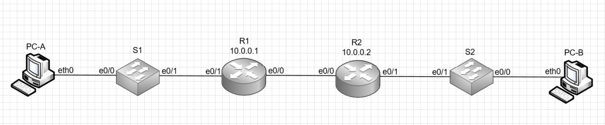
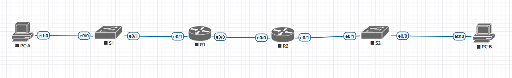

# Лабораторная работа №3.1 Реализация DHCPv4
#### Цель: 
Настроить DHCPv4.
#### Описание:
В данной лабораторной работе необходимо настроить автоматическое получение IPv4 адресов в сети.

## Топология

В ходе выполнения лабораторной работы необходимо собрать стенд в соответствии со схемой:



## Таблица адресов

В ходе выполнения лабораторной работы необходимо настроить адресацию в соответствии с таблицей адресов:

| Устройство      | Интерфейс          | IP адрес     | Маска подсети   | Шлюз по умолчанию |
| --------------- | -------------------| -------------|-----------------|-------------------|
| R1              | e0/0               | 10.0.0.1     | 255.255.255.252 | N/A               |
|                 | e0/1               | N/A          | N/A             |                   |
|                 | e0/1.100           |              |                 |                   |
|                 | e0/1.200           |              |                 |                   |
|                 | e0/1.1000          | N/A          | N/A             | N/A               |
| R2              | e0/0               | 10.0.0.2     | 255.255.255.252 | N/A               |
|                 | e0/1               |              |                 |                   |
| S1              | VLAN 200           |              |                 |                   |
| S2              | VLAN 1             |              |                 |                   |
| PC-A            | NIC                | DHCP         | DHCP            | DHCP              |
| PC-B            | NIC                | DHCP         | DHCP            | DHCP              |


## Таблица VLAN

VLAN, которые необходимо настроить в лабораторной работе, приведены в таблице vlan:

| VLAN      | Имя         | Интерфейсы                  |
| ----------|-------------| ----------------------------|
| 1         | N/A         | S2: e0/0                    | 
| 100       | Clients     | S1: e0/0                    | 
| 200       | Management  | S1: VLAN 200                | 
| 999       | Parking_Lot | S1: e0/2-3                  | 
| 1000      | Native      | N/A                         | 

## Части

Лбораторная работа разбита на 3 части:
1) Создать сеть в соответствии с топологией и настроить основные параметры устройства
2) Настроить и проверить 2 DHCPv4 сервера на R1
3) Настроить и проверить трансляцию DHCPv4 на R2

## Часть 1. Выполнение

### Распределение пула ip адресов на подсети

В ходе выполнения лабораторной работы необходимо разделить пул ip адресов 192.168.1.0/24 на 3 подсети в соответствии с требованиями:
1) Подсеть А должна включать 58 хостов (Client VLAN маршрутизатора R1). Первый ip адрес подсети должен быть назначен маршрутизатору R1 на порт e0/1.100
2) Подсеть В должна включать 28 хостов (Management VLAN маршрутизатора R1). Первый ip адрес подсети должен быть назначен маршрутизатору R1 на порт e0/1.200, а второй ip адрес должен быть назначен коммутатору S1.
3) Подсеть C должна включать 12 хостов (Client сеть маршрутизатора R2). Первый ip адрес подсети должен быть назначен маршрутизатору R2 на порт e0/1

Таблица адресов была заполнена в соответствии с приведенными требованиями:

| Устройство      | Интерфейс          | IP адрес     | Маска подсети   | Шлюз по умолчанию |
| --------------- | -------------------| -------------|-----------------|-------------------|
| R1              | e0/0               | 10.0.0.1     | 255.255.255.252 | N/A               |
|                 | e0/1               | N/A          | N/A             | N/A               |
|                 | e0/1.100           | 192.168.1.1  | 255.255.255.192 | N/A               |
|                 | e0/1.200           | 192.168.1.65 | 255.255.255.224 | N/A               |
|                 | e0/1.1000          | N/A          | N/A             | N/A               |
| R2              | e0/0               | 10.0.0.2     | 255.255.255.252 | N/A               |
|                 | e0/1               | 192.168.1.97 | 255.255.255.240 | N/A               |
| S1              | VLAN 200           | 192.168.1.66 | 255.255.255.224 | 192.168.1.65      |
| S2              | VLAN 1             |              |                 |                   |
| PC-A            | NIC                | DHCP         | DHCP            | DHCP              |
| PC-B            | NIC                | DHCP         | DHCP            | DHCP              |

### Настройка схемы

В ходе лабораторной работы в eve ng был настроен стенд:



### Базовая настройка маршрутизаторов

В ходе базовой настройки маршрутизаторов: настроить его имя, отключить DNS lookup, настроить пароль на вход в привелигерованный режим, настроить аутентификацию и пароль на вход через консоль, настроить аутентификацию и пароль при удаленном подключении, настроить хранение паролей в зашифрованном виде, создать баннер, установить время на маршрутизаторе и сохраненить действующую конфигурацию в стартовую.

После базовой настройки маршрутизаторов в running-config маршрутизаторов появятся настройки:


#### Маршрутизатор R1
```
service password-encryption
!
hostname R1
!
enable password 7 1511070D1739
!
clock timezone msk 3 0
!
no ip domain lookup
!
banner motd ^CUnautorized access is prohibited^C
!
line con 0
 password 7 13061E010803
 logging synchronous
 login
line vty 0
 password 7 13061E010803
 login
 transport input none
```

#### Маршрутизатор R2
```
service password-encryption
!
hostname R2
!
enable password 7 00071F071748
!
clock timezone msk 3 0
!
no ip domain lookup
!
banner motd ^CUnautorized access is prohibited^C
!
line con 0
 password 7 094F471A1A0A
 logging synchronous
 login
line vty 0
 password 7 0822455D0A16
 login
 transport input none
```

### Настройка портов маршрутизаторов

Необходимо создать подинтерфейсы в соответствии с таблицей адресов, назначить ip адрес и описание интерфейсу, включить подключенные интерфейсы, а также назначить в качестве маршрута по умолчанию адрес соседнего маршрутизатора.

В выводе команды show ip interface brief маршрутизаторов появится:

#### Маршрутизатор R1
```
R1# show ip interface brief
Interface                  IP-Address      OK? Method Status                Protocol
Ethernet0/0                10.0.0.1        YES manual up                    up      
Ethernet0/1                unassigned      YES NVRAM  up                    up      
Ethernet0/1.100            192.168.1.1     YES manual up                    up      
Ethernet0/1.200            192.168.1.65    YES manual up                    up      
Ethernet0/1.1000           unassigned      YES unset  up                    up      
Ethernet0/2                unassigned      YES NVRAM  administratively down down    
Ethernet0/3                unassigned      YES NVRAM  administratively down down 
```

#### Маршрутизатор R2
```
R2#sh ip int br
Interface                  IP-Address      OK? Method Status                Protocol
Ethernet0/0                10.0.0.2        YES manual up                    up      
Ethernet0/1                192.168.1.97    YES manual up                    up      
Ethernet0/2                unassigned      YES NVRAM  administratively down down    
Ethernet0/3                unassigned      YES NVRAM  administratively down down 
```

В выводе команды show ip interface brief маршрутизаторов появится:

#### Маршрутизатор R1
```
R1#show ip route
Codes: L - local, C - connected, S - static, R - RIP, M - mobile, B - BGP
       D - EIGRP, EX - EIGRP external, O - OSPF, IA - OSPF inter area 
       N1 - OSPF NSSA external type 1, N2 - OSPF NSSA external type 2
       E1 - OSPF external type 1, E2 - OSPF external type 2
       i - IS-IS, su - IS-IS summary, L1 - IS-IS level-1, L2 - IS-IS level-2
       ia - IS-IS inter area, * - candidate default, U - per-user static route
       o - ODR, P - periodic downloaded static route, H - NHRP, l - LISP
       a - application route
       + - replicated route, % - next hop override

Gateway of last resort is 10.0.0.2 to network 0.0.0.0

S*    0.0.0.0/0 [1/0] via 10.0.0.2
      10.0.0.0/8 is variably subnetted, 2 subnets, 2 masks
C        10.0.0.0/30 is directly connected, Ethernet0/0
L        10.0.0.1/32 is directly connected, Ethernet0/0
      192.168.1.0/24 is variably subnetted, 4 subnets, 3 masks
C        192.168.1.0/26 is directly connected, Ethernet0/1.100
L        192.168.1.1/32 is directly connected, Ethernet0/1.100
C        192.168.1.64/27 is directly connected, Ethernet0/1.200
L        192.168.1.65/32 is directly connected, Ethernet0/1.200
```

#### Маршрутизатор R2
```
R2#show ip route
Codes: L - local, C - connected, S - static, R - RIP, M - mobile, B - BGP
       D - EIGRP, EX - EIGRP external, O - OSPF, IA - OSPF inter area 
       N1 - OSPF NSSA external type 1, N2 - OSPF NSSA external type 2
       E1 - OSPF external type 1, E2 - OSPF external type 2
       i - IS-IS, su - IS-IS summary, L1 - IS-IS level-1, L2 - IS-IS level-2
       ia - IS-IS inter area, * - candidate default, U - per-user static route
       o - ODR, P - periodic downloaded static route, H - NHRP, l - LISP
       a - application route
       + - replicated route, % - next hop override

Gateway of last resort is 10.0.0.1 to network 0.0.0.0

S*    0.0.0.0/0 [1/0] via 10.0.0.1
      10.0.0.0/8 is variably subnetted, 2 subnets, 2 masks
C        10.0.0.0/30 is directly connected, Ethernet0/0
L        10.0.0.2/32 is directly connected, Ethernet0/0
      192.168.1.0/24 is variably subnetted, 2 subnets, 2 masks
C        192.168.1.96/28 is directly connected, Ethernet0/1
L        192.168.1.97/32 is directly connected, Ethernet0/1
```

Чтобы убедиться, что статический маршрут работает произведем ping с маршрутизатора R1 на маршрутизатор R2:
```
R1#ping 10.0.0.2
Type escape sequence to abort.
Sending 5, 100-byte ICMP Echos to 10.0.0.2, timeout is 2 seconds:
!!!!!
Success rate is 100 percent (5/5), round-trip min/avg/max = 1/1/1 ms
```

### Базовая настройка коммутаторов


В качестве базовой настройки коммутаторов необходимо произвести аналогичные настройки как при базовой настройке коммутаторов. 

После базовой настройки коммутатов в running-config коммутаторов появятся настройки:

#### Коммутатор S1
```
service password-encryption
!
hostname S1
!
enable password 7 0307570A151C
!
clock timezone msk 3 0
!
no ip domain lookup
!
banner motd ^CUnautorized access is prohibited^C
!
line con 0
 password 7 045802150C2E
 logging synchronous
 login
line vty 0
 password 7 13061E010803
 login
```

#### Коммутатор S2
```
service password-encryption
!
hostname S1
!
enable password 7 0205085A1815
!
clock timezone msk 3 0
!
no ip domain lookup
!
banner motd ^CUnautorized access is prohibited^C
!
line con 0
 password 7 01100F175804
 logging synchronous
 login
line vty 0
 password 7 14141B180F0B
 login
```

### Настройка VLAN и интерфейсов коммутатора S1 

Необходимо создать и задать имя VLAN в соответствии с таблицей VLAN и ip адресов, назначить ip адрес на vlan управления, назначить шлюз по умолчанию, все неиспользуемые порты перевести в ражим access, назначить в парковочный VLAN и отключить. Необходимо назначить VLAN на интерфейсы в соответствии с таблицей vlan. Интерфейс e0/1 необходимо перевести в режим trunk, назначить 1000 VLAN в качестве vlan по умолчанию и назначить необходимые vlan для передачи. Необходимо назначить на коммутатор ip адрес шлюза по умолчанию. 

После настройки VLAN коммутатора S1 в running-config коммутатора появятся настройки VLAN:

```
interface Ethernet0/0
 switchport access vlan 100
 switchport mode access
!
interface Ethernet0/1
 switchport trunk allowed vlan 100,200,1000
 switchport trunk encapsulation dot1q
 switchport trunk native vlan 1000
 switchport mode trunk
!
interface Ethernet0/2
 switchport access vlan 999
 switchport mode access
 shutdown
 !
 interface Ethernet0/3
 switchport access vlan 999
 switchport mode access
 shutdown
!
interface Vlan100
 description Clients
 no ip address
!
interface Vlan200
 description Management
 ip address 192.168.1.66 255.255.255.224
!
interface Vlan999
 description Parking_Lot
 no ip address
 shutdown
 !
 ip route 0.0.0.0 0.0.0.0 192.168.1.65
```

В выводе команды show ip interface brief коммутатора появится:

```
S1#show ip interface brief 
Interface              IP-Address      OK? Method Status                Protocol
Ethernet0/0            unassigned      YES unset  up                    up      
Ethernet0/1            unassigned      YES unset  up                    up      
Ethernet0/2            unassigned      YES unset  administratively down down    
Ethernet0/3            unassigned      YES unset  administratively down down    
Vlan100                unassigned      YES unset  up                    up      
Vlan200                192.168.1.66    YES manual up                    up      
Vlan999                unassigned      YES unset  administratively down down  
```

В выводе команды show interfaces trunk коммутатора появится:

```
S1#show interfaces trunk 

Port        Mode             Encapsulation  Status        Native vlan
Et0/1       on               802.1q         trunking      1000

Port        Vlans allowed on trunk
Et0/1       100,200,1000

Port        Vlans allowed and active in management domain
Et0/1       100,200

Port        Vlans in spanning tree forwarding state and not pruned
Et0/1       100,200
```

Чтобы убедиться, что статический маршрут работает произведем ping с коммутатора S1 на маршрутизатор R1:
```
S1#ping 192.168.1.65
Type escape sequence to abort.
Sending 5, 100-byte ICMP Echos to 192.168.1.65, timeout is 2 seconds:
!!!!!
Success rate is 100 percent (5/5), round-trip min/avg/max = 1/1/1 ms
```

