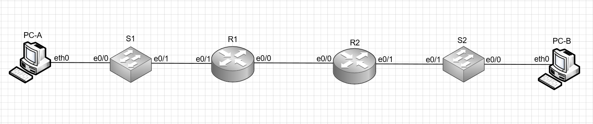
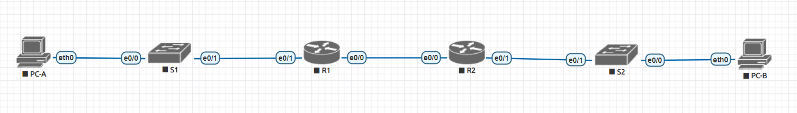

# Лабораторная работа №3.2 Реализация DHCPv6
#### Цель: 
Настроить DHCPv6.
#### Описание:
В данной лабораторной работе необходимо настроить автоматическое получение IPv6 адресов в сети.

## Топология

В ходе выполнения лабораторной работы необходимо собрать стенд в соответствии со схемой:



## Таблица адресов

В ходе выполнения лабораторной работы необходимо настроить адресацию в соответствии с таблицей адресов:

| Устройство      | Интерфейс          | IPv6 адрес             | 
| --------------- | -------------------| -----------------------|
| R1              | e0/0               | 2001:db8:acad:2::1 /64 |
|                 |                    | fe80::1                |
|                 | e0/1               | 2001:db8:acad:1::1/64  |
|                 |                    | fe80::1                |
| R2              | e0/0               | 2001:db8:acad:2::2/64  |
|                 |                    | fe80::2                |
|                 | e0/1               | 2001:db8:acad:3::1 /64 |
|                 |                    | fe80::1                |
| PC-A            | NIC                | DHCP                   |
| PC-B            | NIC                | DHCP                   |

## Части

Лабораторная работа разбита на 5 частей:
1) Создание сети в соответствии с топологией и настройка основных параметров устройств
2) Проверка назначения IPv6 адреса на АРМ c помощью технологии SLAAC и маршрутизатора R1  
3) Настройка и проверка DHCPv6 сервера без сохранения состояния на маршрутизатре R1
4) Настройка и проверка DHCPv6 сервера с сохранением состояния на маршрутизатре R1
5) Настройка и проверка ретрансляции DHCPv6 на маршрутизаторе R2

## Часть 1. Создание сети в соответствии с топологией и настройка основных параметров устройств

### Настройка схемы

В ходе лабораторной работы в eve ng был настроен стенд:



### Базовая настройка маршрутизаторов

В ходе базовой настройки маршрутизаторов: настроить его имя, отключить DNS lookup, настроить пароль на вход в привелигерованный режим, настроить аутентификацию и пароль на вход через консоль, настроить аутентификацию и пароль при удаленном подключении, настроить хранение паролей в зашифрованном виде, создать баннер, установить время на маршрутизаторе и сохраненить действующую конфигурацию в стартовую.

После базовой настройки маршрутизаторов в running-config маршрутизаторов появятся настройки:

#### Маршрутизатор R1
```
service password-encryption
!
hostname R1
!
enable password 7 121A09160118
!
clock timezone msk 3 0
!
no ip domain lookup
!
banner motd ^CUnautorized access is prohibited^C
!
line con 0
 password 7 104D000A0618
 login
line vty 0
 password 7 01100F175804
 login
```

#### Маршрутизатор R2
```
service password-encryption
!
hostname R2
!
enable password 7 045807071C32
!
clock timezone msk 3 0
!
no ip domain lookup
!
banner motd ^CUnautorized access is prohibited^C
!
line con 0
 password 7 094F471A1A0A
 login
line vty 0
 password 7 094F471A1A0A
 login
```

### Базовая настройка коммутаторов

В качестве базовой настройки коммутаторов необходимо произвести аналогичные настройки как при базовой настройке маршрутизаторов, а также выключить неиспользуемые порты.

После базовой настройки коммутатов в running-config коммутаторов появятся настройки:

#### Коммутатор S1
```
service password-encryption
!
hostname S1
!
enable password 7 0307570A151C
!
clock timezone msk 3 0
!
no ip domain lookup
!
interface Ethernet0/2
 shutdown
!
interface Ethernet0/3
 shutdown
!
banner motd ^CUnautorized access is prohibited^C
!
line con 0
 password 7 110A1016141D
 login
line vty 0
 password 7 121A0C041104
 login
```

#### Коммутатор S2
```
service password-encryption
!
hostname S1
!
enable password 7 01100A054818
!
clock timezone msk 3 0
!
no ip domain lookup
!
interface Ethernet0/2
 shutdown
!
interface Ethernet0/3
 shutdown
!
banner motd ^CUnautorized access is prohibited^C
!
line con 0
 password 7 05080F1C2243
 login
line vty 0
 password 7 14141B180F0B
 login
```

### Настройка портов маршрутизаторов

Необходимо настроить порты на маршрутизаторах, назначить на них ip адреса в соответствии с таблицей адресов, настроить в качестве маршрута по умолчанию ip адрес соседнего маршрутизатора. 

После настройки портов маршрутизаторов в running-config маршрутизаторов появятся настройки:

#### Маршрутизатор R1
```
ipv6 unicast-routing
!
interface Ethernet0/0
 no ip address
 ipv6 address FE80::1 link-local
 ipv6 address 2001:DB8:ACAD:2::1/64
!
interface Ethernet0/1
 no ip address
 ipv6 address FE80::1 link-local
 ipv6 address 2001:DB8:ACAD:1::1/64
!
ipv6 route ::/0 2001:DB8:ACAD:2::2
```

#### Маршрутизатор R2
```
ipv6 unicast-routing
!
interface Ethernet0/0
 no ip address
 ipv6 address FE80::2 link-local
 ipv6 address 2001:DB8:ACAD:2::2/64
!
interface Ethernet0/1
 no ip address
 ipv6 address FE80::1 link-local
 ipv6 address 2001:DB8:ACAD:3::1/64
!
ipv6 route ::/0 2001:DB8:ACAD:2::1
```

Чтобы проверить корректность настройки совершим запрос ping c маршрутизатора R1 на маршрутизатор R2:
```
R1#ping 2001:db8:acad:2::2
Type escape sequence to abort.
Sending 5, 100-byte ICMP Echos to 2001:DB8:ACAD:2::2, timeout is 2 seconds:
!!!!!
Success rate is 100 percent (5/5), round-trip min/avg/max = 1/1/1 ms
R1#ping fe80::2           
Output Interface: Ethernet0/0
Type escape sequence to abort.
Sending 5, 100-byte ICMP Echos to FE80::2, timeout is 2 seconds:
Packet sent with a source address of FE80::1%Ethernet0/0
!!!!!
Success rate is 100 percent (5/5), round-trip min/avg/max = 1/1/1 ms
```

## Часть 2. Проверка назначения IPv6 адреса на АРМ c помощью технологии SLAAC и маршрутизатора R1  

Чтобы удостовериться, что АРМ сшенерировал IPv6 адрес из подсети маршрутизатора R1 с помощью технологии SLAAC введем show ipv6 на PC-A

```
VPCS> show ipv6

NAME              : VPCS[1]
LINK-LOCAL SCOPE  : fe80::250:79ff:fe66:6801/64
GLOBAL SCOPE      : 2001:db8:acad:1:2050:79ff:fe66:6801/64
DNS               : 
ROUTER LINK-LAYER : aa:bb:cc:00:30:10
MAC               : 00:50:79:66:68:01
LPORT             : 20000
RHOST:PORT        : 127.0.0.1:30000
MTU:              : 1500
```

Where did the host-id portion of the address come from? - АРМ сам сгенерировал ее зная префикс.

## Часть 3. Настройка и проверка DHCPv6 сервера без сохранения состояния на маршрутизатре R1

В связи с некорректной работой EVE NG в части получения АРМ IPv6 адреса по DHCPv6 был создан аналогиченый стенд в cisco packet tracer для эмулации DHCPv6, а также произведены все насройки приведенные выше. 

Необходимо настроить на маршрутизаторе R1 DHCPv6 без сохранения состояния, для этого необходимо создать dhcp пул в котором необходимо назначить в качестве dns сервера 2001:db8:acad::254 и доменное имя STATELESS.com. Далее необходимо назначить пул на интерфейс e0/1 (GigabitEthernet 0/0/1).


После настройки маршрутизатора R1 в running-config маршрутизатора появятся настройки:

```
ipv6 dhcp pool R1-STATELESS
 dns-server 2001:DB8:ACAD::254
 domain-name STATELESS.com
!
interface GigabitEthernet0/0/1
no ip address
duplex auto
speed auto
ipv6 address FE80::1 link-local
ipv6 address 2001:DB8:ACAD:1::1/64
ipv6 nd other-config-flag
ipv6 dhcp server R1-STATELESS
```

Чтобы проверить корректность работы DHCPv6 необходимо ввести ipv6config /all на PC-A:

```
C:\>ipv6config /all

FastEthernet0 Connection:(default port)

Physical Address................: 0030.F287.51B6
Link-local IPv6 Address.........: FE80::230:F2FF:FE87:51B6
IPv6 Address....................: 2001:DB8:ACAD:1:230:F2FF:FE87:51B6/64
Default Gateway.................: FE80::1
DNS Servers.....................: 2001:DB8:ACAD::254
DHCPv6 IAID.....................: 7617
DHCPv6 Client DUID..............: 00-01-00-01-B8-77-33-50-00-30-F2-87-51-B6
```

После этого произвести пинг с PC-A на порт e0/1 маршрутизатора R2:

```
C:\>ping 2001:db8:acad:3::1

Pinging 2001:db8:acad:3::1 with 32 bytes of data:

Reply from 2001:DB8:ACAD:3::1: bytes=32 time=1ms TTL=254
Reply from 2001:DB8:ACAD:3::1: bytes=32 time<1ms TTL=254
Reply from 2001:DB8:ACAD:3::1: bytes=32 time<1ms TTL=254
Reply from 2001:DB8:ACAD:3::1: bytes=32 time<1ms TTL=254

Ping statistics for 2001:DB8:ACAD:3::1:
Packets: Sent = 4, Received = 4, Lost = 0 (0% loss),
Approximate round trip times in milli-seconds:
Minimum = 0ms, Maximum = 1ms, Average = 0ms
```

## Часть 4. Настройка и проверка DHCPv6 сервера с сохранением состояния на маршрутизатре R1

Необходимо настроить на маршрутизаторе R1 DHCPv6 c сохранением состояния для АРМ PC-B за маршрутизатором R2, для этого необходимо создать dhcp пул в котором необходимо указать пул разрешенных адресов 2001:db8:acad:3:aaa::/80, назначить в качестве dns сервера 2001:db8:acad::254 и доменное имя STATEFUL.com. Далее необходимо назначить пул на интерфейс e0/0 (GigabitEthernet 0/0/0).

После настройки маршрутизатора R1 в running-config маршрутизатора появятся настройки:

```
ipv6 dhcp pool R2-STATEFUL
address prefix 2001:db8:acad:3:aaa::/80 lifetime 172800 86400
dns-server 2001:DB8:ACAD::254
domain-name STATEFUL.com
!
interface GigabitEthernet0/0/0
no ip address
duplex auto
speed auto
ipv6 address FE80::1 link-local
ipv6 address 2001:DB8:ACAD:2::1/64
ipv6 dhcp server R2-STATEFUL
```

## Часть 5. Настройка и проверка ретрансляции DHCPv6 на маршрутизаторе R2

Чтобы проверить назначенный IPv6 адрес на PC-B необходимо ввести ipv6config /all:

```
C:\>ipv6config /all

FastEthernet0 Connection:(default port)

Physical Address................: 00D0.5841.054B
Link-local IPv6 Address.........: FE80::2D0:58FF:FE41:54B
IPv6 Address....................: 2001:DB8:ACAD:3:2D0:58FF:FE41:54B/64
Default Gateway.................: FE80::1
DNS Servers.....................: ::
DHCPv6 IAID.....................: 2270
DHCPv6 Client DUID..............: 00-01-00-01-9D-99-EB-D2-00-D0-58-41-05-4B
```

Для настройки ретрансляции необходимо настроить на интерфейсе e0/1 (GigabitEthernet 0/0/1) маршрутизатора R2 настроить managed-config-flag  и включить dhcpv6 ретрансляцию на маршрутизатор R1 порт 2001:db8:acad:2::1 g0/0/0.

При настройке dhcpv6 ретрансляции произошла ошибка, видимо cisco packet tracer не поддерживает dhcpv6 ретрансляцию и дальнейшая настройка и проверка корректности работы невозможна.

```
R2(config-if)#ipv6 dhcp relay destination 2001:db8:acad:2::1 g0/0/0 
                                        ^
% Invalid input detected at '^' marker.
R2(config-if)#
```

