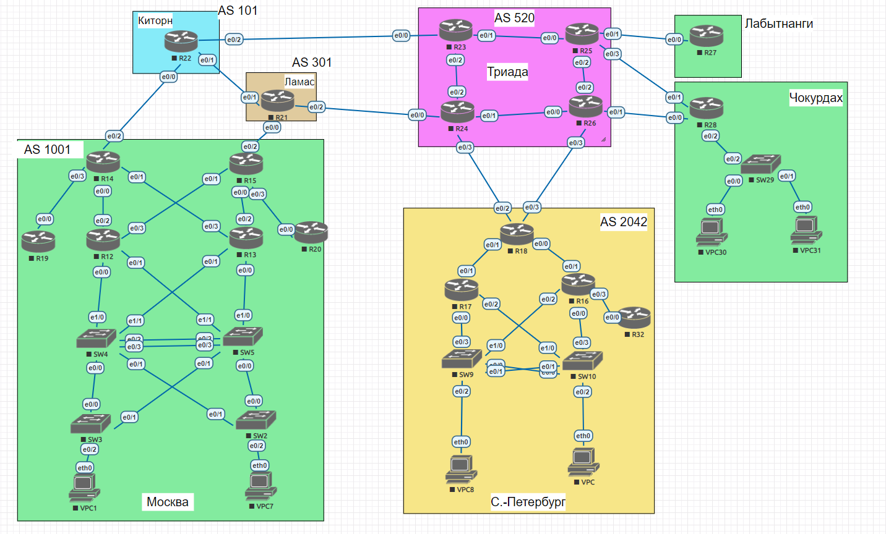

# Лабораторная работа №4 IPv4/6
#### Цель: 
Распланировать адресное пространство.
Настроить IP на всех активных портах для дальнейшей работы над проектом. Адресное пространство должно быть задокументировано.

## Топология

В ходе выполнения лабораторной работы необходимо настроить схему:

## Ход работы

Лабораторная работа разбита на 4 части:
1) Разработка и документирование адресного пространства для лабораторного стенда
2) Настройка ip адресов на всех активных портах
3) Настройка каждого VPC в каждом офисе в своем VLAN
4) Настройка VLAN управления для сетевых устройств

## Часть 1. Разработка и документирование адресного пространства для лабораторного стенда

### Таблица адресов

В ходе выполнения лабораторной работы было разработано адресное пространство, представленное в таблице:

| Устройство | Интерфейс  | Тип ip адреса   | IP адрес                   | Маска подсети/префикс ipv6 | Описание        |
| ---------- | -----------| ----------------|----------------------------|----------------------------|-----------------|
| **Москва**                                                                                                            |
| R14        | e0/2       | IPv4            | 89.110.29.193              | 255.255.255.252            | Киторн          |
|            |            | IPv6            | 2a02:6b8:89:ac61:ac::1/124 | 2a02:6b8:89:ac61:ac::/124  | Киторн          |
|            |            | IPv6 Link-Local | fe80::14                   |                            | Киторн          |
|            | e0/3       | IPv4            | 192.168.10.43              | 255.255.255.128            | R14 - R19       |
|            |            | IPv6            | fde8:8a:fc:1:10:a3:0:43/96 | fde8:8a:fc:1:10:a3:0:0/96  | R14 - R19       |
|            |            | IPv6 Link-Local | fe80::14                   |                            | R14 - R19       |
|            | e0/0       | IPv4            | 192.168.10.40              | 255.255.255.128            | R14 - R12       |
|            |            | IPv6            | fde8:8a:fc:1:10:a3:0:40/96 | fde8:8a:fc:1:10:a3:0:0/96  | R14 - R12       |
|            |            | IPv6 Link-Local | fe80::14                   |                            | R14 - R12       |
|            | e0/1       | IPv4            | 192.168.10.41              | 255.255.255.128            | R14 - R13       |
|            |            | IPv6            | fde8:8a:fc:1:10:a3:0:41/96 | fde8:8a:fc:1:10:a3:0:0/96  | R14 - R13       |
|            |            | IPv6 Link-Local | fe80::14                   |                            | R14 - R13       |
| R15        | e0/2       | IPv4            | 89.110.29.197              | 255.255.255.252            | Ламас           |
|            |            | IPv6            | 2a02:6b8:89:ac61:ac::11/120| 2a02:6b8:89:ac61:ac::/120  | Ламас           |
|            |            | IPv6 Link-Local | fe80::15                   |                            | Ламас           |
|            | e0/3       | IPv4            | 192.168.10.53              | 255.255.255.128            | R15 - R20       |
|            |            | IPv6            | fde8:8a:fc:1:10:a3:0:53/96 | fde8:8a:fc:1:10:a3:0:0/96  | R15 - R20       |
|            |            | IPv6 Link-Local | fe80::15                   |                            | R15 - R20       |
|            | e0/0       | IPv4            | 192.168.10.50              | 255.255.255.128            | R15 - R13       |
|            |            | IPv6            | fde8:8a:fc:1:10:a3:0:50/96 | fde8:8a:fc:1:10:a3:0:0/96  | R15 - R13       |
|            |            | IPv6 Link-Local | fe80::15                   |                            | R15 - R13       |
|            | e0/1       | IPv4            | 192.168.10.51              | 255.255.255.128            | R15 - R12       |
|            |            | IPv6            | fde8:8a:fc:1:10:a3:0:51/96 | fde8:8a:fc:1:10:a3:0:0/96  | R15 - R12       |
|            |            | IPv6 Link-Local | fe80::15                   |                            | R15 - R12       |
| R19        | e0/0       | IPv4            | 192.168.10.19              | 255.255.255.128            | R19 - R14       |
|            |            | IPv6            | fde8:8a:fc:1:10:a3:0:19/96 | fde8:8a:fc:1:10:a3:0:0/96  | R19 - R14       |
|            |            | IPv6 Link-Local | fe80::19                   |                            | R19 - R14       |
| R20        | e0/0       | IPv4            | 192.168.10.20              | 255.255.255.128            | R20 - R15       |
|            |            | IPv6            | fde8:8a:fc:1:10:a3:0:20/96 | fde8:8a:fc:1:10:a3:0:0/96  | R20 - R15       |
|            |            | IPv6 Link-Local | fe80::20                   |                            | R20 - R15       |
| R12        | e0/2       | IPv4            | 192.168.10.22              | 255.255.255.128            | R12 - R14       |
|            |            | IPv6            | fde8:8a:fc:1:10:a3:0:22/96 | fde8:8a:fc:1:10:a3:0:0/96  | R12 - R14       |
|            |            | IPv6 Link-Local | fe80::12                   |                            | R12 - R14       |
|            | e0/3       | IPv4            | 192.168.10.23              | 255.255.255.128            | R12 - R15       |
|            |            | IPv6            | fde8:8a:fc:1:10:a3:0:23/96 | fde8:8a:fc:1:10:a3:0:0/96  | R12 - R15       |
|            |            | IPv6 Link-Local | fe80::12                   |                            | R12 - R15       |
|            | e0/0       | IPv4            | 192.168.10.20              | 255.255.255.128            | R12 - SW4       |
|            |            | IPv6            | fde8:8a:fc:1:10:a3:0:20/96 | fde8:8a:fc:1:10:a3:0:0/96  | R12 - SW4       |
|            |            | IPv6 Link-Local | fe80::12                   |                            | R12 - SW4       |
|            | e0/1       | IPv4            | 192.168.10.21              | 255.255.255.128            | R12 - SW5       |
|            |            | IPv6            | fde8:8a:fc:1:10:a3:0:21/96 | fde8:8a:fc:1:10:a3:0:0/96  | R12 - SW5       |
|            |            | IPv6 Link-Local | fe80::12                   |                            | R12 - SW5       |
| R13        | e0/2       | IPv4            | 192.168.10.32              | 255.255.255.128            | R13 - R15       |
|            |            | IPv6            | fde8:8a:fc:1:10:a3:0:32/96 | fde8:8a:fc:1:10:a3:0:0/96  | R13 - R15       |
|            |            | IPv6 Link-Local | fe80::13                   |                            | R13 - R15       |
|            | e0/3       | IPv4            | 192.168.10.33              | 255.255.255.128            | R13 - R14       |
|            |            | IPv6            | fde8:8a:fc:1:10:a3:0:33/96 | fde8:8a:fc:1:10:a3:0:0/96  | R13 - R14       |
|            |            | IPv6 Link-Local | fe80::13                   |                            | R13 - R14       |
|            | e0/0       | IPv4            | 192.168.10.30              | 255.255.255.128            | R13 - SW5       |
|            |            | IPv6            | fde8:8a:fc:1:10:a3:0:30/96 | fde8:8a:fc:1:10:a3:0:0/96  | R13 - SW5       |
|            |            | IPv6 Link-Local | fe80::13                   |                            | R13 - SW5       |
|            | e0/1       | IPv4            | 192.168.10.31              | 255.255.255.128            | R13 - SW4       |
|            |            | IPv6            | fde8:8a:fc:1:10:a3:0:31/96 | fde8:8a:fc:1:10:a3:0:0/96  | R13 - SW4       |
|            |            | IPv6 Link-Local | fe80::13                   |                            | R13 - SW4       |
| SW4        | e1/0       | IPv4            | 192.168.10.104             | 255.255.255.128            |                 |
|            |            | IPv6            | fde8:8a:fc:1:10:a3:0:104/96| fde8:8a:fc:1:10:a3:0:0/96  |                 |
|            |            | IPv6 Link-Local | fe80::4                    |                            |                 |
|            | e1/1       | IPv4            | 192.168.10.114             | 255.255.255.128            |                 |
|            |            | IPv6            | fde8:8a:fc:1:10:a3:0:114/96| fde8:8a:fc:1:10:a3:0:0/96  |                 |
|            |            | IPv6 Link-Local | fe80::4                    |                            |                 |
|            | e0/2-3     | IPv4            | 192.168.10.124             | 255.255.255.128            |                 |
|            |            | IPv6            | fde8:8a:fc:1:10:a3:0:124/96| fde8:8a:fc:1:10:a3:0:0/96  |                 |
|            |            | IPv6 Link-Local | fe80::4                    |                            |                 |
|            | Vlan 100   | IPv4            | 192.168.10.130             | 255.255.255.192            |                 |
|            |            | IPv6            | fde8:8a:fc:1:10:a1:0:4/96  | fde8:8a:fc:1:10:a1:0:0/96  |                 |
|            |            | IPv6 Link-Local | fe80::4                    |                            |                 |
|            | Vlan 101   | IPv4            | 192.168.10.194             | 255.255.255.192            |                 |
|            |            | IPv6            | fde8:8a:fc:1:10:a2:0:4/96  | fde8:8a:fc:1:10:a2:0:0/96  |                 |
|            |            | IPv6 Link-Local | fe80::4                    |                            |                 |
| SW5        | e1/0       | IPv4            | 192.168.10.105             | 255.255.255.128            |                 |
|            |            | IPv6            | fde8:8a:fc:1:10:a3:0:105/96| fde8:8a:fc:1:10:a3:0:0/96  |                 |
|            |            | IPv6 Link-Local | fe80::5                    |                            |                 |
|            | e1/1       | IPv4            | 192.168.10.115             | 255.255.255.128            |                 |
|            |            | IPv6            | fde8:8a:fc:1:10:a3:0:115/96| fde8:8a:fc:1:10:a3:0:0/96  |                 |
|            |            | IPv6 Link-Local | fe80::5                    |                            |                 |
|            | e0/2-3     | IPv4            | 192.168.10.125             | 255.255.255.128            |                 |
|            |            | IPv6            | fde8:8a:fc:1:10:a3:0:125/96| fde8:8a:fc:1:10:a3:0:0/96  |                 |
|            |            | IPv6 Link-Local | fe80::5                    |                            |                 |
|            | Vlan 100   | IPv4            | 192.168.10.131             | 255.255.255.192            |                 |
|            |            | IPv6            | fde8:8a:fc:1:10:a1:0:5/96  | fde8:8a:fc:1:10:a1:0:0/96  |                 |
|            |            | IPv6 Link-Local | fe80::5                    |                            |                 |
|            | Vlan 101   | IPv4            | 192.168.10.195             | 255.255.255.192            |                 |
|            |            | IPv6            | fde8:8a:fc:1:10:a2:0:5/96  | fde8:8a:fc:1:10:a2:0:0/96  |                 |
|            |            | IPv6 Link-Local | fe80::5                    |                            |                 |
| SW3        | vlan 800   | IPv4            | 80.80.1.3                  | 255.255.255.0              |                 |
|            |            | IPv6            | 2a02:6b8:89:ac62::3/64     | 2a02:6b8:89:ac62::/64      |                 |
|            |            | IPv6 Link-Local | fe80::3                    |                            |                 |
| SW2        | vlan 800   | IPv4            | 80.80.1.2                  | 255.255.255.0              |                 |
|            |            | IPv6            | 2a02:6b8:89:ac62::2/64     | 2a02:6b8:89:ac62::/64      |                 |
|            |            | IPv6 Link-Local | fe80::2                    |                            |                 |
| VPC1       | eth0       | IPv4            | 192.168.10.129             | 255.255.255.192            |                 |
|            |            | IPv6            | fde8:8a:fc:1:10:a1:0:1/96  | fde8:8a:fc:1:10:a1:0:0/96  |                 |
|            |            | IPv6 Link-Local | fe80::1                    |                            |                 |
| VPC7       | eth0       | IPv4            | 192.168.10.193             | 255.255.255.192            |                 |
|            |            | IPv6            | fde8:8a:fc:1:10:a2:0:7/96  | fde8:8a:fc:1:10:a2:0:0/96  |                 |
|            |            | IPv6 Link-Local | fe80::7                    |                            |                 |
| **Киторн**                                                                                                            |
| R22        | e0/0       | IPv4            | 89.110.29.194              | 255.255.255.252            | Москву R14      |
|            |            | IPv6            | 2a02:6b8:89:ac61:ac::2/124 | 2a02:6b8:89:ac61:ac::/124  | Москву R14      |
|            |            | IPv6 Link-Local | fe80::22                   |                            | Москву R14      |
|            | e0/1       | IPv4            | 89.110.29.201              | 255.255.255.252            | Ламас           |
|            |            | IPv6            | 2a02:6b8:89:ac61:ac::21/124| 2a02:6b8:89:ac61:ac::20/124| Ламас           |
|            |            | IPv6 Link-Local | fe80::22                   |                            | Ламас           |
|            | e0/2       | IPv4            | 89.110.29.205              | 255.255.255.252            | Триада R23      |
|            |            | IPv6            | 2a02:6b8:89:ac61:ac::31/124| 2a02:6b8:89:ac61:ac::30/124| Триада R23      | 
|            |            | IPv6 Link-Local | fe80::22                   |                            | Триада R23      |
| **Ламас**                                                                                                             |
| R21        | e0/0       | IPv4            | 89.110.29.198              | 255.255.255.252            | Москву R15      |
|            |            | IPv6            | 2a02:6b8:89:ac61:ac::12/124| 2a02:6b8:89:ac61:ac::10/124| Москву R15      |
|            |            | IPv6 Link-Local | fe80::21                   |                            | Москву R15      |
|            | e0/1       | IPv4            | 89.110.29.202              | 255.255.255.252            | Киторн          |
|            |            | IPv6            | 2a02:6b8:89:ac61:ac::22/124| 2a02:6b8:89:ac61:ac::20/124| Киторн          |
|            |            | IPv6 Link-Local | fe80::21                   |                            | Киторн          | 
|            | e0/2       | IPv4            | 89.110.29.209              | 255.255.255.252            | Триада R24      |
|            |            | IPv6            | 2a02:6b8:89:ac61:ac::41/124| 2a02:6b8:89:ac61:ac::40/124| Триада R24      |
|            |            | IPv6 Link-Local | fe80::21                   |                            | Триада R24      |
| **Триада**                                                                                                            |
| R23        | e0/0       | IPv4            | 89.110.29.206              | 255.255.255.252            | Киторн          |
|            |            | IPv6            | 2a02:6b8:89:ac61:ac::32/124| 2a02:6b8:89:ac61:ac::30/124| Киторн          |
|            |            | IPv6 Link-Local | fe80::23                   |                            | Киторн          |
|            | e0/1       | IPv4            | 192.168.52.2               | 255.255.255.252            | R23 - R25       |
|            |            | IPv6            | fde8:8a:fc:1:52::2/124     | fde8:8a:fc:1:52::/124      | R23 - R25       |
|            |            | IPv6 Link-Local | fe80::23                   |                            | R23 - R25       |
|            | e0/2       | IPv4            | 192.168.52.14              | 255.255.255.252            | R23 - R24       |
|            |            | IPv6            | fde8:8a:fc:1:52::32/124    | fde8:8a:fc:1:52::30/124    | R23 - R24       |
|            |            | IPv6 Link-Local | fe80::23                   |                            | R23 - R24       |
| R24        | e0/0       | IPv4            | 89.110.29.210              | 255.255.255.252            | Ламас           |
|            |            | IPv6            | 2a02:6b8:89:ac61:ac::42/124| 2a02:6b8:89:ac61:ac::40/124| Ламас           |
|            |            | IPv6 Link-Local | fe80::24                   |                            | Ламас           |
|            | e0/1       | IPv4            | 192.168.52.10              | 255.255.255.252            | R24 - R26       |
|            |            | IPv6            | fde8:8a:fc:1:52::21/124    | fde8:8a:fc:1:52::20/124    | R24 - R26       |
|            |            | IPv6 Link-Local | fe80::24                   |                            | R24 - R26       |
|            | e0/2       | IPv4            | 192.168.52.13              | 255.255.255.252            | R24 - R23       |
|            |            | IPv6            | fde8:8a:fc:1:52::31/124    | fde8:8a:fc:1:52::30/124    | R24 - R23       |
|            |            | IPv6 Link-Local | fe80::24                   |                            | R24 - R23       |
|            | e0/3       | IPv4            | 89.110.29.229              | 255.255.255.252            | СПб R18         |
|            |            | IPv6            | 2a02:6b8:89:ac61:ac::91/124| 2a02:6b8:89:ac61:ac::90/124| СПб R18         |
|            |            | IPv6 Link-Local | fe80::24                   |                            | СПб R18         |
| R25        | e0/0       | IPv4            | 192.168.52.1               | 255.255.255.252            | R25 - R23       |
|            |            | IPv6            | fde8:8a:fc:1:52::1/124     | fde8:8a:fc:1:52::/124      | R25 - R23       |
|            |            | IPv6 Link-Local | fe80::25                   |                            | R25 - R23       |
|            | e0/1       | IPv4            | 89.110.29.213              | 255.255.255.252            | Лабытнанги R27  |
|            |            | IPv6            | 2a02:6b8:89:ac61:ac::51/124| 2a02:6b8:89:ac61:ac::50/124| Лабытнанги R27  |
|            |            | IPv6 Link-Local | fe80::25                   |                            | Лабытнанги R27  |
|            | e0/2       | IPv4            | 192.168.52.5               | 255.255.255.252            | R25 - R26       |
|            |            | IPv6            | fde8:8a:fc:1:52::15/124    | fde8:8a:fc:1:52::10/124    | R25 - R26       |
|            |            | IPv6 Link-Local | fe80::25                   |                            | R25 - R26       |
|            | e0/3       | IPv4            | 89.110.29.217              | 255.255.255.252            | Чокурдах R28    |
|            |            | IPv6            | 2a02:6b8:89:ac61:ac::61/124| 2a02:6b8:89:ac61:ac::60/124| Чокурдах R28    |
|            |            | IPv6 Link-Local | fe80::25                   |                            | Чокурдах R28    |
| R26        | e0/0       | IPv4            | 192.168.52.9               | 255.255.255.252            | R26 - R24       |
|            |            | IPv6            | fde8:8a:fc:1:52::29/124    | fde8:8a:fc:1:52::20/124    | R26 - R24       |
|            |            | IPv6 Link-Local | fe80::26                   |                            | R26 - R24       |
|            | e0/1       | IPv4            | 89.110.29.221              | 255.255.255.252            | Чокурдах R28    |
|            |            | IPv6            | 2a02:6b8:89:ac61:ac::71/124| 2a02:6b8:89:ac61:ac::70/124| Чокурдах R28    |
|            |            | IPv6 Link-Local | fe80::26                   |                            | Чокурдах R28    |
|            | e0/2       | IPv4            | 192.168.52.6               | 255.255.255.252            | R26 - R25       |
|            |            | IPv6            | fde8:8a:fc:1:52::16/124    | fde8:8a:fc:1:52::10/124    | R26 - R25       |
|            |            | IPv6 Link-Local | fe80::26                   |                            | R26 - R25       |
|            | e0/3       | IPv4            | 89.110.29.225              | 255.255.255.252            | СПб R18         |
|            |            | IPv6            | 2a02:6b8:89:ac61:ac::81/124| 2a02:6b8:89:ac61:ac::80/124| СПб R18         |
|            |            | IPv6 Link-Local | fe80::26                   |                            | СПб R18         |
| **Лабытнанги**                                                                                                        |
| R27        | e0/0       | IPv4            | 89.110.29.214              | 255.255.255.252            | Триада R25      |
|            |            | IPv6            | 2a02:6b8:89:ac61:ac::52/124| 2a02:6b8:89:ac61:ac::50/124| Триада R25      |
|            |            | IPv6 Link-Local | fe80::27                   |                            | Триада R25      |
| **Чокурдах**                                                                                                          |
| R28        | e0/0       | IPv4            | 89.110.29.222              | 255.255.255.252            | Триада R26      |
|            |            | IPv6            | 2a02:6b8:89:ac61:ac::72/124| 2a02:6b8:89:ac61:ac::70/124| Триада R26      |
|            |            | IPv6 Link-Local | fe80::28                   |                            | Триада R26      |
|            | e0/1       | IPv4            | 89.110.29.218              | 255.255.255.252            | Триада R25      |
|            |            | IPv6            | 2a02:6b8:89:ac61:ac::62/124| 2a02:6b8:89:ac61:ac::60/124| Триада R25      |
|            |            | IPv6 Link-Local | fe80::28                   |                            | Триада R25      |
|            | e0/2.103   | IPv4            | 192.168.28.1               | 255.255.255.0              | R28 - SW29      |
|            |            | IPv6            | fde8:8a:fc:1:28::1/80      | fde8:8a:fc:1:28::/80       | R28 - SW29      |
|            |            | IPv6 Link-Local | fe80::28                   |                            | R28 - SW29      |
|            | e0/2.800   | IPv4            | 80.80.1.28                 | 255.255.255.0              | R28 - SW29      |
|            |            | IPv6            | 2a02:6b8:89:ac62::28/64    | 2a02:6b8:89:ac62::/64      | R28 - SW29      |
|            |            | IPv6 Link-Local | fe80::28                   |                            | R28 - SW29      |
| SW29       | vlan 800   | IPv4            | 80.80.1.29                 | 255.255.255.0              | SW29 - R28      |
|            |            | IPv6            | 2a02:6b8:89:ac62::29/64    | 2a02:6b8:89:ac62::/64      | SW29 - R28      |
|            |            | IPv6 Link-Local | fe80::29                   |                            | SW29 - R28      |
| VPC30      | eth0       | IPv4            | 192.168.28.2               | 255.255.255.0              |                 |
|            |            | IPv6            | fde8:8a:fc:1:28::2/80      | fde8:8a:fc:1:28::/80       |                 |
|            |            | IPv6 Link-Local | fe80::30                   |                            |                 |
| VPC31      | eth0       | IPv4            | 192.168.28.3               | 255.255.255.0              |                 |
|            |            | IPv6            | fde8:8a:fc:1:28::3/80      | fde8:8a:fc:1:28::/80       |                 |
|            |            | IPv6 Link-Local | fe80::31                   |                            |                 |
| **Санкт-Петербург**                                                                                                   |
| R18        | e0/0       | IPv4            | 192.168.18.180             | 255.255.255.0              | R18 - R16       |
|            |            | IPv6            | fde8:8a:fc:1:18::180/80    | fde8:8a:fc:1:18::/80       | R18 - R16       |
|            |            | IPv6 Link-Local | fe80::18                   |                            | R18 - R16       |
|            | e0/1       | IPv4            | 192.168.18.181             | 255.255.255.0              | R18 - R17       |
|            |            | IPv6            | fde8:8a:fc:1:18::181/80    | fde8:8a:fc:1:18::/80       | R18 - R17       |
|            |            | IPv6 Link-Local | fe80::18                   |                            | R18 - R17       |
|            | e0/2       | IPv4            | 89.110.29.230              | 255.255.255.252            | Триада R24      |
|            |            | IPv6            | 2a02:6b8:89:ac61:ac::92/124| 2a02:6b8:89:ac61:ac::90/124| Триада R24      |
|            |            | IPv6 Link-Local | fe80::18                   |                            | Триада R24      |
|            | e0/3       | IPv4            | 89.110.29.226              | 255.255.255.252            | Триада R26      |
|            |            | IPv6            | 2a02:6b8:89:ac61:ac::82/124| 2a02:6b8:89:ac61:ac::80/124| Триада R26      |
|            |            | IPv6 Link-Local | fe80::18                   |                            | Триада R26      |
| R17        | e0/0       | IPv4            | 192.168.18.170             | 255.255.255.0              | R17 - SW9       |
|            |            | IPv6            | fde8:8a:fc:1:18::170/80    | fde8:8a:fc:1:18::/80       | R17 - SW9       |
|            |            | IPv6 Link-Local | fe80::17                   |                            | R17 - SW9       |
|            | e0/1       | IPv4            | 192.168.18.171             | 255.255.255.0              | R17 - R18       |
|            |            | IPv6            | fde8:8a:fc:1:18::171/80    | fde8:8a:fc:1:18::/80       | R17 - R18       |
|            |            | IPv6 Link-Local | fe80::17                   |                            | R17 - R18       |
|            | e0/2       | IPv4            | 192.168.18.172             | 255.255.255.0              | R17 - SW10      |
|            |            | IPv6            | fde8:8a:fc:1:18::172/80    | fde8:8a:fc:1:18::/80       | R17 - SW10      |
|            |            | IPv6 Link-Local | fe80::17                   |                            | R17 - SW10      |
| R16        | e0/0       | IPv4            | 192.168.18.160             | 255.255.255.0              | R16 - SW10      |
|            |            | IPv6            | fde8:8a:fc:1:18::160/80    | fde8:8a:fc:1:18::/80       | R16 - SW10      |
|            |            | IPv6 Link-Local | fe80::18                   |                            | R16 - SW10      |
|            | e0/1       | IPv4            | 192.168.18.161             | 255.255.255.0              | R16 - R18       |
|            |            | IPv6            | fde8:8a:fc:1:18::161/80    | fde8:8a:fc:1:18::/80       | R16 - R18       |
|            |            | IPv6 Link-Local | fe80::18                   |                            | R16 - R18       |
|            | e0/2       | IPv4            | 192.168.18.162             | 255.255.255.0              | R16 - SW9       |
|            |            | IPv6            | fde8:8a:fc:1:18::162/80    | fde8:8a:fc:1:18::/80       | R16 - SW9       |
|            |            | IPv6 Link-Local | fe80::18                   |                            | R16 - SW9       |
|            | e0/3       | IPv4            | 192.168.18.163             | 255.255.255.0              | R16 - R32       |
|            |            | IPv6            | fde8:8a:fc:1:18::163/80    | fde8:8a:fc:1:18::/80       | R16 - R32       |
|            |            | IPv6 Link-Local | fe80::18                   |                            | R16 - R32       |
| R32        | e0/0       | IPv4            | 192.168.18.32              | 255.255.255.0              | R32 - R16       |
|            |            | IPv6            | fde8:8a:fc:1:18::32/80     | fde8:8a:fc:1:18::/80       | R32 - R16       |
|            |            | IPv6 Link-Local | fe80::32                   |                            | R32 - R16       |
| SW9        | vlan 800   | IPv4            | 80.80.1.9                  | 255.255.255.0              |                 |
|            |            | IPv6            | 2a02:6b8:89:ac62::9/64     | 2a02:6b8:89:ac62::/64      |                 |
|            |            | IPv6 Link-Local | fe80::9                    |                            |                 |
|            | vlan 102   | IPv4            | 192.168.18.9               | 255.255.255.0              |                 |
|            |            | IPv6            | fde8:8a:fc:1:18::9/80      | fde8:8a:fc:1:18::/80       |                 |
|            |            | IPv6 Link-Local | fe80::9                    |                            |                 |
| SW10       | vlan 800   | IPv4            | 80.80.1.10                 | 255.255.255.0              |                 |
|            |            | IPv6            | 2a02:6b8:89:ac62::10/64    | 2a02:6b8:89:ac62::/64      |                 |
|            |            | IPv6 Link-Local | fe80::10                   |                            |                 |
|            | vlan 102   | IPv4            | 192.168.18.10              | 255.255.255.0              |                 |
|            |            | IPv6            | fde8:8a:fc:1:18::10/80     | fde8:8a:fc:1:18::/80       |                 |
|            |            | IPv6 Link-Local | fe80::10                   |                            |                 |
| VPC8       | eth0       | IPv4            | 192.168.18.8               | 255.255.255.0              |                 |
|            |            | IPv6            | fde8:8a:fc:1:18::8/80      | fde8:8a:fc:1:18::/80       |                 |
|            |            | IPv6 Link-Local | fe80::30                   |                            |                 |
| VPC        | eth0       | IPv4            | 80.80.1.1                  | 255.255.255.0              |                 |
|            |            | IPv6            | 2a02:6b8:89:ac62::1/64     | 2a02:6b8:89:ac62::/64      |                 |
|            |            | IPv6 Link-Local | fe80::31                   |                            |                 |

### Таблица подсетей

Информация о подсетях разработанных в хое лабораторной работы представленна в таблице:

| IP адрес подсети   | Маска подсети   | Префикс ipv6               |  Оборудование: интерфейсы          | Описание                           |
|--------------------|-----------------|----------------------------|------------------------------------| -----------------------------------|
| 192.168.21.0       | 255.255.255.0   | fde8:8a:fc:1:21::/80       | R21:loopback                       | Внуренняя подсеть Ламас            |
| 192.168.22.0       | 255.255.255.0   | fde8:8a:fc:1:22::/80       | R22:loopback                       | Внуренняя подсеть Киторн           |
| 192.168.27.0       | 255.255.255.0   | fde8:8a:fc:1:27::/80       | R27:loopback                       | Внуренняя подсеть Лабытанги        |
| 192.168.28.0       | 255.255.255.0   | fde8:8a:fc:1:28::/80       | R28:e0/2; VPC30:eth0; VPC30:eth0   | Внуренняя подсеть Чокурды          |
| 192.168.52.0       | 255.255.255.0   | fde8:8a:fc:1:52::/80       | R23:e0/1-2; R24:e0/1-2;            | Внуренняя подсеть Триада           |
|                    |                 |                            | R25:e0/0-2; R26:e0/0-2             |                                    |
| 80.80.195.128      | 255.255.255.192 | 2a02:6b8:89:ac61:b1::/96   | не используется                    | Внешняя подсеть Триада             |
| 192.168.18.0       | 255.255.255.0   | fde8:8a:fc:1:18::/80       | R18:e0/0-1; R17:e0/0-2;            | Внуренняя подсеть СПб              |
|                    |                 |                            | R16:e0/0-3; R32:e0/0; VPC8:eth0    |                                    |
| 80.80.195.64       | 255.255.255.192 | 2a02:6b8:89:ac61:c1::/96   | не используется                    | Внешняя подсеть СПб                |
| 192.168.10.0       | 255.255.255.128 | fde8:8a:fc:1:10:a3:0:0/96  | R14:e0/0-1,e0/3; R19:e0/0;         | Внуренняя подсеть Москва           |
|                    |                 |                            | R15:e0/0-1,e0/3; R20:e0/0;         | (уровень распределения)            |
|                    |                 |                            | R12:e0/0-3; R13:e0/0-3             |                                    |
| 192.168.10.128     | 255.255.255.192 | fde8:8a:fc:1:10:a1:0:0/96  | VPC1:eth0                          | Внуренняя подсеть Москва (клиенты) |
| 192.168.10.192     | 255.255.255.192 | fde8:8a:fc:1:10:a2:0:0/96  | VPC7:eth0                          | Внуренняя подсеть Москва (клиенты) |
| 80.80.195.0        | 255.255.255.192 | 2a02:6b8:89:ac61:a4::/96   | не используется                    | Внешняя подсеть Москва             |
| 80.80.1.0          | 255.255.255.0   | 2a02:6b8:89:ac62::/64      | SW10:vlan800; SW9:vlan800;         | Подсеть управления                 |
|                    |                 |                            | SW5:vlan800; SW4:vlan800;          |                                    |
|                    |                 |                            | SW2:vlan800; SW9:vlan800;          |                                    |
|                    |                 |                            | SW3:vlan800                        |                                    |
| 80.80.195.192      | 255.255.255.192 | 2a02:6b8:89:ac61:ac::/96   | R14:e0/2; R15:e0/2; R22:e0/0-2;    | Подсеть внешних адресов            |
|                    |                 |                            | R23:e0/0; R21:e0/0-2;              |                                    |
|                    |                 |                            | R24:e0/0,e0/3; R25:e0/1,e0/3;      |                                    |
|                    |                 |                            | R26:e0/1,e0/3; R18:e0/2-3;         |                                    |

### Таблица подсетей

Информация о подсетях разработанных в хое лабораторной работы представленна в таблице:

| VLAN      | IP адрес подсети | Маска подсети   | Префикс ipv6              |  Имя подсети    | Оборудование: интерфейсы         |
| ----------|------------------|-----------------|---------------------------|-----------------|----------------------------------| 
| 100       | 192.168.10.128   | 255.255.255.192 | fde8:8a:fc:1:10:a1:0:0/96 | MSK_Client1     | VPC1:eth0                        |
| 101       | 192.168.10.192   | 255.255.255.192 | fde8:8a:fc:1:10:a2:0:0/96 | MSK_Client2     | VPC7:eth0                        |
| 102       | 192.168.18.0     | 255.255.255.0   | fde8:8a:fc:1:18::/80      | SPB_Client      | VPC8:eth0                        |
| 103       | 192.168.28.0     | 255.255.255.0   | fde8:8a:fc:1:28::/80      | Cho_Client      | VPC30:eth0; VPC31:eth0           |
| 800       | 80.80.1.0        | 255.255.255.0   | 2a02:6b8:89:ac62::/64     | Management      | SW10:e0/2; SW9:e0/1-0; SW9:e0/2; |
|           |                  |                 |                           |                 | SW5:e1/0; SW4:e1/0; SW3:e0/0;    |
|           |                  |                 |                           |                 | SW2:e0/0                         |
| 999       |                  |                 |                           | Parking_Lot     | все неиспользуемые порты         | 
| 1000      |                  |                 |                           | Native          | N/A                              |

В ходе лабораторной работы была разработана схема:

