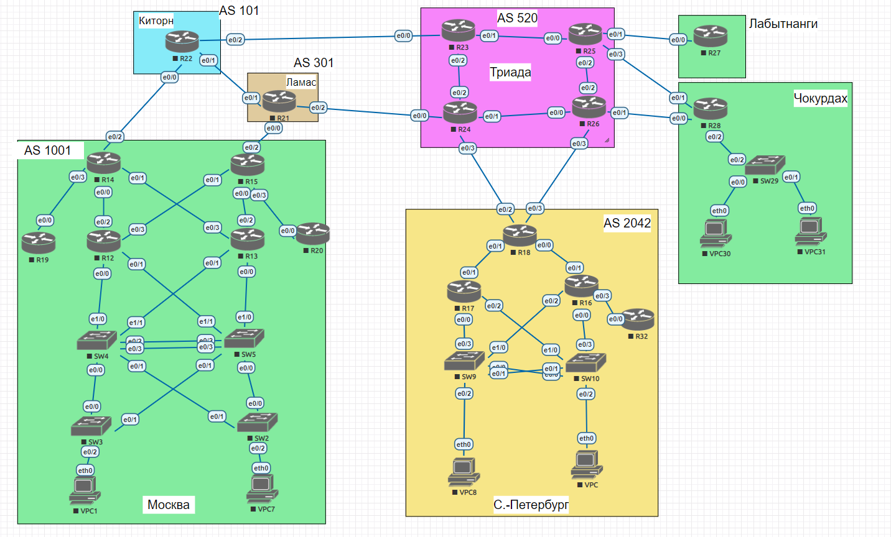
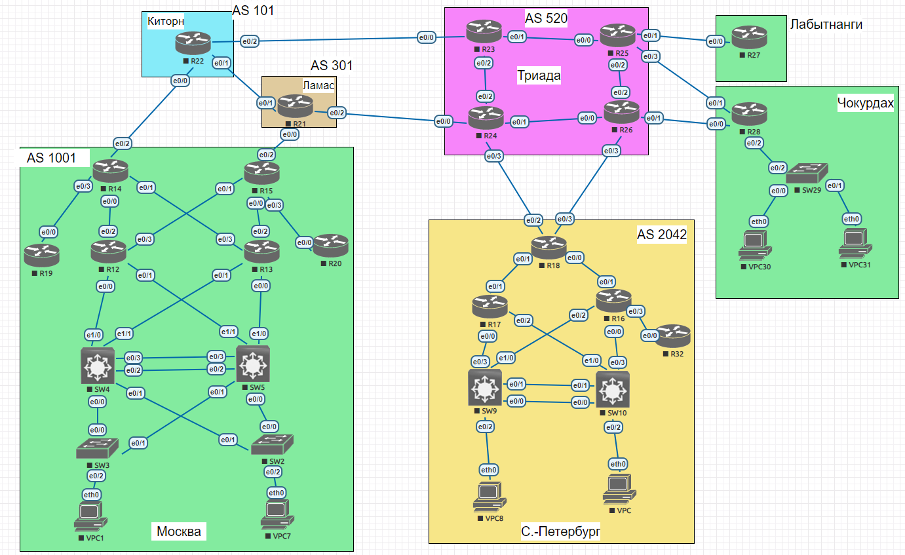
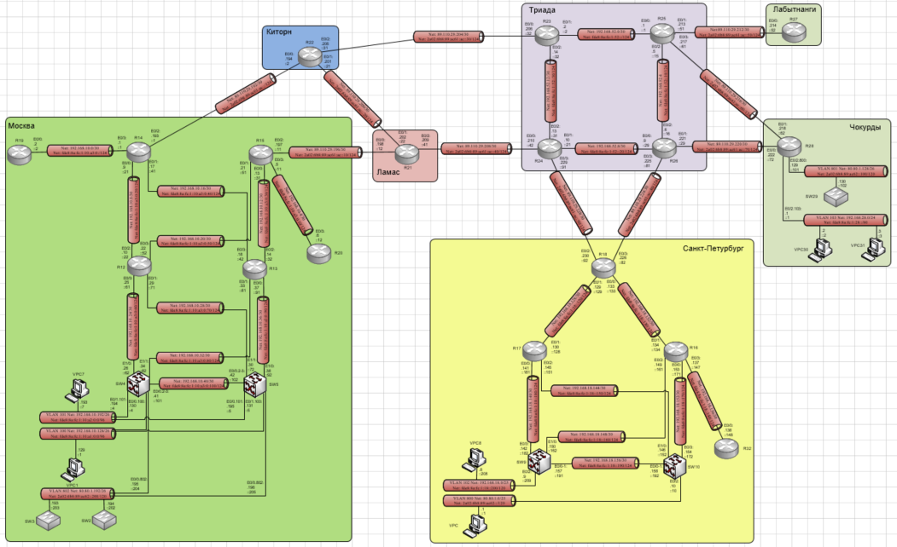
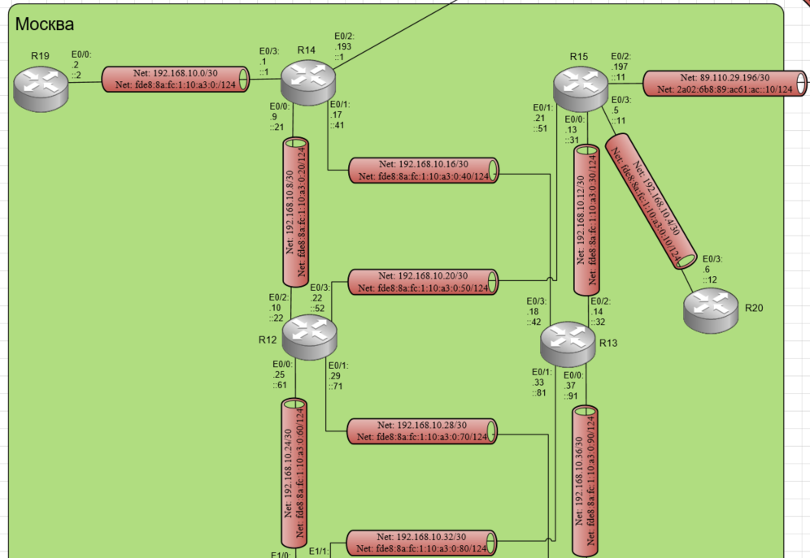
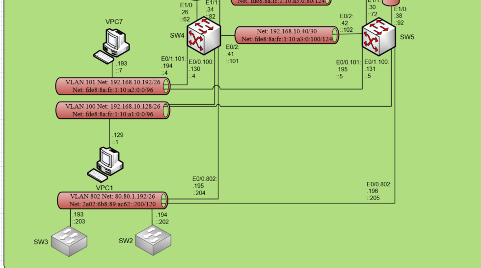
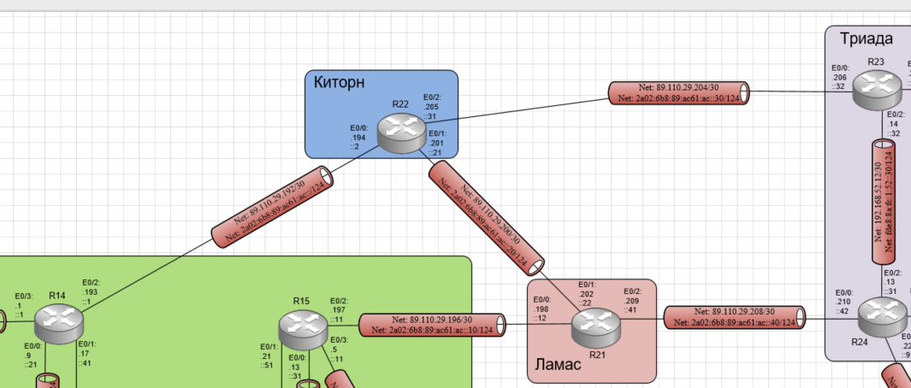
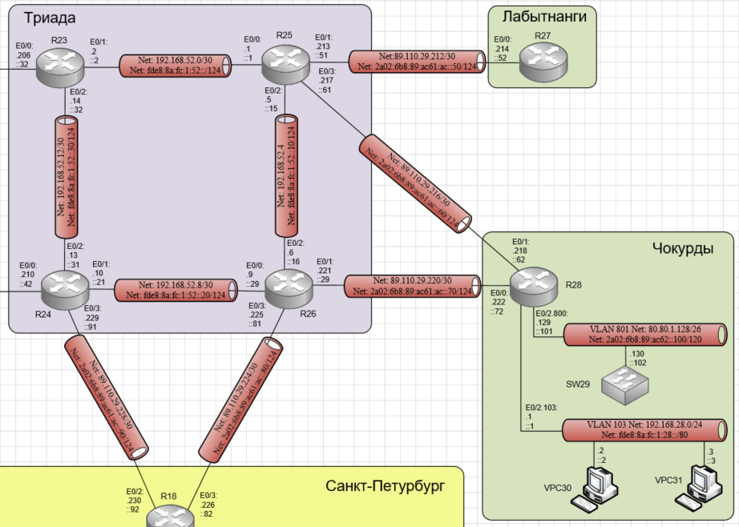
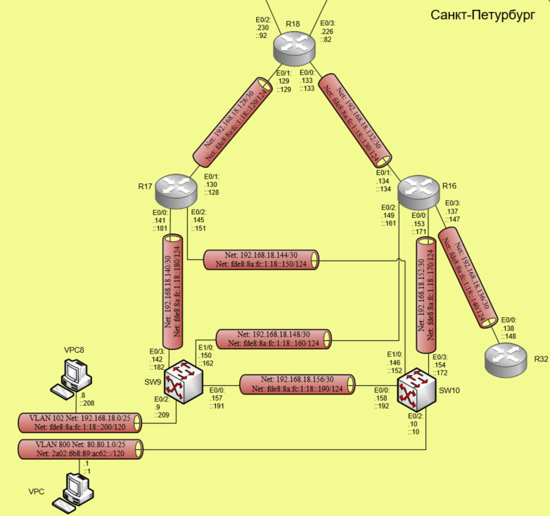

# Лабораторная работа №4 IPv4/6
#### Цель: 
Распланировать адресное пространство.
Настроить IP на всех активных портах для дальнейшей работы над проектом. Адресное пространство должно быть задокументировано.

## Топология

В ходе выполнения лабораторной работы необходимо настроить схему:



## Ход работы

Лабораторная работа разбита на 4 части:
1) Разработка и документирование адресного пространства для лабораторного стенда
2) Настройка ip адресов на всех активных портах
3) Настройка каждого VPC в каждом офисе в своем VLAN
4) Настройка VLAN управления для сетевых устройств

## Часть 1. Разработка и документирование адресного пространства для лабораторного стенда

### Таблица адресов

В ходе выполнения лабораторной работы было разработано адресное пространство, представленное в таблице:

| Устройство | Интерфейс  | Тип ip адреса   | IP адрес                   | Маска подсети/префикс ipv6 | Описание        |
| ---------- | -----------| ----------------|----------------------------|----------------------------|-----------------|
| **Москва**                                                                                                            |
| R14        | e0/0       | IPv4            | 192.168.10.9               | 255.255.255.252            | R14 - R12       |
|            |            | IPv6            | fde8:8a:fc:1:10:a3:0:21/124| fde8:8a:fc:1:10:a3:0:20/124| R14 - R12       |
|            |            | IPv6 Link-Local | fe80::14                   |                            | R14 - R12       |
|            | e0/1       | IPv4            | 192.168.10.17              | 255.255.255.252            | R14 - R13       |
|            |            | IPv6            | fde8:8a:fc:1:10:a3:0:41/124| fde8:8a:fc:1:10:a3:0:40/124| R14 - R13       |
|            |            | IPv6 Link-Local | fe80::14                   |                            | R14 - R13       |
|            | e0/2       | IPv4            | 89.110.29.193              | 255.255.255.252            | Киторн          |
|            |            | IPv6            | 2a02:6b8:89:ac61:ac::1/124 | 2a02:6b8:89:ac61:ac::/124  | Киторн          |
|            |            | IPv6 Link-Local | fe80::14                   |                            | Киторн          |
|            | e0/3       | IPv4            | 192.168.10.1               | 255.255.255.252            | R14 - R19       |
|            |            | IPv6            | fde8:8a:fc:1:10:a3:0:1/124 | fde8:8a:fc:1:10:a3:0:/124  | R14 - R19       |
|            |            | IPv6 Link-Local | fe80::14                   |                            | R14 - R19       |
| R15        | e0/0       | IPv4            | 192.168.10.13              | 255.255.255.252            | R15 - R13       |
|            |            | IPv6            | fde8:8a:fc:1:10:a3:0:31/124| fde8:8a:fc:1:10:a3:0:30/124| R15 - R13       |
|            |            | IPv6 Link-Local | fe80::15                   |                            | R15 - R13       |
|            | e0/1       | IPv4            | 192.168.10.21              | 255.255.255.252            | R15 - R12       |
|            |            | IPv6            | fde8:8a:fc:1:10:a3:0:51/124| fde8:8a:fc:1:10:a3:0:50/124| R15 - R12       |
|            |            | IPv6 Link-Local | fe80::15                   |                            | R15 - R12       |
|            | e0/2       | IPv4            | 89.110.29.197              | 255.255.255.252            | Ламас           |
|            |            | IPv6            | 2a02:6b8:89:ac61:ac::11/124| 2a02:6b8:89:ac61:ac::10/124| Ламас           |
|            |            | IPv6 Link-Local | fe80::15                   |                            | Ламас           |
|            | e0/3       | IPv4            | 192.168.10.5               | 255.255.255.252            | R15 - R20       |
|            |            | IPv6            | fde8:8a:fc:1:10:a3:0:11/124| fde8:8a:fc:1:10:a3:0:10/124| R15 - R20       |
|            |            | IPv6 Link-Local | fe80::15                   |                            | R15 - R20       |
| R19        | e0/0       | IPv4            | 192.168.10.2               | 255.255.255.252            | R19 - R14       |
|            |            | IPv6            | fde8:8a:fc:1:10:a3:0:2/124 | fde8:8a:fc:1:10:a3:0:/124  | R19 - R14       |
|            |            | IPv6 Link-Local | fe80::19                   |                            | R19 - R14       |
| R20        | e0/0       | IPv4            | 192.168.10.6               | 255.255.255.252            | R20 - R15       |
|            |            | IPv6            | fde8:8a:fc:1:10:a3:0:12/124| fde8:8a:fc:1:10:a3:0:10/124| R20 - R15       |
|            |            | IPv6 Link-Local | fe80::20                   |                            | R20 - R15       |
| R12        | e0/0       | IPv4            | 192.168.10.25              | 255.255.255.252            | R12 - SW4       |
|            |            | IPv6            | fde8:8a:fc:1:10:a3:0:61/124| fde8:8a:fc:1:10:a3:0:60/124| R12 - SW4       |
|            |            | IPv6 Link-Local | fe80::12                   |                            | R12 - SW4       |
|            | e0/1       | IPv4            | 192.168.10.29              | 255.255.255.252            | R12 - SW5       |
|            |            | IPv6            | fde8:8a:fc:1:10:a3:0:71/124| fde8:8a:fc:1:10:a3:0:70/124| R12 - SW5       |
|            |            | IPv6 Link-Local | fe80::12                   |                            | R12 - SW5       |
|            | e0/2       | IPv4            | 192.168.10.10              | 255.255.255.252            | R12 - R14       |
|            |            | IPv6            | fde8:8a:fc:1:10:a3:0:22/124| fde8:8a:fc:1:10:a3:0:20/124| R12 - R14       |
|            |            | IPv6 Link-Local | fe80::12                   |                            | R12 - R14       |
|            | e0/3       | IPv4            | 192.168.10.22              | 255.255.255.252            | R12 - R15       |
|            |            | IPv6            | fde8:8a:fc:1:10:a3:0:52/124| fde8:8a:fc:1:10:a3:0:50/124| R12 - R15       |
|            |            | IPv6 Link-Local | fe80::12                   |                            | R12 - R15       |
| R13        | e0/0       | IPv4            | 192.168.10.37              | 255.255.255.252            | R13 - SW5       |
|            |            | IPv6            | fde8:8a:fc:1:10:a3:0:91/124| fde8:8a:fc:1:10:a3:0:90/124| R13 - SW5       |
|            |            | IPv6 Link-Local | fe80::13                   |                            | R13 - SW5       |
|            | e0/1       | IPv4            | 192.168.10.33              | 255.255.255.252            | R13 - SW4       |
|            |            | IPv6            | fde8:8a:fc:1:10:a3:0:81/124| fde8:8a:fc:1:10:a3:0:80/124| R13 - SW4       |
|            |            | IPv6 Link-Local | fe80::13                   |                            | R13 - SW4       |
|            | e0/2       | IPv4            | 192.168.10.14              | 255.255.255.252            | R13 - R15       |
|            |            | IPv6            | fde8:8a:fc:1:10:a3:0:32/124| fde8:8a:fc:1:10:a3:0:30/124| R13 - R15       |
|            |            | IPv6 Link-Local | fe80::13                   |                            | R13 - R15       |
|            | e0/3       | IPv4            | 192.168.10.17              | 255.255.255.252            | R13 - R14       |
|            |            | IPv6            | fde8:8a:fc:1:10:a3:0:42/124| fde8:8a:fc:1:10:a3:0:40/124| R13 - R14       |
|            |            | IPv6 Link-Local | fe80::13                   |                            | R13 - R14       |
| SW4        | e1/0       | IPv4            | 192.168.10.26              | 255.255.255.252            | SW4 - R12       |
|            |            | IPv6            | fde8:8a:fc:1:10:a3:0:62/124| fde8:8a:fc:1:10:a3:0:60/124| SW4 - R12       |
|            |            | IPv6 Link-Local | fe80::4                    |                            | SW4 - R12       |
|            | e1/1       | IPv4            | 192.168.10.34              | 255.255.255.252            | SW4 - R13       |
|            |            | IPv6            | fde8:8a:fc:1:10:a3:0:82/124| fde8:8a:fc:1:10:a3:0:80/124| SW4 - R13       |
|            |            | IPv6 Link-Local | fe80::4                    |                            | SW4 - R13       |
|            | e0/0.100   | IPv4            | 192.168.10.130             | 255.255.255.192            | vlan 100 e0/0   |
|            |            | IPv6            | fde8:8a:fc:1:10:a1:0:4/96  | fde8:8a:fc:1:10:a1:0:0/96  | vlan 100 e0/0   |
|            |            | IPv6 Link-Local | fe80::4                    |                            | vlan 100 e0/0   |
|            | e0/0.802   | IPv4            | 80.80.1.195                | 255.255.255.192            | vlan 802 e0/0   |
|            |            | IPv6            | 2a02:6b8:89:ac62::204/120  | 2a02:6b8:89:ac62::200/120  | vlan 802 e0/0   |
|            |            | IPv6 Link-Local | fe80::4                    |                            | vlan 802 e0/0   |
|            | e0/1.101   | IPv4            | 192.168.10.194             | 255.255.255.192            | vlan 101 e0/1   |
|            |            | IPv6            | fde8:8a:fc:1:10:a2:0:4/96  | fde8:8a:fc:1:10:a2:0:0/96  | vlan 101 e0/1   |
|            |            | IPv6 Link-Local | fe80::4                    |                            | vlan 101 e0/1   |
| SW5        | e1/0       | IPv4            | 192.168.10.38              | 255.255.255.252            | SW5 - R13       |
|            |            | IPv6            | fde8:8a:fc:1:10:a3:0:92/124| fde8:8a:fc:1:10:a3:0:90/124| SW5 - R13       |
|            |            | IPv6 Link-Local | fe80::5                    |                            | SW5 - R13       |
|            | e1/1       | IPv4            | 192.168.10.30              | 255.255.255.252            | SW5 - R12       |
|            |            | IPv6            | fde8:8a:fc:1:10:a3:0:72/124| fde8:8a:fc:1:10:a3:0:70/124| SW5 - R12       |
|            |            | IPv6 Link-Local | fe80::5                    |                            | SW5 - R12       |
|            | e0/0.101   | IPv4            | 192.168.10.195             | 255.255.255.192            | vlan 101 e0/0   |
|            |            | IPv6            | fde8:8a:fc:1:10:a2:0:5/96  | fde8:8a:fc:1:10:a2:0:0/96  | vlan 101 e0/0   |
|            |            | IPv6 Link-Local | fe80::5                    |                            | vlan 101 e0/0   |
|            | e0/0.802   | IPv4            | 80.80.1.196                | 255.255.255.192            | vlan 802 e0/0   |
|            |            | IPv6            | 2a02:6b8:89:ac62::205/120  | 2a02:6b8:89:ac62::200/120  | vlan 802 e0/0   |
|            |            | IPv6 Link-Local | fe80::5                    |                            | vlan 802 e0/0   |
|            | e0/1.100   | IPv4            | 192.168.10.131             | 255.255.255.192            | vlan 100 e0/1   |
|            |            | IPv6            | fde8:8a:fc:1:10:a1:0:5/96  | fde8:8a:fc:1:10:a1:0:0/96  | vlan 100 e0/1   |
|            |            | IPv6 Link-Local | fe80::5                    |                            | vlan 100 e0/1   |
| SW3        | vlan 802   | IPv4            | 80.80.1.193                | 255.255.255.192            | vlan 802        |
|            |            | IPv6            | 2a02:6b8:89:ac62::203/120  | 2a02:6b8:89:ac62::200/120  | vlan 802        |
|            |            | IPv6 Link-Local | fe80::3                    |                            | vlan 802        |
| SW2        | vlan 802   | IPv4            | 80.80.1.194                | 255.255.255.192            | vlan 802        |
|            |            | IPv6            | 2a02:6b8:89:ac62::202/120  | 2a02:6b8:89:ac62::200/120  | vlan 802        |
|            |            | IPv6 Link-Local | fe80::2                    |                            | vlan 802        |
| VPC1       | eth0       | IPv4            | 192.168.10.129             | 255.255.255.192            |                 |
|            |            | IPv6            | fde8:8a:fc:1:10:a1:0:1/96  | fde8:8a:fc:1:10:a1:0:0/96  |                 |
|            |            | IPv6 Link-Local | fe80::1                    |                            |                 |
| VPC7       | eth0       | IPv4            | 192.168.10.193             | 255.255.255.192            |                 |
|            |            | IPv6            | fde8:8a:fc:1:10:a2:0:7/96  | fde8:8a:fc:1:10:a2:0:0/96  |                 |
|            |            | IPv6 Link-Local | fe80::7                    |                            |                 |
| **Киторн**                                                                                                            |
| R22        | e0/0       | IPv4            | 89.110.29.194              | 255.255.255.252            | Москву R14      |
|            |            | IPv6            | 2a02:6b8:89:ac61:ac::2/124 | 2a02:6b8:89:ac61:ac::/124  | Москву R14      |
|            |            | IPv6 Link-Local | fe80::22                   |                            | Москву R14      |
|            | e0/1       | IPv4            | 89.110.29.201              | 255.255.255.252            | Ламас           |
|            |            | IPv6            | 2a02:6b8:89:ac61:ac::21/124| 2a02:6b8:89:ac61:ac::20/124| Ламас           |
|            |            | IPv6 Link-Local | fe80::22                   |                            | Ламас           |
|            | e0/2       | IPv4            | 89.110.29.205              | 255.255.255.252            | Триада R23      |
|            |            | IPv6            | 2a02:6b8:89:ac61:ac::31/124| 2a02:6b8:89:ac61:ac::30/124| Триада R23      | 
|            |            | IPv6 Link-Local | fe80::22                   |                            | Триада R23      |
| **Ламас**                                                                                                             |
| R21        | e0/0       | IPv4            | 89.110.29.198              | 255.255.255.252            | Москву R15      |
|            |            | IPv6            | 2a02:6b8:89:ac61:ac::12/124| 2a02:6b8:89:ac61:ac::10/124| Москву R15      |
|            |            | IPv6 Link-Local | fe80::21                   |                            | Москву R15      |
|            | e0/1       | IPv4            | 89.110.29.202              | 255.255.255.252            | Киторн          |
|            |            | IPv6            | 2a02:6b8:89:ac61:ac::22/124| 2a02:6b8:89:ac61:ac::20/124| Киторн          |
|            |            | IPv6 Link-Local | fe80::21                   |                            | Киторн          | 
|            | e0/2       | IPv4            | 89.110.29.209              | 255.255.255.252            | Триада R24      |
|            |            | IPv6            | 2a02:6b8:89:ac61:ac::41/124| 2a02:6b8:89:ac61:ac::40/124| Триада R24      |
|            |            | IPv6 Link-Local | fe80::21                   |                            | Триада R24      |
| **Триада**                                                                                                            |
| R23        | e0/0       | IPv4            | 89.110.29.206              | 255.255.255.252            | Киторн          |
|            |            | IPv6            | 2a02:6b8:89:ac61:ac::32/124| 2a02:6b8:89:ac61:ac::30/124| Киторн          |
|            |            | IPv6 Link-Local | fe80::23                   |                            | Киторн          |
|            | e0/1       | IPv4            | 192.168.52.2               | 255.255.255.252            | R23 - R25       |
|            |            | IPv6            | fde8:8a:fc:1:52::2/124     | fde8:8a:fc:1:52::/124      | R23 - R25       |
|            |            | IPv6 Link-Local | fe80::23                   |                            | R23 - R25       |
|            | e0/2       | IPv4            | 192.168.52.14              | 255.255.255.252            | R23 - R24       |
|            |            | IPv6            | fde8:8a:fc:1:52::32/124    | fde8:8a:fc:1:52::30/124    | R23 - R24       |
|            |            | IPv6 Link-Local | fe80::23                   |                            | R23 - R24       |
| R24        | e0/0       | IPv4            | 89.110.29.210              | 255.255.255.252            | Ламас           |
|            |            | IPv6            | 2a02:6b8:89:ac61:ac::42/124| 2a02:6b8:89:ac61:ac::40/124| Ламас           |
|            |            | IPv6 Link-Local | fe80::24                   |                            | Ламас           |
|            | e0/1       | IPv4            | 192.168.52.10              | 255.255.255.252            | R24 - R26       |
|            |            | IPv6            | fde8:8a:fc:1:52::21/124    | fde8:8a:fc:1:52::20/124    | R24 - R26       |
|            |            | IPv6 Link-Local | fe80::24                   |                            | R24 - R26       |
|            | e0/2       | IPv4            | 192.168.52.13              | 255.255.255.252            | R24 - R23       |
|            |            | IPv6            | fde8:8a:fc:1:52::31/124    | fde8:8a:fc:1:52::30/124    | R24 - R23       |
|            |            | IPv6 Link-Local | fe80::24                   |                            | R24 - R23       |
|            | e0/3       | IPv4            | 89.110.29.229              | 255.255.255.252            | СПб R18         |
|            |            | IPv6            | 2a02:6b8:89:ac61:ac::91/124| 2a02:6b8:89:ac61:ac::90/124| СПб R18         |
|            |            | IPv6 Link-Local | fe80::24                   |                            | СПб R18         |
| R25        | e0/0       | IPv4            | 192.168.52.1               | 255.255.255.252            | R25 - R23       |
|            |            | IPv6            | fde8:8a:fc:1:52::1/124     | fde8:8a:fc:1:52::/124      | R25 - R23       |
|            |            | IPv6 Link-Local | fe80::25                   |                            | R25 - R23       |
|            | e0/1       | IPv4            | 89.110.29.213              | 255.255.255.252            | Лабытнанги R27  |
|            |            | IPv6            | 2a02:6b8:89:ac61:ac::51/124| 2a02:6b8:89:ac61:ac::50/124| Лабытнанги R27  |
|            |            | IPv6 Link-Local | fe80::25                   |                            | Лабытнанги R27  |
|            | e0/2       | IPv4            | 192.168.52.5               | 255.255.255.252            | R25 - R26       |
|            |            | IPv6            | fde8:8a:fc:1:52::15/124    | fde8:8a:fc:1:52::10/124    | R25 - R26       |
|            |            | IPv6 Link-Local | fe80::25                   |                            | R25 - R26       |
|            | e0/3       | IPv4            | 89.110.29.217              | 255.255.255.252            | Чокурдах R28    |
|            |            | IPv6            | 2a02:6b8:89:ac61:ac::61/124| 2a02:6b8:89:ac61:ac::60/124| Чокурдах R28    |
|            |            | IPv6 Link-Local | fe80::25                   |                            | Чокурдах R28    |
| R26        | e0/0       | IPv4            | 192.168.52.9               | 255.255.255.252            | R26 - R24       |
|            |            | IPv6            | fde8:8a:fc:1:52::29/124    | fde8:8a:fc:1:52::20/124    | R26 - R24       |
|            |            | IPv6 Link-Local | fe80::26                   |                            | R26 - R24       |
|            | e0/1       | IPv4            | 89.110.29.221              | 255.255.255.252            | Чокурдах R28    |
|            |            | IPv6            | 2a02:6b8:89:ac61:ac::71/124| 2a02:6b8:89:ac61:ac::70/124| Чокурдах R28    |
|            |            | IPv6 Link-Local | fe80::26                   |                            | Чокурдах R28    |
|            | e0/2       | IPv4            | 192.168.52.6               | 255.255.255.252            | R26 - R25       |
|            |            | IPv6            | fde8:8a:fc:1:52::16/124    | fde8:8a:fc:1:52::10/124    | R26 - R25       |
|            |            | IPv6 Link-Local | fe80::26                   |                            | R26 - R25       |
|            | e0/3       | IPv4            | 89.110.29.225              | 255.255.255.252            | СПб R18         |
|            |            | IPv6            | 2a02:6b8:89:ac61:ac::81/124| 2a02:6b8:89:ac61:ac::80/124| СПб R18         |
|            |            | IPv6 Link-Local | fe80::26                   |                            | СПб R18         |
| **Лабытнанги**                                                                                                        |
| R27        | e0/0       | IPv4            | 89.110.29.214              | 255.255.255.252            | Триада R25      |
|            |            | IPv6            | 2a02:6b8:89:ac61:ac::52/124| 2a02:6b8:89:ac61:ac::50/124| Триада R25      |
|            |            | IPv6 Link-Local | fe80::27                   |                            | Триада R25      |
| **Чокурдах**                                                                                                          |
| R28        | e0/0       | IPv4            | 89.110.29.222              | 255.255.255.252            | Триада R26      |
|            |            | IPv6            | 2a02:6b8:89:ac61:ac::72/124| 2a02:6b8:89:ac61:ac::70/124| Триада R26      |
|            |            | IPv6 Link-Local | fe80::28                   |                            | Триада R26      |
|            | e0/1       | IPv4            | 89.110.29.218              | 255.255.255.252            | Триада R25      |
|            |            | IPv6            | 2a02:6b8:89:ac61:ac::62/124| 2a02:6b8:89:ac61:ac::60/124| Триада R25      |
|            |            | IPv6 Link-Local | fe80::28                   |                            | Триада R25      |
|            | e0/2.103   | IPv4            | 192.168.28.1               | 255.255.255.0              | vlan 103 e0/2   |
|            |            | IPv6            | fde8:8a:fc:1:28::1/80      | fde8:8a:fc:1:28::/80       | vlan 103 e0/2   |
|            |            | IPv6 Link-Local | fe80::28                   |                            | vlan 103 e0/2   |
|            | e0/2.801   | IPv4            | 80.80.1.129                | 255.255.255.192            | vlan 801 e0/2   |
|            |            | IPv6            | 2a02:6b8:89:ac62::101/120  | 2a02:6b8:89:ac62::100/120  | vlan 801 e0/2   |
|            |            | IPv6 Link-Local | fe80::28                   |                            | vlan 801 e0/2   |
| SW29       | vlan 801   | IPv4            | 80.80.1.130                | 255.255.255.192            | vlan 801        |
|            |            | IPv6            | 2a02:6b8:89:ac62::102/120  | 2a02:6b8:89:ac62::100/120  | vlan 801        |
|            |            | IPv6 Link-Local | fe80::29                   |                            | vlan 801        |
| VPC30      | eth0       | IPv4            | 192.168.28.2               | 255.255.255.0              |                 |
|            |            | IPv6            | fde8:8a:fc:1:28::2/80      | fde8:8a:fc:1:28::/80       |                 |
|            |            | IPv6 Link-Local | fe80::30                   |                            |                 |
| VPC31      | eth0       | IPv4            | 192.168.28.3               | 255.255.255.0              |                 |
|            |            | IPv6            | fde8:8a:fc:1:28::3/80      | fde8:8a:fc:1:28::/80       |                 |
|            |            | IPv6 Link-Local | fe80::31                   |                            |                 |
| **Санкт-Петербург**                                                                                                   |
| R18        | e0/0       | IPv4            | 192.168.18.133             | 255.255.255.252            | R18 - R16       |
|            |            | IPv6            | fde8:8a:fc:1:18::133/124   | fde8:8a:fc:1:18::130/124   | R18 - R16       |
|            |            | IPv6 Link-Local | fe80::18                   |                            | R18 - R16       |
|            | e0/1       | IPv4            | 192.168.18.129             | 255.255.255.252            | R18 - R17       |
|            |            | IPv6            | fde8:8a:fc:1:18::129/124   | fde8:8a:fc:1:18::120/124   | R18 - R17       |
|            |            | IPv6 Link-Local | fe80::18                   |                            | R18 - R17       |
|            | e0/2       | IPv4            | 89.110.29.230              | 255.255.255.252            | Триада R24      |
|            |            | IPv6            | 2a02:6b8:89:ac61:ac::92/124| 2a02:6b8:89:ac61:ac::90/124| Триада R24      |
|            |            | IPv6 Link-Local | fe80::18                   |                            | Триада R24      |
|            | e0/3       | IPv4            | 89.110.29.226              | 255.255.255.252            | Триада R26      |
|            |            | IPv6            | 2a02:6b8:89:ac61:ac::82/124| 2a02:6b8:89:ac61:ac::80/124| Триада R26      |
|            |            | IPv6 Link-Local | fe80::18                   |                            | Триада R26      |
| R17        | e0/0       | IPv4            | 192.168.18.141             | 255.255.255.252            | R17 - SW9       |
|            |            | IPv6            | fde8:8a:fc:1:18::181/124   | fde8:8a:fc:1:18::180/124   | R17 - SW9       |
|            |            | IPv6 Link-Local | fe80::17                   |                            | R17 - SW9       |
|            | e0/1       | IPv4            | 192.168.18.130             | 255.255.255.252            | R17 - R18       |
|            |            | IPv6            | fde8:8a:fc:1:18::128/124   | fde8:8a:fc:1:18::120/124   | R17 - R18       |
|            |            | IPv6 Link-Local | fe80::17                   |                            | R17 - R18       |
|            | e0/2       | IPv4            | 192.168.18.145             | 255.255.255.252            | R17 - SW10      |
|            |            | IPv6            | fde8:8a:fc:1:18::151/124   | fde8:8a:fc:1:18::150/124   | R17 - SW10      |
|            |            | IPv6 Link-Local | fe80::17                   |                            | R17 - SW10      |
| R16        | e0/0       | IPv4            | 192.168.18.153             | 255.255.255.252            | R16 - SW10      |
|            |            | IPv6            | fde8:8a:fc:1:18::171/124   | fde8:8a:fc:1:18::170/124   | R16 - SW10      |
|            |            | IPv6 Link-Local | fe80::18                   |                            | R16 - SW10      |
|            | e0/1       | IPv4            | 192.168.18.134             | 255.255.255.252            | R16 - R18       |
|            |            | IPv6            | fde8:8a:fc:1:18::134/124   | fde8:8a:fc:1:18::130/124   | R16 - R18       |
|            |            | IPv6 Link-Local | fe80::18                   |                            | R16 - R18       |
|            | e0/2       | IPv4            | 192.168.18.149             | 255.255.255.252            | R16 - SW9       |
|            |            | IPv6            | fde8:8a:fc:1:18::161/124   | fde8:8a:fc:1:18::160/124   | R16 - SW9       |
|            |            | IPv6 Link-Local | fe80::18                   |                            | R16 - SW9       |
|            | e0/3       | IPv4            | 192.168.18.137             | 255.255.255.252            | R16 - R32       |
|            |            | IPv6            | fde8:8a:fc:1:18::147/124   | fde8:8a:fc:1:18::140/124   | R16 - R32       |
|            |            | IPv6 Link-Local | fe80::18                   |                            | R16 - R32       |
| R32        | e0/0       | IPv4            | 192.168.18.138             | 255.255.255.252            | R32 - R16       |
|            |            | IPv6            | fde8:8a:fc:1:18::148/124   | fde8:8a:fc:1:18::140/124   | R32 - R16       |
|            |            | IPv6 Link-Local | fe80::32                   |                            | R32 - R16       |
| SW9        | e0/2       | IPv4            | 192.168.18.9               | 255.255.255.128            | SW9 - VPC8      |
|            |            | IPv6            | fde8:8a:fc:1:18::209/120   | fde8:8a:fc:1:18::200/120   | SW9 - VPC8      |
|            |            | IPv6 Link-Local | fe80::9                    |                            | SW9 - VPC8      |
|            | e0/3       | IPv4            | 192.168.18.142             | 255.255.255.252            | SW9 - R17       |
|            |            | IPv6            | fde8:8a:fc:1:18::182/124   | fde8:8a:fc:1:18::180/124   | SW9 - R17       |
|            |            | IPv6 Link-Local | fe80::9                    |                            | SW9 - R17       |
|            | e1/0       | IPv4            | 192.168.18.150             | 255.255.255.252            | SW9 - R16       |
|            |            | IPv6            | fde8:8a:fc:1:18::162/124   | fde8:8a:fc:1:18::160/124   | SW9 - R16       |
|            |            | IPv6 Link-Local | fe80::9                    |                            | SW9 - R16       |
| SW10       | e0/2       | IPv4            | 80.80.1.10                 | 255.255.255.128            | SW10 - VPC      |
|            |            | IPv6            | 2a02:6b8:89:ac62::10/120   | 2a02:6b8:89:ac62::/120     | SW10 - VPC      |
|            |            | IPv6 Link-Local | fe80::10                   |                            | SW10 - VPC      |
|            | e0/3       | IPv4            | 192.168.18.154             | 255.255.255.252            | SW10 - R16      |
|            |            | IPv6            | fde8:8a:fc:1:18::172/124   | fde8:8a:fc:1:18::170/124   | SW10 - R16      |
|            |            | IPv6 Link-Local | fe80::10                   |                            | SW10 - R16      |
|            | e1/0       | IPv4            | 192.168.18.146             | 255.255.255.252            | SW10 - R17      |
|            |            | IPv6            | fde8:8a:fc:1:18::152/124   | fde8:8a:fc:1:18::150/124   | SW10 - R17      |
|            |            | IPv6 Link-Local | fe80::10                   |                            | SW10 - R17      |
| VPC8       | eth0       | IPv4            | 192.168.18.8               | 255.255.255.128            |                 |
|            |            | IPv6            | fde8:8a:fc:1:18::208/120   | fde8:8a:fc:1:18::200/120   |                 |
|            |            | IPv6 Link-Local | fe80::30                   |                            |                 |
| VPC        | eth0       | IPv4            | 80.80.1.1                  | 255.255.255.128            |                 |
|            |            | IPv6            | 2a02:6b8:89:ac62::1/120    | 2a02:6b8:89:ac62::/120     |                 |
|            |            | IPv6 Link-Local | fe80::31                   |                            |                 |


### Таблица подсетей

Информация о подсетях разработанных в хое лабораторной работы представленна в таблице:

| IP адрес подсети   | Маска подсети   | Префикс ipv6               |  Оборудование: интерфейсы          | Описание                           |
|--------------------|-----------------|----------------------------|------------------------------------| -----------------------------------|
| 192.168.21.0       | 255.255.255.0   | fde8:8a:fc:1:21::/80       | не используется                    | Внуренняя подсеть Ламас            |
| 192.168.22.0       | 255.255.255.0   | fde8:8a:fc:1:22::/80       | не используется                    | Внуренняя подсеть Киторн           |
| 192.168.27.0       | 255.255.255.0   | fde8:8a:fc:1:27::/80       | не используется                    | Внуренняя подсеть Лабытанги        |
| 192.168.28.0       | 255.255.255.0   | fde8:8a:fc:1:28::/80       | R28:e0/2; VPC30:eth0; VPC31:eth0   | Внуренняя подсеть Чокурды          |
| 192.168.52.0       | 255.255.255.0   | fde8:8a:fc:1:52::/80       | R23:e0/1-2; R24:e0/1-2;            | Внуренняя подсеть Триада           |
|                    |                 |                            | R25:e0/0-2; R26:e0/0-2             |                                    |
| 80.80.195.128      | 255.255.255.192 | 2a02:6b8:89:ac61:b1::/96   | не используется                    | Внешняя подсеть Триада             |
| 192.168.18.0       | 255.255.255.0   | fde8:8a:fc:1:18::/80       | R18:e0/0-1; R17:e0/0-2;            | Внуренняя подсеть СПб              |
|                    |                 |                            | R16:e0/0-3; R32:e0/0; VPC8:eth0;   |                                    |
|                    |                 |                            | SW9:e0/0,e0/2-3,e1/0;              |                                    |
|                    |                 |                            | SW10:e0/0,e0/3,e1/0                |                                    |
| 80.80.195.64       | 255.255.255.192 | 2a02:6b8:89:ac61:c1::/96   | не используется                    | Внешняя подсеть СПб                |
| 192.168.10.0       | 255.255.255.128 | fde8:8a:fc:1:10:a3:0:0/96  | R14:e0/0-1,e0/3; R19:e0/0;         | Внуренняя подсеть Москва           |
|                    |                 |                            | R15:e0/0-1,e0/3; R20:e0/0;         | (уровень распределения)            |
|                    |                 |                            | R12:e0/0-3; R13:e0/0-3;            |                                    |
|                    |                 |                            | SW4:e1/0-1,e0/2; SW5:e1/0-1,e0/2   |                                    |
| 192.168.10.128     | 255.255.255.192 | fde8:8a:fc:1:10:a1:0:0/96  | VPC1:eth0; SW4:e0/0.100;           | Внуренняя подсеть Москва (клиенты) |
|                    |                 |                            | SW5:e0/1.100                       |                                    |
| 192.168.10.192     | 255.255.255.192 | fde8:8a:fc:1:10:a2:0:0/96  | VPC7:eth0; SW4:e0/1.101;           | Внуренняя подсеть Москва (клиенты) |
|                    |                 |                            | SW5:e0/0.101                       |                                    |
| 80.80.195.0        | 255.255.255.192 | 2a02:6b8:89:ac61:a4::/96   | не используется                    | Внешняя подсеть Москва             |
| 80.80.1.0          | 255.255.255.0   | 2a02:6b8:89:ac62::/64      | SW10:e0/2; VPC:eth0; SW29: vlan801 | Подсеть управления                 |
|                    |                 |                            | R28:e0/2.801; SW2:vlan800;         |                                    |
|                    |                 |                            | SW3:vlan800; SW4:e0/0.802          |                                    |
|                    |                 |                            | SW5:e0/0.802                       |                                    |
| 80.80.195.192      | 255.255.255.192 | 2a02:6b8:89:ac61:ac::/96   | R14:e0/2; R15:e0/2; R22:e0/0-2;    | Подсеть внешних адресов            |
|                    |                 |                            | R23:e0/0; R21:e0/0-2;              |                                    |
|                    |                 |                            | R24:e0/0,e0/3; R25:e0/1,e0/3;      |                                    |
|                    |                 |                            | R26:e0/1,e0/3; R18:e0/2-3          |                                    |


### Таблица подсетей

Информация о подсетях разработанных в хое лабораторной работы представленна в таблице:

| VLAN      | IP адрес подсети | Маска подсети   | Префикс ipv6              |  Имя подсети    | Оборудование: интерфейсы         |
| ----------|------------------|-----------------|---------------------------|-----------------|----------------------------------| 
| 100       | 192.168.10.128   | 255.255.255.192 | fde8:8a:fc:1:10:a1:0:0/96 | MSK_Client1     | VPC1:eth0; SW4:e0/0; SW5:e0/1    |
| 101       | 192.168.10.192   | 255.255.255.192 | fde8:8a:fc:1:10:a2:0:0/96 | MSK_Client2     | VPC7:eth0; SW4:e0/1; SW5:e0/0    |
| 102       | 192.168.18.0     | 255.255.255.128 | fde8:8a:fc:1:18::200/120  | SPB_Client      | VPC8:eth0; SW9:e0/2              |
| 103       | 192.168.28.0     | 255.255.255.0   | fde8:8a:fc:1:28::/80      | Cho_Client      | VPC30:eth0; VPC31:eth0;          |
|           |                  |                 |                           |                 | R28:e0/2.103                     |
| 800       | 80.80.1.0        | 255.255.255.0   | 2a02:6b8:89:ac62::/64     | Management      | SW10:e0/2; VPC:eth0              |
| 801       | 80.80.1.128      | 255.255.255.192 | 2a02:6b8:89:ac62::100/120 | Management      | SW29:e0/2; R28:e0/2.801          |
| 802       | 80.80.1.192      | 255.255.255.192 | 2a02:6b8:89:ac62::200/120 | Management      | SW4:e0/0.802; SW5:e0/0.802;      |
|           |                  |                 |                           |                 | SW3:e0/0; SW2:e0/0               |
| 999       |                  |                 |                           | Parking_Lot     | все неиспользуемые порты         | 
| 1000      |                  |                 |                           | Native          | N/A                              |


### Схема лабораторного стенда

В ходе лабораторной работы была скорректированна топология:



В ходе лабораторной работы была разработана схема L3:



Более детальные изображения площадок:

**Москва**




**Киторн, Ламас и взаимодействие площадок**



**Триада, Лабытанги и Чокурдах**



**Санкт-Петербург**



### Описание схемы

Для Москвы предусмотрена внутренняя подсеть уровня распределения, в которой уровень L3 заканчивается на коммутаторах SW4 и SW5, ниже имет уровень доступа L2. На уровне доступа присутствует 2 подсети, VPC1 И VPC7 находятся в разных подсетях. 

Для Санкт-Петербурга предусмотрена внутренняя подсеть общая для всей площадки кроме VPC, который является АРМом Администратора и принадлежит подсети управления. В Санкт-Петербурге предусмотрен уровень L3 включая SW9 и SW10. 

Для площадок Киторн, Ламас и Лабытанги зарезервированны внутренние подсети.

Для площадок Москва, Санкт-Петербург и Триада зарезервированны внедшие подсети.

## Часть 2. Настройка ip адресов на всех активных портах

### Базовая настройка маршрутизаторов и коммутаторов

В качестве базовой настройки маршрутизаторов и коммутаторов необходимо: настроить имя, отключить DNS lookup, настроить пароль на вход в привелигерованный режим, настроить аутентификацию и пароль на вход через консоль, настроить аутентификацию и пароль при удаленном подключении, настроить хранение паролей в зашифрованном виде, создать баннер, установить время на маршрутизаторте/коммутаторе и сохраненить действующую конфигурацию в стартовую.

После базовой настройки в running-config появятся настройки:
```
service password-encryption
!
hostname <hostname>
!
!
enable password 7 <encrypted password>
!
clock timezone msk 3 0
!
no ip domain lookup
!
banner motd ^CAnyone accessing the device that unauthorized access is prohibited^C
!
line con 0
 password 7 <encrypted password>
 login
line vty 0 4
 password 7 <encrypted password>
 login
```

### Настройка ip адресов

На маршрутизаторах/коммутаторах L3 необходимо настроить ip адреса в соответствии с таблицей адресов и включить маршратизацию ipv6: 

```
interface <Тип и номер интерфейса>
 ip address <ipv4 адрес> <маска подсети>
 ipv6 address <ipv6 link-local адрес> link-local
 ipv6 address <ipv6 адрес>
 ipv6 unicast-routing
```

При необходимости на маршрутизаторах/коммутаторах L3 необходимо настроить сабинтерфейсы в соответствии с таблицей vlan и таблицей адресов:

```
interface <Тип и номер интерфейса>.<номер сабинтерфейса>
 description <имя vlan>
 encapsulation dot1Q <номер vlan>
 ip address <ipv4 адрес> <маска подсети>
 ipv6 address <ipv6 link-local адрес> link-local
 ipv6 address <ipv6 адрес>
```
На коммутаторах L2 необходимо настроить vlan в соответствии с таблицей vlan и таблицей адресов, при необходимости назначить ему ip адреса:

```
interface <номер vlan>
 description <имя vlan>
 ip address <ipv4 адрес> <маска подсети>
 ipv6 address <ipv6 link-local адрес> link-local
 ipv6 address <ipv6 адрес>
```

На коммутаторах L2 необходимо настроить интерфейсы доступа и назначить им vlan в сооветствии с таблицами:

```
interface <Тип и номер интерфейса>
 switchport mode access
 switchport access vlan <номер vlan>
```

На коммутаторах L2 необходимо настроить транк интерфейсы и назначить им vlan в сооветствии со схемой для линков направленных в сторону вышестоящих устройств, назначить 1000 vlan в качестве native:

```
interface <Тип и номер интерфейса>
 switchport trunk encapsulation dot1q
 switchport mode trunk
 switchport trunk allowed vlan <номера vlan>
 switchport trunk native vlan 1000
```

На коммутаторах L2 необходимо настроить маршратизацию ipv6: 

```
 ipv6 unicast-routing
```

На коммутаторах L2 необходимо настроить маршруты по умолчанию: 

```
ip route 0.0.0.0 0.0.0.0 <маска назначения> <ip адрес шлюза по умолчанию>
!
!
ipv6 route ::/0 <ipv6 адрес шлюза по умолчанию>
```

## Часть 3. Настройка каждого VPC в каждом офисе в своем VLAN

### Настройка каждого VPC 

На каждом VPC необходимо настроить ip адрес командой:

```
VPCS> ip <ipv4 адрес> <маска подсети> <шлюз по умолчанию>     
```

## Часть 4. Настройка VLAN управления для сетевых устройств

### Настройка VLAN управления для сетевых устройств 

На коммутаторах, маршрутизаторах и VPC необходимо настроить VLAN управления в соответствии с таблицами. Более подробно настройка vlan описана в части 2

Running config всех маршрутизаторов и коммутаторов хранятся в папках с названием площадок
