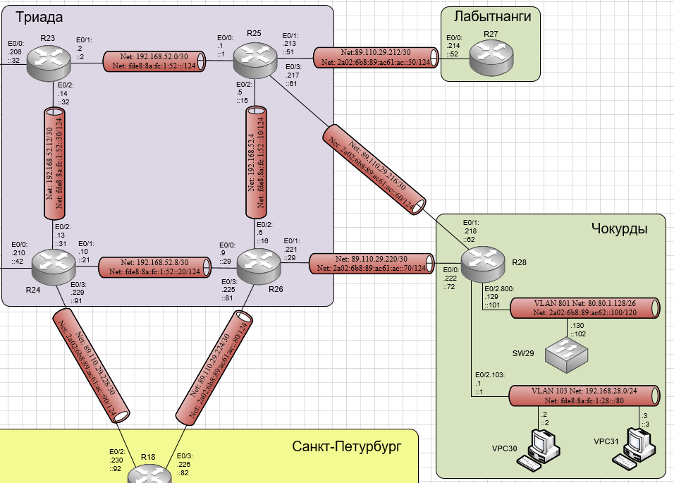

# Лабораторная работа №5 PBR

#### Цель: 

Настроить политику маршрутизации в офисе Чокурдах. Распределить трафик между 2 линками.

## Топология

Выполнение лабораторной работы будет происходить в созданной при выполнении лабораторной работы №4 схеме. При этом необходимо:
- Настроить политику маршрутизации для сетей офиса;
- Распределить трафик между двумя линками с провайдером;
- Настроить отслеживание линка через технологию IP SLA;
- Настройте для офиса Лабытнанги маршрут по-умолчанию.

Схема сети приведена ниже:




## Ход работы

Лабораторная работа разбита на 4 части:
1) Распределение трафика между двумя линками с провайдером
2) Настройка отслеживания линка через технологию IP SLA
3) Настройка для офиса Лабытнанги маршрута по-умолчанию

## Часть 1. Распределение трафика между двумя линками с провайдером

Необходимо глобально включить на маршрутизаторах и L3 комутаторах ospf, назначить router-id, перевести не участвующие в ospf интерфейсы в режим passive, включить на интерфейсах ospf ipv4 и ipv6.

В выводе running-config маршрутизаторов появятся настройки:

#### Маршрутизатор R14:

```

```


## Часть 2. Настройка отслеживания линка через технологию IP SLA

Необходимо глобально включить на маршрутизаторах и L3 комутаторах ospf, назначить router-id, перевести не участвующие в ospf интерфейсы в режим passive, включить на интерфейсах ospf ipv4 и ipv6.

В выводе running-config маршрутизаторов появятся настройки:

#### Маршрутизатор R14:

```

```


## Часть 3. Настройка для офиса Лабытнанги маршрута по-умолчанию

Необходимо настроить маршрут по умолчанию для ipv4 и ipv6 на маршрутизаторе R27.

В выводе running-config маршрутизаторов появятся настройки:

#### Маршрутизатор R27:

```
ip route 0.0.0.0 0.0.0.0 89.110.29.213
!
ipv6 route ::/0 2A02:6B8:89:AC61:AC::51
```


