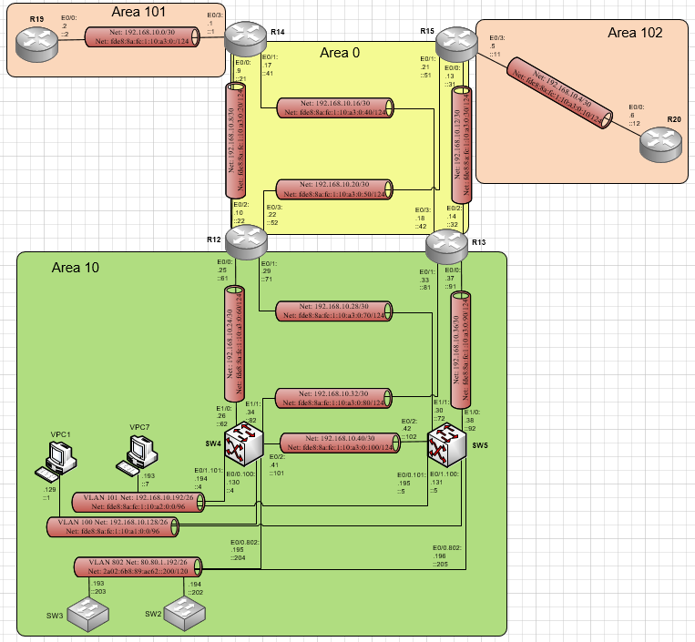

# Лабораторная работа №6 OSPF

#### Цель: 

Настроить OSPF офисе Москва. Разделить сеть на зоны. Настроить фильтрацию между зонами.

## Топология

Выполнение лабораторной работы будет происходить в созданной при выполнении лабораторной работы №4 схеме. При этом необходимо учесть:
- маршрутизаторы R14-R15 находятся в зоне 0 - backbone;
- маршрутизаторы R12-R13 находятся в зоне 10. Дополнительно к маршрутам должны получать маршрут по умолчанию;
- маршрутизатор R19 находится в зоне 101 и получает только маршрут по умолчанию;
- маршрутизатор R20 находится в зоне 102 и получает все маршруты, кроме маршрутов до сетей зоны 101;
- настройка для IPv6 повторяет логику IPv4.

В соответствии с приведенными выше требованиями схема ospf маршрутизации на площадке Москва будет выглядеть как на схеме ниже:



## Ход работы

Лабораторная работа разбита на 4 части:
1) Настройка ospf на маршрутизаторах и коммутаторах L3
2) Настройка распространения маршрута по умолчанию
3) Фильтрация для маршрутизаторов для зоны 101
4) Фильтрация для маршрутизаторов для зоны 102

## Часть 1. Настройка ospf на маршрутизаторах и коммутаторах L3

Необходимо глобально включить на маршрутизаторах и L3 комутаторах ospf, назначить router-id, перевести не участвующие в ospf интерфейсы в режим passive, включить на интерфейсах ospf ipv4 и ipv6.

В выводе running-config маршрутизаторов появятся настройки:

#### Маршрутизатор R14:

```
!
interface Ethernet0/0
 ip address 192.168.10.9 255.255.255.252
 ip ospf 1 area 0
 ipv6 address FE80::14 link-local
 ipv6 address FDE8:8A:FC:1:10:A3:0:21/124
 ipv6 ospf 1 area 0
!
interface Ethernet0/1
 ip address 192.168.10.17 255.255.255.252
 ip ospf 1 area 0
 ipv6 address FE80::14 link-local
 ipv6 address FDE8:8A:FC:1:10:A3:0:41/124
 ipv6 ospf 1 area 0
!
interface Ethernet0/2
 ip address 89.110.29.193 255.255.255.252
 ipv6 address FE80::14 link-local
 ipv6 address 2A02:6B8:89:AC61:AC::1/124
!
interface Ethernet0/3
 ip address 192.168.10.1 255.255.255.252
 ip ospf 1 area 101
 ipv6 address FE80::14 link-local
 ipv6 address FDE8:8A:FC:1:10:A3:0:1/124
 ipv6 ospf 1 area 101
!
router ospf 1
 router-id 14.14.14.14
 passive-interface Ethernet0/2
!
ipv6 router ospf 1
!
```

#### Маршрутизатор R15:

```
!
interface Ethernet0/0
 ip address 192.168.10.13 255.255.255.252
 ip ospf 1 area 0
 ipv6 address FE80::15 link-local
 ipv6 address FDE8:8A:FC:1:10:A3:0:31/124
 ipv6 ospf 1 area 0
!
interface Ethernet0/1
 ip address 192.168.10.21 255.255.255.252
 ip ospf 1 area 0
 ipv6 address FE80::15 link-local
 ipv6 address FDE8:8A:FC:1:10:A3:0:51/124
 ipv6 ospf 1 area 0
!
interface Ethernet0/2
 ip address 89.110.29.197 255.255.255.252
 ipv6 address FE80::15 link-local
 ipv6 address 2A02:6B8:89:AC61:AC::11/124
!
interface Ethernet0/3
 ip address 192.168.10.5 255.255.255.252
 ip ospf 1 area 102
 ipv6 address FE80::15 link-local
 ipv6 address FDE8:8A:FC:1:10:A3:0:11/124
 ipv6 ospf 1 area 102
!
router ospf 1
 router-id 15.15.15.15
 passive-interface Ethernet0/2
!
ipv6 router ospf 1
!
```

#### Маршрутизатор R12:

```
!
 ip address 192.168.10.25 255.255.255.252
 ip ospf 1 area 10
 ipv6 address FE80::12 link-local
 ipv6 address FDE8:8A:FC:1:10:A3:0:61/124
 ipv6 ospf 1 area 10
!
interface Ethernet0/1
 ip address 192.168.10.29 255.255.255.252
 ip ospf 1 area 10
 ipv6 address FE80::12 link-local
 ipv6 address FDE8:8A:FC:1:10:A3:0:71/124
 ipv6 ospf 1 area 10
!
interface Ethernet0/2
 ip address 192.168.10.10 255.255.255.252
 ip ospf 1 area 0
 ipv6 address FE80::12 link-local
 ipv6 address FDE8:8A:FC:1:10:A3:0:22/124
 ipv6 ospf 1 area 0
!
interface Ethernet0/3
 ip address 192.168.10.22 255.255.255.252
 ip ospf 1 area 0
 ipv6 address FE80::12 link-local
 ipv6 address FDE8:8A:FC:1:10:A3:0:52/124
 ipv6 ospf 1 area 0
!
router ospf 1
 router-id 12.12.12.12
 passive-interface Ethernet1/0
 passive-interface Ethernet1/1
 passive-interface Ethernet1/2
 passive-interface Ethernet1/3
!
ipv6 router ospf 1
!
```

#### Маршрутизатор R13:

```
!
interface Ethernet0/0
 ip address 192.168.10.37 255.255.255.252
 ip ospf 1 area 10
 ipv6 address FE80::13 link-local
 ipv6 address FDE8:8A:FC:1:10:A3:0:91/124
 ipv6 ospf 1 area 10
!
interface Ethernet0/1
 ip address 192.168.10.33 255.255.255.252
 ip ospf 1 area 10
 ipv6 address FE80::13 link-local
 ipv6 address FDE8:8A:FC:1:10:A3:0:81/124
 ipv6 ospf 1 area 10
!
interface Ethernet0/2
 ip address 192.168.10.14 255.255.255.252
 ip ospf 1 area 0
 ipv6 address FE80::13 link-local
 ipv6 address FDE8:8A:FC:1:10:A3:0:32/124
 ipv6 ospf 1 area 0
!
interface Ethernet0/3
 ip address 192.168.10.18 255.255.255.252
 ip ospf 1 area 0
 ipv6 address FE80::13 link-local
 ipv6 address FDE8:8A:FC:1:10:A3:0:42/124
 ipv6 ospf 1 area 0
!
router ospf 1
 router-id 13.13.13.13
 passive-interface Ethernet1/0
 passive-interface Ethernet1/1
 passive-interface Ethernet1/2
 passive-interface Ethernet1/3
!
ipv6 router ospf 1
!
```

#### Маршрутизатор R19:

```
!
interface Ethernet0/0
 ip address 192.168.10.2 255.255.255.252
 ip ospf 1 area 101
 ipv6 address FE80::19 link-local
 ipv6 address FDE8:8A:FC:1:10:A3:0:2/124
 ipv6 ospf 1 area 101
!
router ospf 1
 router-id 19.19.19.19
 passive-interface Ethernet0/1
 passive-interface Ethernet0/2
 passive-interface Ethernet0/3
!
ipv6 router ospf 1
!
```

#### Маршрутизатор R20:

```
!
interface Ethernet0/0
 ip address 192.168.10.6 255.255.255.252
 ip ospf 1 area 102
 ipv6 address FE80::20 link-local
 ipv6 address FDE8:8A:FC:1:10:A3:0:12/124
 ipv6 ospf 1 area 102
!
router ospf 1
 router-id 20.20.20.20
 passive-interface Ethernet0/1
 passive-interface Ethernet0/2
 passive-interface Ethernet0/3
!
ipv6 router ospf 1
!
```

#### L3 коммутатор SW4:

```
!
interface Ethernet0/0.100
 description MSK_Client1
 encapsulation dot1Q 100
 ip address 192.168.10.130 255.255.255.192
 ip ospf 1 area 10
 ipv6 address FE80::4 link-local
 ipv6 address FDE8:8A:FC:1:10:A1:0:4/96
 ipv6 ospf 1 area 10
!
interface Ethernet0/0.802
 description Management
 encapsulation dot1Q 802
 ip address 80.80.1.195 255.255.255.192
 ip ospf 1 area 10
 ipv6 address FE80::4 link-local
 ipv6 address 2A02:6B8:89:AC62::204/120
 ipv6 ospf 1 area 10
!
interface Ethernet0/1.101
 description MSK_Client2
 encapsulation dot1Q 101
 ip address 192.168.10.194 255.255.255.192
 ip ospf 1 area 10
 ipv6 address FE80::4 link-local
 ipv6 address FDE8:8A:FC:1:10:A2:0:4/96
 ipv6 ospf 1 area 10
!
interface Ethernet0/2
 ip address 192.168.10.41 255.255.255.252
 ip ospf 1 area 10
 ipv6 address FE80::4 link-local
 ipv6 address FDE8:8A:FC:1:10:A3:0:101/124
 ipv6 ospf 1 area 10
!
interface Ethernet1/0
 ip address 192.168.10.26 255.255.255.252
 ip ospf 1 area 10
 ipv6 address FE80::4 link-local
 ipv6 address FDE8:8A:FC:1:10:A3:0:62/124
 ipv6 ospf 1 area 10
!
interface Ethernet1/1
 ip address 192.168.10.34 255.255.255.252
 ip ospf 1 area 10
 ipv6 address FE80::4 link-local
 ipv6 address FDE8:8A:FC:1:10:A3:0:82/124
 ipv6 ospf 1 area 10
!
router ospf 1
 router-id 4.4.4.4
 passive-interface Ethernet0/0
 passive-interface Ethernet0/1
 passive-interface Ethernet0/3
 passive-interface Ethernet1/2
 passive-interface Ethernet1/3
!
ipv6 router ospf 1
```

#### L3 коммутатор SW5:

```
!
interface Ethernet0/0.101
 description MSK_Client2
 encapsulation dot1Q 101
 ip address 192.168.10.195 255.255.255.192
 ip ospf 1 area 10
 ipv6 address FE80::5 link-local
 ipv6 address FDE8:8A:FC:1:10:A2:0:5/96
 ipv6 ospf 1 area 10
!
interface Ethernet0/0.802
 encapsulation dot1Q 802
 ip address 80.80.1.196 255.255.255.192
 ip ospf 1 area 10
 ipv6 address FE80::5 link-local
 ipv6 address 2A02:6B8:89:AC62::205/120
 ipv6 ospf 1 area 10
!
interface Ethernet0/1.100
 description MSK_Client1
 encapsulation dot1Q 100
 ip address 192.168.10.131 255.255.255.192
 ip ospf 1 area 10
 ipv6 address FE80::5 link-local
 ipv6 address FDE8:8A:FC:1:10:A1:0:5/96
 ipv6 ospf 1 area 10
!
interface Ethernet0/2
 ip address 192.168.10.42 255.255.255.252
 ip ospf 1 area 10
 ipv6 address FE80::5 link-local
 ipv6 address FDE8:8A:FC:1:10:A3:0:102/124
 ipv6 ospf 1 area 10
!
interface Ethernet1/0
 ip address 192.168.10.38 255.255.255.252
 ip ospf 1 area 10
 ipv6 address FE80::5 link-local
 ipv6 address FDE8:8A:FC:1:10:A3:0:92/124
 ipv6 ospf 1 area 10
!
interface Ethernet1/1
 ip address 192.168.10.30 255.255.255.252
 ip ospf 1 area 10
 ipv6 address FE80::5 link-local
 ipv6 address FDE8:8A:FC:1:10:A3:0:72/124
 ipv6 ospf 1 area 10
!
router ospf 1
 router-id 5.5.5.5
 passive-interface Ethernet0/0
 passive-interface Ethernet0/1
 passive-interface Ethernet0/3
 passive-interface Ethernet1/2
 passive-interface Ethernet1/3
!
ipv6 router ospf 1
!
```

Чтобы проверить, что АСО видят соседей, получают маршруты и их взаимодействие настроено корректно необходимо ввести show ip ospf neighbors, show ip route ospf, show ipv6 route ospf, show ip protocols:

#### Маршрутизатор R14:

```
R14#show ip ospf neighbor 

Neighbor ID     Pri   State           Dead Time   Address         Interface
13.13.13.13       1   FULL/BDR        00:00:30    192.168.10.18   Ethernet0/1
12.12.12.12       1   FULL/BDR        00:00:34    192.168.10.10   Ethernet0/0
19.19.19.19       1   FULL/DR         00:00:38    192.168.10.2    Ethernet0/3
R14#show ip route ospf
Codes: L - local, C - connected, S - static, R - RIP, M - mobile, B - BGP
       D - EIGRP, EX - EIGRP external, O - OSPF, IA - OSPF inter area 
       N1 - OSPF NSSA external type 1, N2 - OSPF NSSA external type 2
       E1 - OSPF external type 1, E2 - OSPF external type 2
       i - IS-IS, su - IS-IS summary, L1 - IS-IS level-1, L2 - IS-IS level-2
       ia - IS-IS inter area, * - candidate default, U - per-user static route
       o - ODR, P - periodic downloaded static route, H - NHRP, l - LISP
       a - application route
       + - replicated route, % - next hop override

Gateway of last resort is not set

      80.0.0.0/26 is subnetted, 1 subnets
O IA     80.80.1.192 [110/30] via 192.168.10.18, 00:45:04, Ethernet0/1
                     [110/30] via 192.168.10.10, 00:45:04, Ethernet0/0
      192.168.10.0/24 is variably subnetted, 16 subnets, 3 masks
O IA     192.168.10.4/30 [110/30] via 192.168.10.18, 01:43:48, Ethernet0/1
                         [110/30] via 192.168.10.10, 01:47:32, Ethernet0/0
O        192.168.10.12/30 [110/20] via 192.168.10.18, 01:43:48, Ethernet0/1
O        192.168.10.20/30 [110/20] via 192.168.10.10, 01:47:42, Ethernet0/0
O IA     192.168.10.24/30 [110/20] via 192.168.10.10, 01:47:42, Ethernet0/0
O IA     192.168.10.28/30 [110/20] via 192.168.10.10, 01:47:42, Ethernet0/0
O IA     192.168.10.32/30 [110/20] via 192.168.10.18, 01:43:48, Ethernet0/1
O IA     192.168.10.36/30 [110/20] via 192.168.10.18, 01:43:48, Ethernet0/1
O IA     192.168.10.40/30 [110/30] via 192.168.10.18, 01:43:48, Ethernet0/1
                          [110/30] via 192.168.10.10, 01:47:42, Ethernet0/0
O IA     192.168.10.128/26 [110/30] via 192.168.10.18, 00:45:21, Ethernet0/1
                           [110/30] via 192.168.10.10, 00:45:21, Ethernet0/0
O IA     192.168.10.192/26 [110/30] via 192.168.10.18, 00:45:43, Ethernet0/1
                           [110/30] via 192.168.10.10, 00:45:43, Ethernet0/0
R14#show ipv6 route ospf
IPv6 Routing Table - default - 20 entries
Codes: C - Connected, L - Local, S - Static, U - Per-user Static route
       B - BGP, HA - Home Agent, MR - Mobile Router, R - RIP
       H - NHRP, I1 - ISIS L1, I2 - ISIS L2, IA - ISIS interarea
       IS - ISIS summary, D - EIGRP, EX - EIGRP external, NM - NEMO
       ND - ND Default, NDp - ND Prefix, DCE - Destination, NDr - Redirect
       O - OSPF Intra, OI - OSPF Inter, OE1 - OSPF ext 1, OE2 - OSPF ext 2
       ON1 - OSPF NSSA ext 1, ON2 - OSPF NSSA ext 2, la - LISP alt
       lr - LISP site-registrations, ld - LISP dyn-eid, a - Application
OI  2A02:6B8:89:AC62::200/120 [110/30]
     via FE80::13, Ethernet0/1
     via FE80::12, Ethernet0/0
OI  FDE8:8A:FC:1:10:A1::/96 [110/30]
     via FE80::13, Ethernet0/1
     via FE80::12, Ethernet0/0
OI  FDE8:8A:FC:1:10:A2::/96 [110/30]
     via FE80::13, Ethernet0/1
     via FE80::12, Ethernet0/0
OI  FDE8:8A:FC:1:10:A3:0:10/124 [110/30]
     via FE80::12, Ethernet0/0
     via FE80::13, Ethernet0/1
O   FDE8:8A:FC:1:10:A3:0:30/124 [110/20]
     via FE80::13, Ethernet0/1
O   FDE8:8A:FC:1:10:A3:0:50/124 [110/20]
     via FE80::12, Ethernet0/0
OI  FDE8:8A:FC:1:10:A3:0:60/124 [110/20]
     via FE80::12, Ethernet0/0
OI  FDE8:8A:FC:1:10:A3:0:70/124 [110/20]
     via FE80::12, Ethernet0/0
OI  FDE8:8A:FC:1:10:A3:0:80/124 [110/20]
     via FE80::13, Ethernet0/1
OI  FDE8:8A:FC:1:10:A3:0:90/124 [110/20]
     via FE80::13, Ethernet0/1
OI  FDE8:8A:FC:1:10:A3:0:100/124 [110/30]
     via FE80::12, Ethernet0/0
     via FE80::13, Ethernet0/1
R14# show ip protocols
*** IP Routing is NSF aware ***

Routing Protocol is "application"
  Sending updates every 0 seconds
  Invalid after 0 seconds, hold down 0, flushed after 0
  Outgoing update filter list for all interfaces is not set
  Incoming update filter list for all interfaces is not set
  Maximum path: 32
  Routing for Networks:
  Routing Information Sources:
    Gateway         Distance      Last Update
  Distance: (default is 4)

Routing Protocol is "ospf 1"
  Outgoing update filter list for all interfaces is not set
  Incoming update filter list for all interfaces is not set
  Router ID 14.14.14.14
  It is an area border router
  Number of areas in this router is 2. 2 normal 0 stub 0 nssa
  Maximum path: 4
  Routing for Networks:
  Routing on Interfaces Configured Explicitly (Area 0):
    Ethernet0/1
    Ethernet0/0
  Routing on Interfaces Configured Explicitly (Area 101):
    Ethernet0/3
  Passive Interface(s):
    Ethernet0/2
  Routing Information Sources:
    Gateway         Distance      Last Update
    13.13.13.13          110      00:46:00
    12.12.12.12          110      00:46:00
    15.15.15.15          110      01:44:44
  Distance: (default is 110)
```

#### Маршрутизатор R15:

```
R15#show ip ospf neighbor 

Neighbor ID     Pri   State           Dead Time   Address         Interface
12.12.12.12       1   FULL/BDR        00:00:39    192.168.10.22   Ethernet0/1
13.13.13.13       1   FULL/BDR        00:00:38    192.168.10.14   Ethernet0/0
20.20.20.20       1   FULL/DR         00:00:33    192.168.10.6    Ethernet0/3
R15#show ip route ospf
Codes: L - local, C - connected, S - static, R - RIP, M - mobile, B - BGP
       D - EIGRP, EX - EIGRP external, O - OSPF, IA - OSPF inter area 
       N1 - OSPF NSSA external type 1, N2 - OSPF NSSA external type 2
       E1 - OSPF external type 1, E2 - OSPF external type 2
       i - IS-IS, su - IS-IS summary, L1 - IS-IS level-1, L2 - IS-IS level-2
       ia - IS-IS inter area, * - candidate default, U - per-user static route
       o - ODR, P - periodic downloaded static route, H - NHRP, l - LISP
       a - application route
       + - replicated route, % - next hop override

Gateway of last resort is not set

      80.0.0.0/26 is subnetted, 1 subnets
O IA     80.80.1.192 [110/30] via 192.168.10.22, 00:47:35, Ethernet0/1
                     [110/30] via 192.168.10.14, 00:47:35, Ethernet0/0
      192.168.10.0/24 is variably subnetted, 16 subnets, 3 masks
O IA     192.168.10.0/30 [110/30] via 192.168.10.22, 01:50:08, Ethernet0/1
                         [110/30] via 192.168.10.14, 01:46:19, Ethernet0/0
O        192.168.10.8/30 [110/20] via 192.168.10.22, 01:50:08, Ethernet0/1
O        192.168.10.16/30 [110/20] via 192.168.10.14, 01:46:19, Ethernet0/0
O IA     192.168.10.24/30 [110/20] via 192.168.10.22, 01:50:08, Ethernet0/1
O IA     192.168.10.28/30 [110/20] via 192.168.10.22, 01:50:08, Ethernet0/1
O IA     192.168.10.32/30 [110/20] via 192.168.10.14, 01:50:08, Ethernet0/0
O IA     192.168.10.36/30 [110/20] via 192.168.10.14, 01:50:08, Ethernet0/0
O IA     192.168.10.40/30 [110/30] via 192.168.10.22, 01:50:08, Ethernet0/1
                          [110/30] via 192.168.10.14, 01:50:08, Ethernet0/0
O IA     192.168.10.128/26 [110/30] via 192.168.10.22, 00:47:52, Ethernet0/1
                           [110/30] via 192.168.10.14, 00:47:52, Ethernet0/0
O IA     192.168.10.192/26 [110/30] via 192.168.10.22, 00:48:15, Ethernet0/1
                           [110/30] via 192.168.10.14, 00:48:15, Ethernet0/0
R15#show ipv6 route ospf
IPv6 Routing Table - default - 20 entries
Codes: C - Connected, L - Local, S - Static, U - Per-user Static route
       B - BGP, HA - Home Agent, MR - Mobile Router, R - RIP
       H - NHRP, I1 - ISIS L1, I2 - ISIS L2, IA - ISIS interarea
       IS - ISIS summary, D - EIGRP, EX - EIGRP external, NM - NEMO
       ND - ND Default, NDp - ND Prefix, DCE - Destination, NDr - Redirect
       O - OSPF Intra, OI - OSPF Inter, OE1 - OSPF ext 1, OE2 - OSPF ext 2
       ON1 - OSPF NSSA ext 1, ON2 - OSPF NSSA ext 2, la - LISP alt
       lr - LISP site-registrations, ld - LISP dyn-eid, a - Application
OI  2A02:6B8:89:AC62::200/120 [110/30]
     via FE80::13, Ethernet0/0
     via FE80::12, Ethernet0/1
OI  FDE8:8A:FC:1:10:A1::/96 [110/30]
     via FE80::13, Ethernet0/0
     via FE80::12, Ethernet0/1
OI  FDE8:8A:FC:1:10:A2::/96 [110/30]
     via FE80::13, Ethernet0/0
     via FE80::12, Ethernet0/1
OI  FDE8:8A:FC:1:10:A3::/124 [110/30]
     via FE80::12, Ethernet0/1
     via FE80::13, Ethernet0/0
O   FDE8:8A:FC:1:10:A3:0:20/124 [110/20]
     via FE80::12, Ethernet0/1
O   FDE8:8A:FC:1:10:A3:0:40/124 [110/20]
     via FE80::13, Ethernet0/0
OI  FDE8:8A:FC:1:10:A3:0:60/124 [110/20]
     via FE80::12, Ethernet0/1
OI  FDE8:8A:FC:1:10:A3:0:70/124 [110/20]
     via FE80::12, Ethernet0/1
OI  FDE8:8A:FC:1:10:A3:0:80/124 [110/20]
     via FE80::13, Ethernet0/0
OI  FDE8:8A:FC:1:10:A3:0:90/124 [110/20]
     via FE80::13, Ethernet0/0
OI  FDE8:8A:FC:1:10:A3:0:100/124 [110/30]
     via FE80::13, Ethernet0/0
     via FE80::12, Ethernet0/1
R15#show ip protocols
*** IP Routing is NSF aware ***

Routing Protocol is "application"
  Sending updates every 0 seconds
  Invalid after 0 seconds, hold down 0, flushed after 0
  Outgoing update filter list for all interfaces is not set
  Incoming update filter list for all interfaces is not set
  Maximum path: 32
  Routing for Networks:
  Routing Information Sources:
    Gateway         Distance      Last Update
  Distance: (default is 4)

Routing Protocol is "ospf 1"
  Outgoing update filter list for all interfaces is not set
  Incoming update filter list for all interfaces is not set
  Router ID 15.15.15.15
  It is an area border router
  Number of areas in this router is 2. 2 normal 0 stub 0 nssa
  Maximum path: 4
  Routing for Networks:
  Routing on Interfaces Configured Explicitly (Area 0):
    Ethernet0/1
    Ethernet0/0
  Routing on Interfaces Configured Explicitly (Area 102):
    Ethernet0/3
  Passive Interface(s):
    Ethernet0/2
  Routing Information Sources:
    Gateway         Distance      Last Update
    12.12.12.12          110      00:47:49
    14.14.14.14          110      01:46:33
    13.13.13.13          110      00:47:49
  Distance: (default is 110)
```

#### Маршрутизатор R12:

```
R12#show ip ospf neighbor 

Neighbor ID     Pri   State           Dead Time   Address         Interface
15.15.15.15       1   FULL/DR         00:00:31    192.168.10.21   Ethernet0/3
14.14.14.14       1   FULL/DR         00:00:36    192.168.10.9    Ethernet0/2
5.5.5.5           1   FULL/BDR        00:00:33    192.168.10.30   Ethernet0/1
4.4.4.4           1   FULL/BDR        00:00:33    192.168.10.26   Ethernet0/0
R12#show ip route ospf
Codes: L - local, C - connected, S - static, R - RIP, M - mobile, B - BGP
       D - EIGRP, EX - EIGRP external, O - OSPF, IA - OSPF inter area 
       N1 - OSPF NSSA external type 1, N2 - OSPF NSSA external type 2
       E1 - OSPF external type 1, E2 - OSPF external type 2
       i - IS-IS, su - IS-IS summary, L1 - IS-IS level-1, L2 - IS-IS level-2
       ia - IS-IS inter area, * - candidate default, U - per-user static route
       o - ODR, P - periodic downloaded static route, H - NHRP, l - LISP
       a - application route
       + - replicated route, % - next hop override

Gateway of last resort is not set

      80.0.0.0/26 is subnetted, 1 subnets
O        80.80.1.192 [110/20] via 192.168.10.30, 00:38:20, Ethernet0/1
                     [110/20] via 192.168.10.26, 00:48:34, Ethernet0/0
      192.168.10.0/24 is variably subnetted, 17 subnets, 3 masks
O IA     192.168.10.0/30 [110/20] via 192.168.10.9, 01:51:13, Ethernet0/2
O IA     192.168.10.4/30 [110/20] via 192.168.10.21, 01:51:13, Ethernet0/3
O        192.168.10.12/30 [110/20] via 192.168.10.21, 01:51:13, Ethernet0/3
O        192.168.10.16/30 [110/20] via 192.168.10.9, 01:51:13, Ethernet0/2
O        192.168.10.32/30 [110/20] via 192.168.10.26, 01:51:03, Ethernet0/0
O        192.168.10.36/30 [110/20] via 192.168.10.30, 01:51:03, Ethernet0/1
O        192.168.10.40/30 [110/20] via 192.168.10.30, 01:51:03, Ethernet0/1
                          [110/20] via 192.168.10.26, 01:51:03, Ethernet0/0
O        192.168.10.128/26 [110/20] via 192.168.10.30, 00:38:39, Ethernet0/1
                           [110/20] via 192.168.10.26, 00:48:51, Ethernet0/0
O        192.168.10.192/26 [110/20] via 192.168.10.30, 00:39:18, Ethernet0/1
                           [110/20] via 192.168.10.26, 00:49:13, Ethernet0/0
R12#show ipv6 route ospf
IPv6 Routing Table - default - 19 entries
Codes: C - Connected, L - Local, S - Static, U - Per-user Static route
       B - BGP, HA - Home Agent, MR - Mobile Router, R - RIP
       H - NHRP, I1 - ISIS L1, I2 - ISIS L2, IA - ISIS interarea
       IS - ISIS summary, D - EIGRP, EX - EIGRP external, NM - NEMO
       ND - ND Default, NDp - ND Prefix, DCE - Destination, NDr - Redirect
       O - OSPF Intra, OI - OSPF Inter, OE1 - OSPF ext 1, OE2 - OSPF ext 2
       ON1 - OSPF NSSA ext 1, ON2 - OSPF NSSA ext 2, la - LISP alt
       lr - LISP site-registrations, ld - LISP dyn-eid, a - Application
O   2A02:6B8:89:AC62::200/120 [110/20]
     via FE80::4, Ethernet0/0
     via FE80::5, Ethernet0/1
O   FDE8:8A:FC:1:10:A1::/96 [110/20]
     via FE80::4, Ethernet0/0
     via FE80::5, Ethernet0/1
O   FDE8:8A:FC:1:10:A2::/96 [110/20]
     via FE80::4, Ethernet0/0
     via FE80::5, Ethernet0/1
OI  FDE8:8A:FC:1:10:A3::/124 [110/20]
     via FE80::14, Ethernet0/2
OI  FDE8:8A:FC:1:10:A3:0:10/124 [110/20]
     via FE80::15, Ethernet0/3
O   FDE8:8A:FC:1:10:A3:0:30/124 [110/20]
     via FE80::15, Ethernet0/3
O   FDE8:8A:FC:1:10:A3:0:40/124 [110/20]
     via FE80::14, Ethernet0/2
O   FDE8:8A:FC:1:10:A3:0:80/124 [110/20]
     via FE80::4, Ethernet0/0
O   FDE8:8A:FC:1:10:A3:0:90/124 [110/20]
     via FE80::5, Ethernet0/1
O   FDE8:8A:FC:1:10:A3:0:100/124 [110/20]
     via FE80::4, Ethernet0/0
     via FE80::5, Ethernet0/1
R12#show ip protocols
*** IP Routing is NSF aware ***

Routing Protocol is "application"
  Sending updates every 0 seconds
  Invalid after 0 seconds, hold down 0, flushed after 0
  Outgoing update filter list for all interfaces is not set
  Incoming update filter list for all interfaces is not set
  Maximum path: 32
  Routing for Networks:
  Routing Information Sources:
    Gateway         Distance      Last Update
  Distance: (default is 4)

Routing Protocol is "ospf 1"
  Outgoing update filter list for all interfaces is not set
  Incoming update filter list for all interfaces is not set
  Router ID 12.12.12.12
  It is an area border router
  Number of areas in this router is 2. 2 normal 0 stub 0 nssa
  Maximum path: 4
  Routing for Networks:
  Routing on Interfaces Configured Explicitly (Area 0):
    Ethernet0/3
    Ethernet0/2
  Routing on Interfaces Configured Explicitly (Area 10):
    Ethernet0/1
    Ethernet0/0
  Passive Interface(s):
    Ethernet1/0
    Ethernet1/1
    Ethernet1/2
    Ethernet1/3
  Routing Information Sources:
    Gateway         Distance      Last Update
    5.5.5.5              110      00:38:35
    13.13.13.13          110      00:51:24
    15.15.15.15          110      01:51:28
    14.14.14.14          110      01:51:28
    4.4.4.4              110      00:38:54
  Distance: (default is 110)
```

#### Маршрутизатор R13:

```
R13#show ip ospf neighbor 

Neighbor ID     Pri   State           Dead Time   Address         Interface
14.14.14.14       1   FULL/DR         00:00:35    192.168.10.17   Ethernet0/3
15.15.15.15       1   FULL/DR         00:00:32    192.168.10.13   Ethernet0/2
4.4.4.4           1   FULL/BDR        00:00:38    192.168.10.34   Ethernet0/1
5.5.5.5           1   FULL/BDR        00:00:34    192.168.10.38   Ethernet0/0
R13#show ip route ospf
Codes: L - local, C - connected, S - static, R - RIP, M - mobile, B - BGP
       D - EIGRP, EX - EIGRP external, O - OSPF, IA - OSPF inter area 
       N1 - OSPF NSSA external type 1, N2 - OSPF NSSA external type 2
       E1 - OSPF external type 1, E2 - OSPF external type 2
       i - IS-IS, su - IS-IS summary, L1 - IS-IS level-1, L2 - IS-IS level-2
       ia - IS-IS inter area, * - candidate default, U - per-user static route
       o - ODR, P - periodic downloaded static route, H - NHRP, l - LISP
       a - application route
       + - replicated route, % - next hop override

Gateway of last resort is not set

      80.0.0.0/26 is subnetted, 1 subnets
O        80.80.1.192 [110/20] via 192.168.10.38, 00:39:15, Ethernet0/0
                     [110/20] via 192.168.10.34, 00:49:28, Ethernet0/1
      192.168.10.0/24 is variably subnetted, 17 subnets, 3 masks
O IA     192.168.10.0/30 [110/20] via 192.168.10.17, 01:48:12, Ethernet0/3
O IA     192.168.10.4/30 [110/20] via 192.168.10.13, 01:52:04, Ethernet0/2
O        192.168.10.8/30 [110/20] via 192.168.10.17, 01:48:12, Ethernet0/3
O        192.168.10.20/30 [110/20] via 192.168.10.13, 01:52:04, Ethernet0/2
O        192.168.10.24/30 [110/20] via 192.168.10.34, 01:52:04, Ethernet0/1
O        192.168.10.28/30 [110/20] via 192.168.10.38, 01:51:54, Ethernet0/0
O        192.168.10.40/30 [110/20] via 192.168.10.38, 01:51:54, Ethernet0/0
                          [110/20] via 192.168.10.34, 01:51:54, Ethernet0/1
O        192.168.10.128/26 [110/20] via 192.168.10.38, 00:39:33, Ethernet0/0
                           [110/20] via 192.168.10.34, 00:49:45, Ethernet0/1
O        192.168.10.192/26 [110/20] via 192.168.10.38, 00:40:12, Ethernet0/0
                           [110/20] via 192.168.10.34, 00:50:08, Ethernet0/1
R13#show ipv6 route ospf
IPv6 Routing Table - default - 19 entries
Codes: C - Connected, L - Local, S - Static, U - Per-user Static route
       B - BGP, HA - Home Agent, MR - Mobile Router, R - RIP
       H - NHRP, I1 - ISIS L1, I2 - ISIS L2, IA - ISIS interarea
       IS - ISIS summary, D - EIGRP, EX - EIGRP external, NM - NEMO
       ND - ND Default, NDp - ND Prefix, DCE - Destination, NDr - Redirect
       O - OSPF Intra, OI - OSPF Inter, OE1 - OSPF ext 1, OE2 - OSPF ext 2
       ON1 - OSPF NSSA ext 1, ON2 - OSPF NSSA ext 2, la - LISP alt
       lr - LISP site-registrations, ld - LISP dyn-eid, a - Application
O   2A02:6B8:89:AC62::200/120 [110/20]
     via FE80::4, Ethernet0/1
     via FE80::5, Ethernet0/0
O   FDE8:8A:FC:1:10:A1::/96 [110/20]
     via FE80::4, Ethernet0/1
     via FE80::5, Ethernet0/0
O   FDE8:8A:FC:1:10:A2::/96 [110/20]
     via FE80::4, Ethernet0/1
     via FE80::5, Ethernet0/0
OI  FDE8:8A:FC:1:10:A3::/124 [110/20]
     via FE80::14, Ethernet0/3
OI  FDE8:8A:FC:1:10:A3:0:10/124 [110/20]
     via FE80::15, Ethernet0/2
O   FDE8:8A:FC:1:10:A3:0:20/124 [110/20]
     via FE80::14, Ethernet0/3
O   FDE8:8A:FC:1:10:A3:0:50/124 [110/20]
     via FE80::15, Ethernet0/2
O   FDE8:8A:FC:1:10:A3:0:60/124 [110/20]
     via FE80::4, Ethernet0/1
O   FDE8:8A:FC:1:10:A3:0:70/124 [110/20]
     via FE80::5, Ethernet0/0
O   FDE8:8A:FC:1:10:A3:0:100/124 [110/20]
     via FE80::4, Ethernet0/1
     via FE80::5, Ethernet0/0
R13#show ip protocols
*** IP Routing is NSF aware ***

Routing Protocol is "application"
  Sending updates every 0 seconds
  Invalid after 0 seconds, hold down 0, flushed after 0
  Outgoing update filter list for all interfaces is not set
  Incoming update filter list for all interfaces is not set
  Maximum path: 32
  Routing for Networks:
  Routing Information Sources:
    Gateway         Distance      Last Update
  Distance: (default is 4)

Routing Protocol is "ospf 1"
  Outgoing update filter list for all interfaces is not set
  Incoming update filter list for all interfaces is not set
  Router ID 13.13.13.13
  It is an area border router
  Number of areas in this router is 2. 2 normal 0 stub 0 nssa
  Maximum path: 4
  Routing for Networks:
  Routing on Interfaces Configured Explicitly (Area 0):
    Ethernet0/3
    Ethernet0/2
  Routing on Interfaces Configured Explicitly (Area 10):
    Ethernet0/1
    Ethernet0/0
  Passive Interface(s):
    Ethernet1/0
    Ethernet1/1
    Ethernet1/2
    Ethernet1/3
  Routing Information Sources:
    Gateway         Distance      Last Update
    5.5.5.5              110      00:39:28
    15.15.15.15          110      01:52:17
    14.14.14.14          110      01:48:25
    12.12.12.12          110      00:52:17
    4.4.4.4              110      00:39:46
  Distance: (default is 110)
```

#### Маршрутизатор R19:

```
R19#show ip ospf neighbor 

Neighbor ID     Pri   State           Dead Time   Address         Interface
14.14.14.14       1   FULL/BDR        00:00:31    192.168.10.1    Ethernet0/0
R19#show ip route ospf
Codes: L - local, C - connected, S - static, R - RIP, M - mobile, B - BGP
       D - EIGRP, EX - EIGRP external, O - OSPF, IA - OSPF inter area 
       N1 - OSPF NSSA external type 1, N2 - OSPF NSSA external type 2
       E1 - OSPF external type 1, E2 - OSPF external type 2
       i - IS-IS, su - IS-IS summary, L1 - IS-IS level-1, L2 - IS-IS level-2
       ia - IS-IS inter area, * - candidate default, U - per-user static route
       o - ODR, P - periodic downloaded static route, H - NHRP, l - LISP
       a - application route
       + - replicated route, % - next hop override

Gateway of last resort is not set

      80.0.0.0/26 is subnetted, 1 subnets
O IA     80.80.1.192 [110/40] via 192.168.10.1, 00:50:25, Ethernet0/0
      192.168.10.0/24 is variably subnetted, 14 subnets, 3 masks
O IA     192.168.10.4/30 [110/40] via 192.168.10.1, 01:52:53, Ethernet0/0
O IA     192.168.10.8/30 [110/20] via 192.168.10.1, 01:53:39, Ethernet0/0
O IA     192.168.10.12/30 [110/30] via 192.168.10.1, 01:49:08, Ethernet0/0
O IA     192.168.10.16/30 [110/20] via 192.168.10.1, 01:53:39, Ethernet0/0
O IA     192.168.10.20/30 [110/30] via 192.168.10.1, 01:53:03, Ethernet0/0
O IA     192.168.10.24/30 [110/30] via 192.168.10.1, 01:53:03, Ethernet0/0
O IA     192.168.10.28/30 [110/30] via 192.168.10.1, 01:53:03, Ethernet0/0
O IA     192.168.10.32/30 [110/30] via 192.168.10.1, 01:49:08, Ethernet0/0
O IA     192.168.10.36/30 [110/30] via 192.168.10.1, 01:49:08, Ethernet0/0
O IA     192.168.10.40/30 [110/40] via 192.168.10.1, 01:53:03, Ethernet0/0
O IA     192.168.10.128/26 [110/40] via 192.168.10.1, 00:50:41, Ethernet0/0
O IA     192.168.10.192/26 [110/40] via 192.168.10.1, 00:51:04, Ethernet0/0
R19#show ipv6 route ospf
IPv6 Routing Table - default - 16 entries
Codes: C - Connected, L - Local, S - Static, U - Per-user Static route
       B - BGP, HA - Home Agent, MR - Mobile Router, R - RIP
       H - NHRP, I1 - ISIS L1, I2 - ISIS L2, IA - ISIS interarea
       IS - ISIS summary, D - EIGRP, EX - EIGRP external, NM - NEMO
       ND - ND Default, NDp - ND Prefix, DCE - Destination, NDr - Redirect
       O - OSPF Intra, OI - OSPF Inter, OE1 - OSPF ext 1, OE2 - OSPF ext 2
       ON1 - OSPF NSSA ext 1, ON2 - OSPF NSSA ext 2, la - LISP alt
       lr - LISP site-registrations, ld - LISP dyn-eid, a - Application
OI  2A02:6B8:89:AC62::200/120 [110/40]
     via FE80::14, Ethernet0/0
OI  FDE8:8A:FC:1:10:A1::/96 [110/40]
     via FE80::14, Ethernet0/0
OI  FDE8:8A:FC:1:10:A2::/96 [110/40]
     via FE80::14, Ethernet0/0
OI  FDE8:8A:FC:1:10:A3:0:10/124 [110/40]
     via FE80::14, Ethernet0/0
OI  FDE8:8A:FC:1:10:A3:0:20/124 [110/20]
     via FE80::14, Ethernet0/0
OI  FDE8:8A:FC:1:10:A3:0:30/124 [110/30]
     via FE80::14, Ethernet0/0
OI  FDE8:8A:FC:1:10:A3:0:40/124 [110/20]
     via FE80::14, Ethernet0/0
OI  FDE8:8A:FC:1:10:A3:0:50/124 [110/30]
     via FE80::14, Ethernet0/0
OI  FDE8:8A:FC:1:10:A3:0:60/124 [110/30]
     via FE80::14, Ethernet0/0
OI  FDE8:8A:FC:1:10:A3:0:70/124 [110/30]
     via FE80::14, Ethernet0/0
OI  FDE8:8A:FC:1:10:A3:0:80/124 [110/30]
     via FE80::14, Ethernet0/0
OI  FDE8:8A:FC:1:10:A3:0:90/124 [110/30]
     via FE80::14, Ethernet0/0
OI  FDE8:8A:FC:1:10:A3:0:100/124 [110/40]
     via FE80::14, Ethernet0/0
R19#show ip protocols
*** IP Routing is NSF aware ***

Routing Protocol is "application"
  Sending updates every 0 seconds
  Invalid after 0 seconds, hold down 0, flushed after 0
  Outgoing update filter list for all interfaces is not set
  Incoming update filter list for all interfaces is not set
  Maximum path: 32
  Routing for Networks:
  Routing Information Sources:
    Gateway         Distance      Last Update
  Distance: (default is 4)

Routing Protocol is "ospf 1"
  Outgoing update filter list for all interfaces is not set
  Incoming update filter list for all interfaces is not set
  Router ID 19.19.19.19
  Number of areas in this router is 1. 1 normal 0 stub 0 nssa
  Maximum path: 4
  Routing for Networks:
  Routing on Interfaces Configured Explicitly (Area 101):
    Ethernet0/0
  Passive Interface(s):
  Passive Interface(s):
    Ethernet0/1
    Ethernet0/2
    Ethernet0/3
  Routing Information Sources:
    Gateway         Distance      Last Update
    14.14.14.14          110      00:50:38
  Distance: (default is 110)
```

#### Маршрутизатор R20:

```
R20#show ip ospf neighbor 

Neighbor ID     Pri   State           Dead Time   Address         Interface
15.15.15.15       1   FULL/BDR        00:00:35    192.168.10.5    Ethernet0/0
R20#show ip route ospf
Codes: L - local, C - connected, S - static, R - RIP, M - mobile, B - BGP
       D - EIGRP, EX - EIGRP external, O - OSPF, IA - OSPF inter area 
       N1 - OSPF NSSA external type 1, N2 - OSPF NSSA external type 2
       E1 - OSPF external type 1, E2 - OSPF external type 2
       i - IS-IS, su - IS-IS summary, L1 - IS-IS level-1, L2 - IS-IS level-2
       ia - IS-IS inter area, * - candidate default, U - per-user static route
       o - ODR, P - periodic downloaded static route, H - NHRP, l - LISP
       a - application route
       + - replicated route, % - next hop override

Gateway of last resort is not set

      80.0.0.0/26 is subnetted, 1 subnets
O IA     80.80.1.192 [110/40] via 192.168.10.5, 00:51:50, Ethernet0/0
      192.168.10.0/24 is variably subnetted, 14 subnets, 3 masks
O IA     192.168.10.0/30 [110/40] via 192.168.10.5, 01:54:23, Ethernet0/0
O IA     192.168.10.8/30 [110/30] via 192.168.10.5, 01:54:23, Ethernet0/0
O IA     192.168.10.12/30 [110/20] via 192.168.10.5, 01:54:33, Ethernet0/0
O IA     192.168.10.16/30 [110/30] via 192.168.10.5, 01:50:43, Ethernet0/0
O IA     192.168.10.20/30 [110/20] via 192.168.10.5, 01:54:33, Ethernet0/0
O IA     192.168.10.24/30 [110/30] via 192.168.10.5, 01:54:23, Ethernet0/0
O IA     192.168.10.28/30 [110/30] via 192.168.10.5, 01:54:23, Ethernet0/0
O IA     192.168.10.32/30 [110/30] via 192.168.10.5, 01:54:23, Ethernet0/0
O IA     192.168.10.36/30 [110/30] via 192.168.10.5, 01:54:23, Ethernet0/0
O IA     192.168.10.40/30 [110/40] via 192.168.10.5, 01:54:23, Ethernet0/0
O IA     192.168.10.128/26 [110/40] via 192.168.10.5, 00:52:07, Ethernet0/0
O IA     192.168.10.192/26 [110/40] via 192.168.10.5, 00:52:29, Ethernet0/0
R20#show ipv6 route ospf
IPv6 Routing Table - default - 16 entries
Codes: C - Connected, L - Local, S - Static, U - Per-user Static route
       B - BGP, HA - Home Agent, MR - Mobile Router, R - RIP
       H - NHRP, I1 - ISIS L1, I2 - ISIS L2, IA - ISIS interarea
       IS - ISIS summary, D - EIGRP, EX - EIGRP external, NM - NEMO
       ND - ND Default, NDp - ND Prefix, DCE - Destination, NDr - Redirect
       O - OSPF Intra, OI - OSPF Inter, OE1 - OSPF ext 1, OE2 - OSPF ext 2
       ON1 - OSPF NSSA ext 1, ON2 - OSPF NSSA ext 2, la - LISP alt
       lr - LISP site-registrations, ld - LISP dyn-eid, a - Application
OI  2A02:6B8:89:AC62::200/120 [110/40]
     via FE80::15, Ethernet0/0
OI  FDE8:8A:FC:1:10:A1::/96 [110/40]
     via FE80::15, Ethernet0/0
OI  FDE8:8A:FC:1:10:A2::/96 [110/40]
     via FE80::15, Ethernet0/0
OI  FDE8:8A:FC:1:10:A3::/124 [110/40]
     via FE80::15, Ethernet0/0
OI  FDE8:8A:FC:1:10:A3:0:20/124 [110/30]
     via FE80::15, Ethernet0/0
OI  FDE8:8A:FC:1:10:A3:0:30/124 [110/20]
     via FE80::15, Ethernet0/0
OI  FDE8:8A:FC:1:10:A3:0:40/124 [110/30]
     via FE80::15, Ethernet0/0
OI  FDE8:8A:FC:1:10:A3:0:50/124 [110/20]
     via FE80::15, Ethernet0/0
OI  FDE8:8A:FC:1:10:A3:0:60/124 [110/30]
     via FE80::15, Ethernet0/0
OI  FDE8:8A:FC:1:10:A3:0:70/124 [110/30]
     via FE80::15, Ethernet0/0
OI  FDE8:8A:FC:1:10:A3:0:80/124 [110/30]
     via FE80::15, Ethernet0/0
OI  FDE8:8A:FC:1:10:A3:0:90/124 [110/30]
     via FE80::15, Ethernet0/0
OI  FDE8:8A:FC:1:10:A3:0:100/124 [110/40]
     via FE80::15, Ethernet0/0
R20#show ip protocols
*** IP Routing is NSF aware ***

Routing Protocol is "application"
  Sending updates every 0 seconds
  Invalid after 0 seconds, hold down 0, flushed after 0
  Outgoing update filter list for all interfaces is not set
  Incoming update filter list for all interfaces is not set
  Maximum path: 32
  Routing for Networks:
  Routing Information Sources:
    Gateway         Distance      Last Update
  Distance: (default is 4)

Routing Protocol is "ospf 1"
  Outgoing update filter list for all interfaces is not set
  Incoming update filter list for all interfaces is not set
  Router ID 20.20.20.20
  Number of areas in this router is 1. 1 normal 0 stub 0 nssa
  Maximum path: 4
  Routing for Networks:
  Routing on Interfaces Configured Explicitly (Area 102):
    Ethernet0/0
  Passive Interface(s):
  Passive Interface(s):
    Ethernet0/1
    Ethernet0/2
    Ethernet0/3
  Routing Information Sources:
    Gateway         Distance      Last Update
    15.15.15.15          110      00:52:03
  Distance: (default is 110)
```

#### L3 коммутатор SW4:

```
SW4#show ip ospf neighbor 

Neighbor ID     Pri   State           Dead Time   Address         Interface
5.5.5.5           1   FULL/BDR        00:00:35    192.168.10.131  Ethernet0/0.100
5.5.5.5           1   FULL/BDR        00:00:30    192.168.10.195  Ethernet0/1.101
13.13.13.13       1   FULL/DR         00:00:37    192.168.10.33   Ethernet1/1
12.12.12.12       1   FULL/DR         00:00:31    192.168.10.25   Ethernet1/0
5.5.5.5           1   FULL/DR         00:00:30    192.168.10.42   Ethernet0/2
SW4#show ip route ospf
Codes: L - local, C - connected, S - static, R - RIP, M - mobile, B - BGP
       D - EIGRP, EX - EIGRP external, O - OSPF, IA - OSPF inter area 
       N1 - OSPF NSSA external type 1, N2 - OSPF NSSA external type 2
       E1 - OSPF external type 1, E2 - OSPF external type 2
       i - IS-IS, su - IS-IS summary, L1 - IS-IS level-1, L2 - IS-IS level-2
       ia - IS-IS inter area, * - candidate default, U - per-user static route
       o - ODR, P - periodic downloaded static route, H - NHRP, l - LISP
       a - application route
       + - replicated route, % - next hop override

Gateway of last resort is 192.168.10.132 to network 0.0.0.0

      192.168.10.0/24 is variably subnetted, 18 subnets, 3 masks
O IA     192.168.10.0/30 [110/30] via 192.168.10.33, 01:51:35, Ethernet1/1
                         [110/30] via 192.168.10.25, 01:55:30, Ethernet1/0
O IA     192.168.10.4/30 [110/30] via 192.168.10.33, 01:55:20, Ethernet1/1
                         [110/30] via 192.168.10.25, 01:55:30, Ethernet1/0
O IA     192.168.10.8/30 [110/20] via 192.168.10.25, 01:55:30, Ethernet1/0
O IA     192.168.10.12/30 [110/20] via 192.168.10.33, 01:55:20, Ethernet1/1
O IA     192.168.10.16/30 [110/20] via 192.168.10.33, 01:51:45, Ethernet1/1
O IA     192.168.10.20/30 [110/20] via 192.168.10.25, 01:55:30, Ethernet1/0
O        192.168.10.28/30 
           [110/20] via 192.168.10.195, 00:43:35, Ethernet0/1.101
           [110/20] via 192.168.10.131, 00:42:56, Ethernet0/0.100
           [110/20] via 192.168.10.42, 01:55:20, Ethernet0/2
           [110/20] via 192.168.10.25, 01:55:30, Ethernet1/0
O        192.168.10.36/30 
           [110/20] via 192.168.10.195, 00:43:35, Ethernet0/1.101
           [110/20] via 192.168.10.131, 00:42:56, Ethernet0/0.100
           [110/20] via 192.168.10.42, 01:55:20, Ethernet0/2
           [110/20] via 192.168.10.33, 01:55:20, Ethernet1/1
SW4#show ipv6 route ospf
IPv6 Routing Table - default - 21 entries
Codes: C - Connected, L - Local, S - Static, U - Per-user Static route
       B - BGP, HA - Home Agent, MR - Mobile Router, R - RIP
       H - NHRP, I1 - ISIS L1, I2 - ISIS L2, IA - ISIS interarea
       IS - ISIS summary, D - EIGRP, EX - EIGRP external, NM - NEMO
       ND - ND Default, NDp - ND Prefix, DCE - Destination, NDr - Redirect
       O - OSPF Intra, OI - OSPF Inter, OE1 - OSPF ext 1, OE2 - OSPF ext 2
       ON1 - OSPF NSSA ext 1, ON2 - OSPF NSSA ext 2, la - LISP alt
       lr - LISP site-registrations, ld - LISP dyn-eid, a - Application
OI  FDE8:8A:FC:1:10:A3::/124 [110/30]
     via FE80::13, Ethernet1/1
     via FE80::12, Ethernet1/0
OI  FDE8:8A:FC:1:10:A3:0:10/124 [110/30]
     via FE80::12, Ethernet1/0
     via FE80::13, Ethernet1/1
OI  FDE8:8A:FC:1:10:A3:0:20/124 [110/20]
     via FE80::12, Ethernet1/0
OI  FDE8:8A:FC:1:10:A3:0:30/124 [110/20]
     via FE80::13, Ethernet1/1
OI  FDE8:8A:FC:1:10:A3:0:40/124 [110/20]
     via FE80::13, Ethernet1/1
OI  FDE8:8A:FC:1:10:A3:0:50/124 [110/20]
     via FE80::12, Ethernet1/0
O   FDE8:8A:FC:1:10:A3:0:70/124 [110/20]
     via FE80::12, Ethernet1/0
     via FE80::5, Ethernet0/2
     via FE80::5, Ethernet0/1.101
     via FE80::5, Ethernet0/0.100
O   FDE8:8A:FC:1:10:A3:0:90/124 [110/20]
     via FE80::13, Ethernet1/1
     via FE80::5, Ethernet0/2
     via FE80::5, Ethernet0/1.101
     via FE80::5, Ethernet0/0.100
SW4#show ip protocols
*** IP Routing is NSF aware ***

Routing Protocol is "application"
  Sending updates every 0 seconds
  Invalid after 0 seconds, hold down 0, flushed after 0
  Outgoing update filter list for all interfaces is not set
  Incoming update filter list for all interfaces is not set
  Maximum path: 32
  Routing for Networks:
  Routing Information Sources:
    Gateway         Distance      Last Update
  Distance: (default is 4)

Routing Protocol is "ospf 1"
  Outgoing update filter list for all interfaces is not set
  Incoming update filter list for all interfaces is not set
  Router ID 4.4.4.4
  Number of areas in this router is 1. 1 normal 0 stub 0 nssa
  Maximum path: 4
  Routing for Networks:
  Routing on Interfaces Configured Explicitly (Area 10):
    Ethernet0/0.802
    Ethernet0/0.100
    Ethernet0/1.101
    Ethernet1/1
    Ethernet1/0
    Ethernet0/2
  Passive Interface(s):
    Ethernet0/0
    Ethernet0/1
    Ethernet0/3
    Ethernet1/2
    Ethernet1/3
  Routing Information Sources:
    Gateway         Distance      Last Update
    13.13.13.13          110      00:43:08
    12.12.12.12          110      00:43:08
  Distance: (default is 110)
```

#### L3 коммутатор SW5:

```
SW5#show ip ospf neighbor 

Neighbor ID     Pri   State           Dead Time   Address         Interface
4.4.4.4           1   FULL/DR         00:00:38    192.168.10.130  Ethernet0/1.100
4.4.4.4           1   FULL/DR         00:00:39    192.168.10.194  Ethernet0/0.101
12.12.12.12       1   FULL/DR         00:00:34    192.168.10.29   Ethernet1/1
13.13.13.13       1   FULL/DR         00:00:37    192.168.10.37   Ethernet1/0
4.4.4.4           1   FULL/BDR        00:00:37    192.168.10.41   Ethernet0/2
SW5#show ip route ospf
Codes: L - local, C - connected, S - static, R - RIP, M - mobile, B - BGP
       D - EIGRP, EX - EIGRP external, O - OSPF, IA - OSPF inter area 
       N1 - OSPF NSSA external type 1, N2 - OSPF NSSA external type 2
       E1 - OSPF external type 1, E2 - OSPF external type 2
       i - IS-IS, su - IS-IS summary, L1 - IS-IS level-1, L2 - IS-IS level-2
       ia - IS-IS inter area, * - candidate default, U - per-user static route
       o - ODR, P - periodic downloaded static route, H - NHRP, l - LISP
       a - application route
       + - replicated route, % - next hop override

Gateway of last resort is not set

      192.168.10.0/24 is variably subnetted, 18 subnets, 3 masks
O IA     192.168.10.0/30 [110/30] via 192.168.10.37, 01:52:31, Ethernet1/0
                         [110/30] via 192.168.10.29, 01:56:10, Ethernet1/1
O IA     192.168.10.4/30 [110/30] via 192.168.10.37, 01:56:10, Ethernet1/0
                         [110/30] via 192.168.10.29, 01:56:10, Ethernet1/1
O IA     192.168.10.8/30 [110/20] via 192.168.10.29, 01:56:10, Ethernet1/1
O IA     192.168.10.12/30 [110/20] via 192.168.10.37, 01:56:10, Ethernet1/0
O IA     192.168.10.16/30 [110/20] via 192.168.10.37, 01:52:41, Ethernet1/0
O IA     192.168.10.20/30 [110/20] via 192.168.10.29, 01:56:10, Ethernet1/1
O        192.168.10.24/30 
           [110/20] via 192.168.10.194, 00:44:42, Ethernet0/0.101
           [110/20] via 192.168.10.130, 00:43:53, Ethernet0/1.100
           [110/20] via 192.168.10.41, 01:56:20, Ethernet0/2
           [110/20] via 192.168.10.29, 01:56:10, Ethernet1/1
O        192.168.10.32/30 
           [110/20] via 192.168.10.194, 00:44:42, Ethernet0/0.101
           [110/20] via 192.168.10.130, 00:43:53, Ethernet0/1.100
           [110/20] via 192.168.10.41, 01:56:20, Ethernet0/2
           [110/20] via 192.168.10.37, 01:56:10, Ethernet1/0
SW5#show ipv6 route ospf
IPv6 Routing Table - default - 21 entries
Codes: C - Connected, L - Local, S - Static, U - Per-user Static route
       B - BGP, HA - Home Agent, MR - Mobile Router, R - RIP
       H - NHRP, I1 - ISIS L1, I2 - ISIS L2, IA - ISIS interarea
       IS - ISIS summary, D - EIGRP, EX - EIGRP external, NM - NEMO
       ND - ND Default, NDp - ND Prefix, DCE - Destination, NDr - Redirect
       O - OSPF Intra, OI - OSPF Inter, OE1 - OSPF ext 1, OE2 - OSPF ext 2
       ON1 - OSPF NSSA ext 1, ON2 - OSPF NSSA ext 2, la - LISP alt
       lr - LISP site-registrations, ld - LISP dyn-eid, a - Application
OI  FDE8:8A:FC:1:10:A3::/124 [110/30]
     via FE80::13, Ethernet1/0
     via FE80::12, Ethernet1/1
OI  FDE8:8A:FC:1:10:A3:0:10/124 [110/30]
     via FE80::13, Ethernet1/0
     via FE80::12, Ethernet1/1
OI  FDE8:8A:FC:1:10:A3:0:20/124 [110/20]
     via FE80::12, Ethernet1/1
OI  FDE8:8A:FC:1:10:A3:0:30/124 [110/20]
     via FE80::13, Ethernet1/0
OI  FDE8:8A:FC:1:10:A3:0:40/124 [110/20]
     via FE80::13, Ethernet1/0
OI  FDE8:8A:FC:1:10:A3:0:50/124 [110/20]
     via FE80::12, Ethernet1/1
O   FDE8:8A:FC:1:10:A3:0:60/124 [110/20]
     via FE80::4, Ethernet0/2
     via FE80::12, Ethernet1/1
     via FE80::4, Ethernet0/0.101
     via FE80::4, Ethernet0/1.100
O   FDE8:8A:FC:1:10:A3:0:80/124 [110/20]
     via FE80::4, Ethernet0/2
     via FE80::13, Ethernet1/0
     via FE80::4, Ethernet0/0.101
     via FE80::4, Ethernet0/1.100
SW5#show ip protocols
*** IP Routing is NSF aware ***

Routing Protocol is "application"
  Sending updates every 0 seconds
  Invalid after 0 seconds, hold down 0, flushed after 0
  Outgoing update filter list for all interfaces is not set
  Incoming update filter list for all interfaces is not set
  Maximum path: 32
  Routing for Networks:
  Routing Information Sources:
    Gateway         Distance      Last Update
  Distance: (default is 4)

Routing Protocol is "ospf 1"
  Outgoing update filter list for all interfaces is not set
  Incoming update filter list for all interfaces is not set
  Router ID 5.5.5.5
  Number of areas in this router is 1. 1 normal 0 stub 0 nssa
  Maximum path: 4
  Routing for Networks:
  Routing on Interfaces Configured Explicitly (Area 10):
    Ethernet0/0.802
    Ethernet0/1.100
    Ethernet0/0.101
    Ethernet1/1
    Ethernet1/0
    Ethernet0/2
  Passive Interface(s):
    Ethernet0/0
    Ethernet0/1
    Ethernet0/3
    Ethernet1/2
    Ethernet1/3
  Routing Information Sources:
    Gateway         Distance      Last Update
    4.4.4.4              110      00:44:06
    13.13.13.13          110      00:44:06
    12.12.12.12          110      00:44:06
  Distance: (default is 110)
```

## Часть 2. Настройка распространения маршрута по умолчанию

Для маршрутизаторов R14 и R15 необходимо создать ipv4 и ipv6 маршруты по умолчанию до маршрутизаторов R22 и R21 соответственно. В режиме конфигурирования ospf настроить передачу маршруты по умолчанию для ipv4 и ipv6.

В выводе running-config маршрутизаторов появятся настройки:

#### Маршрутизатор R14:

```
router ospf 1
 router-id 14.14.14.14
 passive-interface Ethernet0/2
 default-information originate
!
ip route 0.0.0.0 0.0.0.0 89.110.29.194
!
ipv6 route ::/0 2A02:6B8:89:AC61:AC::2
ipv6 router ospf 1
 default-information originate
```

#### Маршрутизатор R15:

```
router ospf 1
 router-id 15.15.15.15
 passive-interface Ethernet0/2
 default-information originate
!
ip route 0.0.0.0 0.0.0.0 89.110.29.198
!
ipv6 route ::/0 2A02:6B8:89:AC61:AC::12
ipv6 router ospf 1
 default-information originate
!
```

На примере маршрутизатора R13 убедимся в появлении маршрута по умолчанию в выводе команд show ip route ospf, show ipv6 route ospf:

#### Маршрутизатор R13:

```
R13#sh ip route ospf
Codes: L - local, C - connected, S - static, R - RIP, M - mobile, B - BGP
       D - EIGRP, EX - EIGRP external, O - OSPF, IA - OSPF inter area 
       N1 - OSPF NSSA external type 1, N2 - OSPF NSSA external type 2
       E1 - OSPF external type 1, E2 - OSPF external type 2
       i - IS-IS, su - IS-IS summary, L1 - IS-IS level-1, L2 - IS-IS level-2
       ia - IS-IS inter area, * - candidate default, U - per-user static route
       o - ODR, P - periodic downloaded static route, H - NHRP, l - LISP
       a - application route
       + - replicated route, % - next hop override

Gateway of last resort is 192.168.10.17 to network 0.0.0.0

O*E2  0.0.0.0/0 [110/1] via 192.168.10.17, 00:17:21, Ethernet0/3
                [110/1] via 192.168.10.13, 00:10:25, Ethernet0/2
      80.0.0.0/26 is subnetted, 1 subnets
O        80.80.1.192 [110/20] via 192.168.10.38, 01:05:07, Ethernet0/0
                     [110/20] via 192.168.10.34, 01:15:20, Ethernet0/1
      192.168.10.0/24 is variably subnetted, 17 subnets, 3 masks
O IA     192.168.10.0/30 [110/20] via 192.168.10.17, 02:14:04, Ethernet0/3
O IA     192.168.10.4/30 [110/20] via 192.168.10.13, 02:17:56, Ethernet0/2
O        192.168.10.8/30 [110/20] via 192.168.10.17, 02:14:04, Ethernet0/3
O        192.168.10.20/30 [110/20] via 192.168.10.13, 02:17:56, Ethernet0/2
          
R13#sh ipv6 route ospf
IPv6 Routing Table - default - 20 entries
Codes: C - Connected, L - Local, S - Static, U - Per-user Static route
       B - BGP, HA - Home Agent, MR - Mobile Router, R - RIP
       H - NHRP, I1 - ISIS L1, I2 - ISIS L2, IA - ISIS interarea
       IS - ISIS summary, D - EIGRP, EX - EIGRP external, NM - NEMO
       ND - ND Default, NDp - ND Prefix, DCE - Destination, NDr - Redirect
       O - OSPF Intra, OI - OSPF Inter, OE1 - OSPF ext 1, OE2 - OSPF ext 2
       ON1 - OSPF NSSA ext 1, ON2 - OSPF NSSA ext 2, la - LISP alt
       lr - LISP site-registrations, ld - LISP dyn-eid, a - Application
OE2 ::/0 [110/1], tag 1
     via FE80::14, Ethernet0/3
     via FE80::15, Ethernet0/2
O   2A02:6B8:89:AC62::200/120 [110/20]
     via FE80::4, Ethernet0/1
     via FE80::5, Ethernet0/0
O   FDE8:8A:FC:1:10:A1::/96 [110/20]
     via FE80::4, Ethernet0/1
     via FE80::5, Ethernet0/0
O   FDE8:8A:FC:1:10:A2::/96 [110/20]
     via FE80::4, Ethernet0/1
     via FE80::5, Ethernet0/0
OI  FDE8:8A:FC:1:10:A3::/124 [110/20]
     via FE80::14, Ethernet0/3
OI  FDE8:8A:FC:1:10:A3:0:10/124 [110/20]
     via FE80::15, Ethernet0/2
O   FDE8:8A:FC:1:10:A3:0:20/124 [110/20]
     via FE80::14, Ethernet0/3
O   FDE8:8A:FC:1:10:A3:0:50/124 [110/20]
     via FE80::15, Ethernet0/2
O   FDE8:8A:FC:1:10:A3:0:60/124 [110/20]
     via FE80::4, Ethernet0/1
O   FDE8:8A:FC:1:10:A3:0:70/124 [110/20]
     via FE80::5, Ethernet0/0
O   FDE8:8A:FC:1:10:A3:0:100/124 [110/20]
     via FE80::4, Ethernet0/1
     via FE80::5, Ethernet0/0
```

## Часть 3. Фильтрация для маршрутизаторов для зоны 101

Для фильтрации заны 101 переведем ее в totally-stub area на маршрутизаторах R19 и R14.

В выводе running-config маршрутизаторов появятся настройки:

#### Маршрутизатор R14:

```
router ospf 1
 router-id 14.14.14.14
 area 101 stub no-summary
 passive-interface Ethernet0/2
 default-information originate
!
ipv6 router ospf 1
 area 101 stub no-summary
 default-information originate
```

#### Маршрутизатор R19:

```
router ospf 1
 router-id 19.19.19.19
 area 101 stub
 passive-interface Ethernet0/1
 passive-interface Ethernet0/2
 passive-interface Ethernet0/3
!
ipv6 router ospf 1
 area 101 stub
```

Проверим, что маршрутизатор R19 получает только маршрут по умолчанию к помощью команд show ip route ospf, show ipv6 route ospf:

#### Маршрутизатор R19:

```
R19#show ip route ospf
Codes: L - local, C - connected, S - static, R - RIP, M - mobile, B - BGP
       D - EIGRP, EX - EIGRP external, O - OSPF, IA - OSPF inter area 
       N1 - OSPF NSSA external type 1, N2 - OSPF NSSA external type 2
       E1 - OSPF external type 1, E2 - OSPF external type 2
       i - IS-IS, su - IS-IS summary, L1 - IS-IS level-1, L2 - IS-IS level-2
       ia - IS-IS inter area, * - candidate default, U - per-user static route
       o - ODR, P - periodic downloaded static route, H - NHRP, l - LISP
       a - application route
       + - replicated route, % - next hop override

Gateway of last resort is 192.168.10.1 to network 0.0.0.0

O*IA  0.0.0.0/0 [110/11] via 192.168.10.1, 00:18:12, Ethernet0/0
R19#show ipv6 route ospf
IPv6 Routing Table - default - 4 entries
Codes: C - Connected, L - Local, S - Static, U - Per-user Static route
       B - BGP, HA - Home Agent, MR - Mobile Router, R - RIP
       H - NHRP, I1 - ISIS L1, I2 - ISIS L2, IA - ISIS interarea
       IS - ISIS summary, D - EIGRP, EX - EIGRP external, NM - NEMO
       ND - ND Default, NDp - ND Prefix, DCE - Destination, NDr - Redirect
       O - OSPF Intra, OI - OSPF Inter, OE1 - OSPF ext 1, OE2 - OSPF ext 2
       ON1 - OSPF NSSA ext 1, ON2 - OSPF NSSA ext 2, la - LISP alt
       lr - LISP site-registrations, ld - LISP dyn-eid, a - Application
OI  ::/0 [110/11]
     via FE80::14, Ethernet0/0
```

## Часть 4. Фильтрация для маршрутизаторов для зоны 102

Для фильтрации заны 102 переведем ее в totally-stub area на маршрутизаторах R19 и R14.

В выводе running-config маршрутизаторов появятся настройки:

#### Маршрутизатор R14:

```

```


