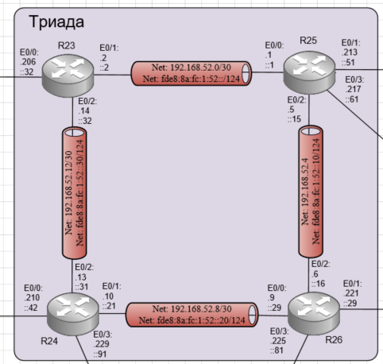

# Лабораторная работа №7 IS-IS

#### Цель: 

Настроить IS-IS офисе Триада.

## Топология

Выполнение лабораторной работы будет происходить в созданной при выполнении лабораторной работы №4 схеме. Будет настраиваться объект Триада:

## Ход работы

Лабораторная работа разбита на 4 части:
1) Настроить is-is на маршрутизаторах R23 и R25 находящихся в зоне 2222
2) Настроить is-is на маршрутизаторе R24 находящемся в зоне 24
3) Настроить is-is на маршрутизаторе R26 находящемся в зоне 26
4) Проверить корректность настройки is-is
