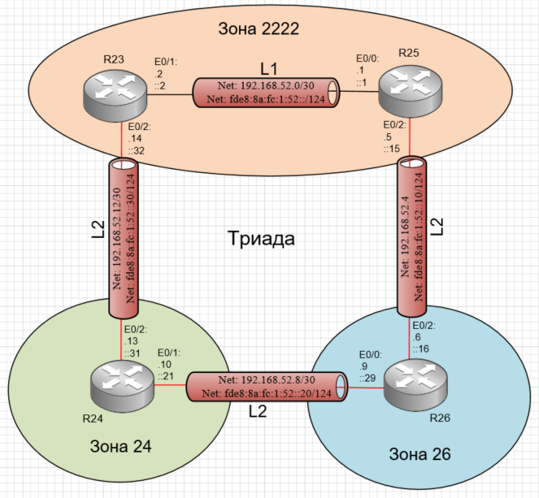

# Лабораторная работа №7 IS-IS

#### Цель: 

Настроить IS-IS офисе Триада.

При этом необходимо учесть:
- R23 и R25 находятся в зоне 2222;
- R24 находятся в зоне 24;
- R26 находятся в зоне 26;

## Топология

Выполнение лабораторной работы будет происходить в созданной при выполнении лабораторной работы №4 схеме. При этом необходимо учесть:
- R23 и R25 находятся в зоне 2222;
- R24 находятся в зоне 24;
- R26 находятся в зоне 26;

В соответствии с приведенными выше требованиями схема is-is маршрутизации на площадке Триада будет выглядеть:

## Ход работы

Лабораторная работа разбита на 2 части:
1) Настроить is-is на маршрутизаторах
2) Проверить корректность настройки is-is

## Часть 1. Настройка is-is на маршрутизаторах

## Часть 2. Проверка корректности настройки is-is

