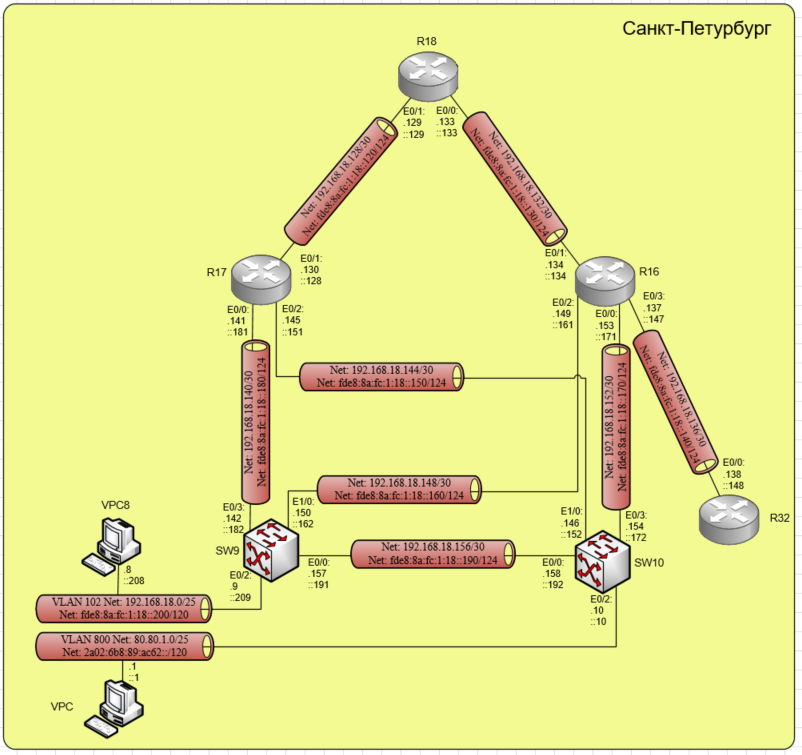

# Лабораторная работа №8 EIGRP

#### Цель: 

Настроить EIGRP в Санкт-Петербурге используя именованный EIGRP.

При этом необходимо учесть:
- R32 получает только маршрут по умолчанию;
- R16-R17 анонсируют только суммарные префиксы.

## Топология

Выполнение лабораторной работы будет происходить в созданной при выполнении лабораторной работы №4 схеме. Топология сети Санкт-Петербург приведена ниже:



## Ход работы

Лабораторная работа разбита на 2 части:
1) Настройка EIGRP на маршрутизаторах и L3 коммутаторах
2) Настройка на маршрутизаторах R17 и R16 суммаризации
3) Создание для маршрута по умолчанию через R18 и передача его на R32
4) Создание ACL и настройка его для передачи на R32 только маршрут по умолчанию

## Часть 1. Настройка EIGRP на маршрутизаторах и L3 коммутаторах

Необходимо включить на АСО именованный eigrp, назначить идентификатор узла для ipv4 и ipv6, запустить ipv4 eigrp, указать для ipv4 анонсируемые адреса и включить ipv6 eigrp.
Не участвующие в eigrp интерфейсы переведены в состояние passive.

В выводе running-config маршрутизаторов появятся настройки:

#### Маршрутизатор R18:

```
router eigrp LAB
 !
 address-family ipv4 unicast autonomous-system 1
  !
  af-interface Ethernet0/2
   passive-interface
  exit-af-interface
  !
  af-interface Ethernet0/3
   passive-interface
  exit-af-interface
  !
  topology base
  exit-af-topology
  network 192.168.18.0
  eigrp router-id 18.18.18.18
 exit-address-family
 !
 address-family ipv6 unicast autonomous-system 1
  !
  af-interface Ethernet0/2
   passive-interface
  exit-af-interface
  !
  af-interface Ethernet0/3
   passive-interface
  exit-af-interface
  !
  topology base
  exit-af-topology
  eigrp router-id 18.18.18.18
 exit-address-family
!
```

#### Маршрутизатор R17:

```
router eigrp LAB
 !
 address-family ipv4 unicast autonomous-system 1
  !       
  af-interface Ethernet0/3
   passive-interface
  exit-af-interface
  !
  topology base
  exit-af-topology
  network 192.168.18.0
  eigrp router-id 17.17.17.17
 exit-address-family
 !
 address-family ipv6 unicast autonomous-system 1
  !
  af-interface Ethernet0/3
   passive-interface
  exit-af-interface
  !
  topology base
  exit-af-topology
  eigrp router-id 17.17.17.17
 exit-address-family
!
```

#### Маршрутизатор R16:

```
router eigrp LAB
 !
 address-family ipv4 unicast autonomous-system 1
  !
  topology base
  exit-af-topology
  network 192.168.18.0
  eigrp router-id 16.16.16.16
 exit-address-family
 !
 address-family ipv6 unicast autonomous-system 1
  !
  topology base
  exit-af-topology
  eigrp router-id 16.16.16.16
 exit-address-family
!
```

#### Маршрутизатор R32:

```
router eigrp LAB
 !
 address-family ipv4 unicast autonomous-system 1
  !
  af-interface Ethernet0/1
   passive-interface
  exit-af-interface
  !
  af-interface Ethernet0/2
   passive-interface
  exit-af-interface
  !
  af-interface Ethernet0/3
   passive-interface
  exit-af-interface
  !
  topology base
  exit-af-topology
  network 192.168.18.0
  eigrp router-id 32.32.32.32
 exit-address-family
 !
 address-family ipv6 unicast autonomous-system 1
  !
  af-interface Ethernet0/1
   passive-interface
  exit-af-interface
  !
  af-interface Ethernet0/2
   passive-interface
  exit-af-interface
  !
  af-interface Ethernet0/3
   passive-interface
  exit-af-interface
  !
  topology base
  exit-af-topology
  eigrp router-id 32.32.32.32
 exit-address-family
!
```

#### L3 коммутатор SW10:

```
router eigrp LAB
 !
 address-family ipv4 unicast autonomous-system 1
  !
  af-interface Ethernet0/1
   passive-interface
  exit-af-interface
  !
  af-interface Ethernet1/1
   passive-interface
  exit-af-interface
  !
  af-interface Ethernet1/2
   passive-interface
  exit-af-interface
  !
  af-interface Ethernet1/3
   passive-interface
  exit-af-interface
  !
  topology base
  exit-af-topology
  network 80.0.0.0
  network 192.168.18.0
  eigrp router-id 10.10.10.10
 exit-address-family
 !
 address-family ipv6 unicast autonomous-system 1
  !
  af-interface Ethernet0/1
   passive-interface
  exit-af-interface
  !
  af-interface Ethernet1/1
   passive-interface
  exit-af-interface
  !
  af-interface Ethernet1/2
   passive-interface
  exit-af-interface
  !
  af-interface Ethernet1/3
   passive-interface
  exit-af-interface
  !
  topology base
  exit-af-topology
  eigrp router-id 10.10.10.10
 exit-address-family
!
```

#### L3 коммутатор SW9:

```
router eigrp LAB
 !
 address-family ipv4 unicast autonomous-system 1
  !
  af-interface Ethernet0/1
   passive-interface
  exit-af-interface
  !
  af-interface Ethernet1/1
   passive-interface
  exit-af-interface
  !
  af-interface Ethernet1/2
   passive-interface
  exit-af-interface
  !
  af-interface Ethernet1/3
   passive-interface
  exit-af-interface
  !
  topology base
  exit-af-topology
  network 192.168.18.0
  eigrp router-id 9.9.9.9
 exit-address-family
 !
 address-family ipv6 unicast autonomous-system 1
  !
  af-interface Ethernet0/1
   passive-interface
  exit-af-interface
  !       
  af-interface Ethernet1/1
   passive-interface
  exit-af-interface
  !
  af-interface Ethernet1/2
   passive-interface
  exit-af-interface
  !
  af-interface Ethernet1/3
   passive-interface
  exit-af-interface
  !
  topology base
  exit-af-topology
 exit-address-family
!
```

Чтобы проверить, что АСО видят соседей, получают маршруты и их взаимодействие настроено корректно необходимо ввести show ip eigrp neighbors, show ip route eigrp, show ipv6 route eigrp, show eigrp protocols:

#### Маршрутизатор R18:

```
R18#show ip eigrp neighbors 
EIGRP-IPv4 VR(LAB) Address-Family Neighbors for AS(1)
H   Address                 Interface              Hold Uptime   SRTT   RTO  Q  Seq
                                                   (sec)         (ms)       Cnt Num
1   192.168.18.134          Et0/0                    11 00:34:31    5   100  0  20
0   192.168.18.130          Et0/1                    13 00:34:35  657  3942  0  17
R18#show ip route eigrp
Codes: L - local, C - connected, S - static, R - RIP, M - mobile, B - BGP
       D - EIGRP, EX - EIGRP external, O - OSPF, IA - OSPF inter area 
       N1 - OSPF NSSA external type 1, N2 - OSPF NSSA external type 2
       E1 - OSPF external type 1, E2 - OSPF external type 2
       i - IS-IS, su - IS-IS summary, L1 - IS-IS level-1, L2 - IS-IS level-2
       ia - IS-IS inter area, * - candidate default, U - per-user static route
       o - ODR, P - periodic downloaded static route, H - NHRP, l - LISP
       a - application route
       + - replicated route, % - next hop override

Gateway of last resort is not set

      80.0.0.0/25 is subnetted, 1 subnets
D        80.80.1.0 [90/2048000] via 192.168.18.134, 00:34:24, Ethernet0/0
                   [90/2048000] via 192.168.18.130, 00:34:24, Ethernet0/1
      192.168.18.0/24 is variably subnetted, 11 subnets, 3 masks
D        192.168.18.0/25 
           [90/2048000] via 192.168.18.134, 00:34:22, Ethernet0/0
           [90/2048000] via 192.168.18.130, 00:34:22, Ethernet0/1
D        192.168.18.136/30 
           [90/1536000] via 192.168.18.134, 00:34:43, Ethernet0/0
D        192.168.18.140/30 
           [90/1536000] via 192.168.18.130, 00:34:22, Ethernet0/1
D        192.168.18.144/30 
           [90/1536000] via 192.168.18.130, 00:34:24, Ethernet0/1
D        192.168.18.148/30 
           [90/1536000] via 192.168.18.134, 00:34:22, Ethernet0/0
D        192.168.18.152/30 
           [90/1536000] via 192.168.18.134, 00:34:25, Ethernet0/0
D        192.168.18.156/30 
           [90/2048000] via 192.168.18.134, 00:34:22, Ethernet0/0
           [90/2048000] via 192.168.18.130, 00:34:22, Ethernet0/1
R18#show ipv6 route eigrp
IPv6 Routing Table - default - 17 entries
Codes: C - Connected, L - Local, S - Static, U - Per-user Static route
       B - BGP, HA - Home Agent, MR - Mobile Router, R - RIP
       H - NHRP, I1 - ISIS L1, I2 - ISIS L2, IA - ISIS interarea
       IS - ISIS summary, D - EIGRP, EX - EIGRP external, NM - NEMO
       ND - ND Default, NDp - ND Prefix, DCE - Destination, NDr - Redirect
       O - OSPF Intra, OI - OSPF Inter, OE1 - OSPF ext 1, OE2 - OSPF ext 2
       ON1 - OSPF NSSA ext 1, ON2 - OSPF NSSA ext 2, la - LISP alt
       lr - LISP site-registrations, ld - LISP dyn-eid, a - Application
D   2A02:6B8:89:AC62::/120 [90/2048000]
     via FE80::17, Ethernet0/1
     via FE80::16, Ethernet0/0
D   FDE8:8A:FC:1:18::140/124 [90/1536000]
     via FE80::16, Ethernet0/0
D   FDE8:8A:FC:1:18::150/124 [90/1536000]
     via FE80::17, Ethernet0/1
D   FDE8:8A:FC:1:18::160/124 [90/1536000]
     via FE80::16, Ethernet0/0
D   FDE8:8A:FC:1:18::170/124 [90/1536000]
     via FE80::16, Ethernet0/0
D   FDE8:8A:FC:1:18::180/124 [90/1536000]
     via FE80::17, Ethernet0/1
D   FDE8:8A:FC:1:18::190/124 [90/2048000]
     via FE80::17, Ethernet0/1
     via FE80::16, Ethernet0/0
D   FDE8:8A:FC:1:18::200/120 [90/2048000]
     via FE80::16, Ethernet0/0
     via FE80::17, Ethernet0/1
R18#show eigrp protocols
EIGRP-IPv4 VR(LAB) Address-Family Protocol for AS(1)
  Metric weight K1=1, K2=0, K3=1, K4=0, K5=0 K6=0
  Metric rib-scale 128
  Metric version 64bit
  NSF-aware route hold timer is 240
  Router-ID: 18.18.18.18
  Topology : 0 (base) 
    Active Timer: 3 min
    Distance: internal 90 external 170
    Maximum path: 4
    Maximum hopcount 100
    Maximum metric variance 1
    Total Prefix Count: 10
    Total Redist Count: 0

EIGRP-IPv6 VR(LAB) Address-Family Protocol for AS(1)
  Metric weight K1=1, K2=0, K3=1, K4=0, K5=0 K6=0
  Metric rib-scale 128
  Metric version 64bit
  NSF-aware route hold timer is 240
  Router-ID: 18.18.18.18
  Topology : 0 (base) 
    Active Timer: 3 min
    Distance: internal 90 external 170
    Maximum path: 16
    Maximum hopcount 100
    Maximum metric variance 1
    Total Prefix Count: 12
    Total Redist Count: 0
```

#### Маршрутизатор R17:

```
R17#show ip eigrp neighbors 
EIGRP-IPv4 VR(LAB) Address-Family Neighbors for AS(1)
H   Address                 Interface              Hold Uptime   SRTT   RTO  Q  Seq
                                                   (sec)         (ms)       Cnt Num
2   192.168.18.142          Et0/0                    13 00:30:42    2   100  0  10
1   192.168.18.146          Et0/2                    12 00:30:45    9   100  0  9
0   192.168.18.129          Et0/1                    14 00:31:05    5   100  0  16
R17#show ip route eigrp 
Codes: L - local, C - connected, S - static, R - RIP, M - mobile, B - BGP
       D - EIGRP, EX - EIGRP external, O - OSPF, IA - OSPF inter area 
       N1 - OSPF NSSA external type 1, N2 - OSPF NSSA external type 2
       E1 - OSPF external type 1, E2 - OSPF external type 2
       i - IS-IS, su - IS-IS summary, L1 - IS-IS level-1, L2 - IS-IS level-2
       ia - IS-IS inter area, * - candidate default, U - per-user static route
       o - ODR, P - periodic downloaded static route, H - NHRP, l - LISP
       a - application route
       + - replicated route, % - next hop override

Gateway of last resort is not set

      80.0.0.0/25 is subnetted, 1 subnets
D        80.80.1.0 [90/1536000] via 192.168.18.146, 00:31:08, Ethernet0/2
      192.168.18.0/24 is variably subnetted, 12 subnets, 3 masks
D        192.168.18.0/25 
           [90/1536000] via 192.168.18.142, 00:31:11, Ethernet0/0
D        192.168.18.132/30 
           [90/1536000] via 192.168.18.129, 00:31:08, Ethernet0/1
D        192.168.18.136/30 
           [90/2048000] via 192.168.18.146, 00:31:08, Ethernet0/2
           [90/2048000] via 192.168.18.142, 00:31:08, Ethernet0/0
           [90/2048000] via 192.168.18.129, 00:31:08, Ethernet0/1
D        192.168.18.148/30 
           [90/1536000] via 192.168.18.142, 00:31:11, Ethernet0/0
D        192.168.18.152/30 
           [90/1536000] via 192.168.18.146, 00:31:08, Ethernet0/2
D        192.168.18.156/30 
           [90/1536000] via 192.168.18.146, 00:31:11, Ethernet0/2
           [90/1536000] via 192.168.18.142, 00:31:11, Ethernet0/0
R17#show ipv6 route eigrp 
IPv6 Routing Table - default - 16 entries
Codes: C - Connected, L - Local, S - Static, U - Per-user Static route
       B - BGP, HA - Home Agent, MR - Mobile Router, R - RIP
       H - NHRP, I1 - ISIS L1, I2 - ISIS L2, IA - ISIS interarea
       IS - ISIS summary, D - EIGRP, EX - EIGRP external, NM - NEMO
       ND - ND Default, NDp - ND Prefix, DCE - Destination, NDr - Redirect
       O - OSPF Intra, OI - OSPF Inter, OE1 - OSPF ext 1, OE2 - OSPF ext 2
       ON1 - OSPF NSSA ext 1, ON2 - OSPF NSSA ext 2, la - LISP alt
       lr - LISP site-registrations, ld - LISP dyn-eid, a - Application
D   2A02:6B8:89:AC61:AC::80/124 [90/1536000]
     via FE80::18, Ethernet0/1
D   2A02:6B8:89:AC61:AC::90/124 [90/1536000]
     via FE80::18, Ethernet0/1
D   2A02:6B8:89:AC62::/120 [90/1536000]
     via FE80::10, Ethernet0/2
D   FDE8:8A:FC:1:18::130/124 [90/1536000]
     via FE80::18, Ethernet0/1
D   FDE8:8A:FC:1:18::140/124 [90/2048000]
     via FE80::18, Ethernet0/1
     via FE80::10, Ethernet0/2
     via FE80::9, Ethernet0/0
D   FDE8:8A:FC:1:18::160/124 [90/1536000]
     via FE80::9, Ethernet0/0
D   FDE8:8A:FC:1:18::170/124 [90/1536000]
     via FE80::10, Ethernet0/2
D   FDE8:8A:FC:1:18::190/124 [90/1536000]
     via FE80::10, Ethernet0/2
     via FE80::9, Ethernet0/0
D   FDE8:8A:FC:1:18::200/120 [90/1536000]
     via FE80::9, Ethernet0/0
R17#show eigrp protocols 
EIGRP-IPv4 VR(LAB) Address-Family Protocol for AS(1)
  Metric weight K1=1, K2=0, K3=1, K4=0, K5=0 K6=0
  Metric rib-scale 128
  Metric version 64bit
  NSF-aware route hold timer is 240
  Router-ID: 17.17.17.17
  Topology : 0 (base) 
    Active Timer: 3 min
    Distance: internal 90 external 170
    Maximum path: 4
    Maximum hopcount 100
    Maximum metric variance 1
    Total Prefix Count: 10
    Total Redist Count: 0

EIGRP-IPv6 VR(LAB) Address-Family Protocol for AS(1)
  Metric weight K1=1, K2=0, K3=1, K4=0, K5=0 K6=0
  Metric rib-scale 128
  Metric version 64bit
  NSF-aware route hold timer is 240
  Router-ID: 17.17.17.17
  Topology : 0 (base) 
    Active Timer: 3 min
    Distance: internal 90 external 170
    Maximum path: 16
    Maximum hopcount 100
    Maximum metric variance 1
    Total Prefix Count: 12
    Total Redist Count: 0
```

#### Маршрутизатор R16:

```
R16#show ip eigrp neighbors
EIGRP-IPv4 VR(LAB) Address-Family Neighbors for AS(1)
H   Address                 Interface              Hold Uptime   SRTT   RTO  Q  Seq
                                                   (sec)         (ms)       Cnt Num
3   192.168.18.150          Et0/2                    14 00:37:05    2   100  0  11
2   192.168.18.154          Et0/0                    13 00:37:06    7   100  0  11
1   192.168.18.133          Et0/1                    14 00:37:23    5   100  0  15
0   192.168.18.138          Et0/3                    13 00:37:23    6   100  0  6
R16#show ip route eigrp
Codes: L - local, C - connected, S - static, R - RIP, M - mobile, B - BGP
       D - EIGRP, EX - EIGRP external, O - OSPF, IA - OSPF inter area 
       N1 - OSPF NSSA external type 1, N2 - OSPF NSSA external type 2
       E1 - OSPF external type 1, E2 - OSPF external type 2
       i - IS-IS, su - IS-IS summary, L1 - IS-IS level-1, L2 - IS-IS level-2
       ia - IS-IS inter area, * - candidate default, U - per-user static route
       o - ODR, P - periodic downloaded static route, H - NHRP, l - LISP
       a - application route
       + - replicated route, % - next hop override

Gateway of last resort is 192.168.18.133 to network 0.0.0.0

      80.0.0.0/25 is subnetted, 1 subnets
D        80.80.1.0 [90/1536000] via 192.168.18.154, 00:37:11, Ethernet0/0
      192.168.18.0/24 is variably subnetted, 13 subnets, 3 masks
D        192.168.18.0/25 
           [90/1536000] via 192.168.18.150, 00:37:12, Ethernet0/2
D        192.168.18.128/30 
           [90/1536000] via 192.168.18.133, 00:37:11, Ethernet0/1
D        192.168.18.140/30 
           [90/1536000] via 192.168.18.150, 00:37:12, Ethernet0/2
D        192.168.18.144/30 
           [90/1536000] via 192.168.18.154, 00:37:11, Ethernet0/0
D        192.168.18.156/30 
           [90/1536000] via 192.168.18.154, 00:37:16, Ethernet0/0
           [90/1536000] via 192.168.18.150, 00:37:16, Ethernet0/2
R16#show ipv6 route eigrp
IPv6 Routing Table - default - 17 entries
Codes: C - Connected, L - Local, S - Static, U - Per-user Static route
       B - BGP, HA - Home Agent, MR - Mobile Router, R - RIP
       H - NHRP, I1 - ISIS L1, I2 - ISIS L2, IA - ISIS interarea
       IS - ISIS summary, D - EIGRP, EX - EIGRP external, NM - NEMO
       ND - ND Default, NDp - ND Prefix, DCE - Destination, NDr - Redirect
       O - OSPF Intra, OI - OSPF Inter, OE1 - OSPF ext 1, OE2 - OSPF ext 2
       ON1 - OSPF NSSA ext 1, ON2 - OSPF NSSA ext 2, la - LISP alt
       lr - LISP site-registrations, ld - LISP dyn-eid, a - Application
D   2A02:6B8:89:AC61:AC::80/124 [90/1536000]
     via FE80::18, Ethernet0/1
D   2A02:6B8:89:AC61:AC::90/124 [90/1536000]
     via FE80::18, Ethernet0/1
D   2A02:6B8:89:AC62::/120 [90/1536000]
     via FE80::10, Ethernet0/0
D   FDE8:8A:FC:1:18::120/124 [90/1536000]
     via FE80::18, Ethernet0/1
D   FDE8:8A:FC:1:18::150/124 [90/1536000]
     via FE80::10, Ethernet0/0
D   FDE8:8A:FC:1:18::180/124 [90/1536000]
     via FE80::9, Ethernet0/2
D   FDE8:8A:FC:1:18::190/124 [90/1536000]
     via FE80::10, Ethernet0/0
     via FE80::9, Ethernet0/2
D   FDE8:8A:FC:1:18::200/120 [90/1536000]
     via FE80::9, Ethernet0/2
R16#show eigrp protocols
EIGRP-IPv4 VR(LAB) Address-Family Protocol for AS(1)
  Metric weight K1=1, K2=0, K3=1, K4=0, K5=0 K6=0
  Metric rib-scale 128
  Metric version 64bit
  NSF-aware route hold timer is 240
  Router-ID: 16.16.16.16
  Topology : 0 (base) 
    Active Timer: 3 min
    Distance: internal 90 external 170
    Maximum path: 4
    Maximum hopcount 100
    Maximum metric variance 1
    Total Prefix Count: 10
    Total Redist Count: 0

EIGRP-IPv6 VR(LAB) Address-Family Protocol for AS(1)
  Metric weight K1=1, K2=0, K3=1, K4=0, K5=0 K6=0
  Metric rib-scale 128
  Metric version 64bit
  NSF-aware route hold timer is 240
  Router-ID: 16.16.16.16
  Topology : 0 (base) 
    Active Timer: 3 min
    Distance: internal 90 external 170
    Maximum path: 16
    Maximum hopcount 100
    Maximum metric variance 1
    Total Prefix Count: 12
    Total Redist Count: 0
```

#### Маршрутизатор R32:

```
R32#show ip route eigrp
Codes: L - local, C - connected, S - static, R - RIP, M - mobile, B - BGP
       D - EIGRP, EX - EIGRP external, O - OSPF, IA - OSPF inter area 
       N1 - OSPF NSSA external type 1, N2 - OSPF NSSA external type 2
       E1 - OSPF external type 1, E2 - OSPF external type 2
       i - IS-IS, su - IS-IS summary, L1 - IS-IS level-1, L2 - IS-IS level-2
       ia - IS-IS inter area, * - candidate default, U - per-user static route
       o - ODR, P - periodic downloaded static route, H - NHRP, l - LISP
       a - application route
       + - replicated route, % - next hop override

Gateway of last resort is not set

      80.0.0.0/25 is subnetted, 1 subnets
D        80.80.1.0 [90/2048000] via 192.168.18.137, 00:38:44, Ethernet0/0
      192.168.18.0/24 is variably subnetted, 10 subnets, 3 masks
D        192.168.18.0/25 
           [90/2048000] via 192.168.18.137, 00:38:42, Ethernet0/0
D        192.168.18.128/30 
           [90/2048000] via 192.168.18.137, 00:38:58, Ethernet0/0
D        192.168.18.132/30 
           [90/1536000] via 192.168.18.137, 00:39:01, Ethernet0/0
D        192.168.18.140/30 
           [90/2048000] via 192.168.18.137, 00:38:42, Ethernet0/0
D        192.168.18.144/30 
           [90/2048000] via 192.168.18.137, 00:38:44, Ethernet0/0
D        192.168.18.148/30 
           [90/1536000] via 192.168.18.137, 00:39:01, Ethernet0/0
D        192.168.18.152/30 
           [90/1536000] via 192.168.18.137, 00:39:01, Ethernet0/0
D        192.168.18.156/30 
           [90/2048000] via 192.168.18.137, 00:38:42, Ethernet0/0
R32#show ipv6 route eigrp
IPv6 Routing Table - default - 14 entries
Codes: C - Connected, L - Local, S - Static, U - Per-user Static route
       B - BGP, HA - Home Agent, MR - Mobile Router, R - RIP
       H - NHRP, I1 - ISIS L1, I2 - ISIS L2, IA - ISIS interarea
       IS - ISIS summary, D - EIGRP, EX - EIGRP external, NM - NEMO
       ND - ND Default, NDp - ND Prefix, DCE - Destination, NDr - Redirect
       O - OSPF Intra, OI - OSPF Inter, OE1 - OSPF ext 1, OE2 - OSPF ext 2
       ON1 - OSPF NSSA ext 1, ON2 - OSPF NSSA ext 2, la - LISP alt
       lr - LISP site-registrations, ld - LISP dyn-eid, a - Application
D   2A02:6B8:89:AC61:AC::80/124 [90/2048000]
     via FE80::16, Ethernet0/0
D   2A02:6B8:89:AC61:AC::90/124 [90/2048000]
     via FE80::16, Ethernet0/0
D   2A02:6B8:89:AC62::/120 [90/2048000]
     via FE80::16, Ethernet0/0
D   FDE8:8A:FC:1:18::120/124 [90/2048000]
     via FE80::16, Ethernet0/0
D   FDE8:8A:FC:1:18::130/124 [90/1536000]
     via FE80::16, Ethernet0/0
D   FDE8:8A:FC:1:18::150/124 [90/2048000]
     via FE80::16, Ethernet0/0
D   FDE8:8A:FC:1:18::160/124 [90/1536000]
     via FE80::16, Ethernet0/0
D   FDE8:8A:FC:1:18::170/124 [90/1536000]
     via FE80::16, Ethernet0/0
D   FDE8:8A:FC:1:18::180/124 [90/2048000]
     via FE80::16, Ethernet0/0
D   FDE8:8A:FC:1:18::190/124 [90/2048000]
     via FE80::16, Ethernet0/0
D   FDE8:8A:FC:1:18::200/120 [90/2048000]
     via FE80::16, Ethernet0/0
R32#show eigrp protocols
EIGRP-IPv4 VR(LAB) Address-Family Protocol for AS(1)
  Metric weight K1=1, K2=0, K3=1, K4=0, K5=0 K6=0
  Metric rib-scale 128
  Metric version 64bit
  NSF-aware route hold timer is 240
  Router-ID: 32.32.32.32
  Topology : 0 (base) 
    Active Timer: 3 min
    Distance: internal 90 external 170
    Maximum path: 4
    Maximum hopcount 100
    Maximum metric variance 1
    Total Prefix Count: 10
    Total Redist Count: 0

EIGRP-IPv6 VR(LAB) Address-Family Protocol for AS(1)
  Metric weight K1=1, K2=0, K3=1, K4=0, K5=0 K6=0
  Metric rib-scale 128
  Metric version 64bit
  NSF-aware route hold timer is 240
  Router-ID: 32.32.32.32
  Topology : 0 (base) 
    Active Timer: 3 min
    Distance: internal 90 external 170
    Maximum path: 16
    Maximum hopcount 100
    Maximum metric variance 1
    Total Prefix Count: 12
    Total Redist Count: 0
```

#### L3 коммутатор SW10:

```
SW10#show ip eigrp neighbors
EIGRP-IPv4 VR(LAB) Address-Family Neighbors for AS(1)
H   Address                 Interface              Hold Uptime   SRTT   RTO  Q  Seq
                                                   (sec)         (ms)       Cnt Num
2   192.168.18.153          Et0/3                    10 00:39:27 1594  5000  0  19
1   192.168.18.157          Et0/0                    11 00:39:27    1   100  0  9
0   192.168.18.145          Et1/0                    10 00:39:28    5   100  0  15
SW10#show ip route eigrp
Codes: L - local, C - connected, S - static, R - RIP, M - mobile, B - BGP
       D - EIGRP, EX - EIGRP external, O - OSPF, IA - OSPF inter area 
       N1 - OSPF NSSA external type 1, N2 - OSPF NSSA external type 2
       E1 - OSPF external type 1, E2 - OSPF external type 2
       i - IS-IS, su - IS-IS summary, L1 - IS-IS level-1, L2 - IS-IS level-2
       ia - IS-IS inter area, * - candidate default, U - per-user static route
       o - ODR, P - periodic downloaded static route, H - NHRP, l - LISP
       a - application route
       + - replicated route, % - next hop override

Gateway of last resort is not set

      192.168.18.0/24 is variably subnetted, 12 subnets, 3 masks
D        192.168.18.0/25 
           [90/1536000] via 192.168.18.157, 00:39:34, Ethernet0/0
D        192.168.18.128/30 
           [90/1536000] via 192.168.18.145, 00:39:34, Ethernet1/0
D        192.168.18.132/30 
           [90/1536000] via 192.168.18.153, 00:39:34, Ethernet0/3
D        192.168.18.136/30 
           [90/1536000] via 192.168.18.153, 00:39:34, Ethernet0/3
D        192.168.18.140/30 
           [90/1536000] via 192.168.18.157, 00:39:34, Ethernet0/0
           [90/1536000] via 192.168.18.145, 00:39:34, Ethernet1/0
D        192.168.18.148/30 
           [90/1536000] via 192.168.18.157, 00:39:34, Ethernet0/0
           [90/1536000] via 192.168.18.153, 00:39:34, Ethernet0/3
SW10#show ipv6 route eigrp
IPv6 Routing Table - default - 17 entries
Codes: C - Connected, L - Local, S - Static, U - Per-user Static route
       B - BGP, HA - Home Agent, MR - Mobile Router, R - RIP
       H - NHRP, I1 - ISIS L1, I2 - ISIS L2, IA - ISIS interarea
       IS - ISIS summary, D - EIGRP, EX - EIGRP external, NM - NEMO
       ND - ND Default, NDp - ND Prefix, DCE - Destination, NDr - Redirect
       O - OSPF Intra, OI - OSPF Inter, OE1 - OSPF ext 1, OE2 - OSPF ext 2
       ON1 - OSPF NSSA ext 1, ON2 - OSPF NSSA ext 2, la - LISP alt
       lr - LISP site-registrations, ld - LISP dyn-eid, a - Application
D   2A02:6B8:89:AC61:AC::80/124 [90/2048000]
     via FE80::17, Ethernet1/0
     via FE80::16, Ethernet0/3
D   2A02:6B8:89:AC61:AC::90/124 [90/2048000]
     via FE80::17, Ethernet1/0
     via FE80::16, Ethernet0/3
D   FDE8:8A:FC:1:18::120/124 [90/1536000]
     via FE80::17, Ethernet1/0
D   FDE8:8A:FC:1:18::130/124 [90/1536000]
     via FE80::16, Ethernet0/3
D   FDE8:8A:FC:1:18::140/124 [90/1536000]
     via FE80::16, Ethernet0/3
D   FDE8:8A:FC:1:18::160/124 [90/1536000]
     via FE80::9, Ethernet0/0
     via FE80::16, Ethernet0/3
D   FDE8:8A:FC:1:18::180/124 [90/1536000]
     via FE80::17, Ethernet1/0
     via FE80::9, Ethernet0/0
D   FDE8:8A:FC:1:18::200/120 [90/1536000]
     via FE80::9, Ethernet0/0
SW10#show eigrp protocols
EIGRP-IPv4 VR(LAB) Address-Family Protocol for AS(1)
  Metric weight K1=1, K2=0, K3=1, K4=0, K5=0 K6=0
  Metric rib-scale 128
  Metric version 64bit
  NSF-aware route hold timer is 240
  Router-ID: 10.10.10.10
  Topology : 0 (base) 
    Active Timer: 3 min
    Distance: internal 90 external 170
    Maximum path: 4
    Maximum hopcount 100
    Maximum metric variance 1
    Total Prefix Count: 10
    Total Redist Count: 0

EIGRP-IPv6 VR(LAB) Address-Family Protocol for AS(1)
  Metric weight K1=1, K2=0, K3=1, K4=0, K5=0 K6=0
  Metric rib-scale 128
  Metric version 64bit
  NSF-aware route hold timer is 240
  Router-ID: 10.10.10.10
  Topology : 0 (base) 
    Active Timer: 3 min
    Distance: internal 90 external 170
    Maximum path: 16
    Maximum hopcount 100
    Maximum metric variance 1
    Total Prefix Count: 12
    Total Redist Count: 0
```

#### L3 коммутатор SW9:

```
SW9#show ip eigrp neighbors
EIGRP-IPv4 VR(LAB) Address-Family Neighbors for AS(1)
H   Address                 Interface              Hold Uptime   SRTT   RTO  Q  Seq
                                                   (sec)         (ms)       Cnt Num
2   192.168.18.149          Et1/0                    11 00:40:18 1597  5000  0  18
1   192.168.18.141          Et0/3                    11 00:40:18    9   100  0  16
0   192.168.18.158          Et0/0                    11 00:40:20    6   100  0  10
SW9#show ip route eigrp
Codes: L - local, C - connected, S - static, R - RIP, M - mobile, B - BGP
       D - EIGRP, EX - EIGRP external, O - OSPF, IA - OSPF inter area 
       N1 - OSPF NSSA external type 1, N2 - OSPF NSSA external type 2
       E1 - OSPF external type 1, E2 - OSPF external type 2
       i - IS-IS, su - IS-IS summary, L1 - IS-IS level-1, L2 - IS-IS level-2
       ia - IS-IS inter area, * - candidate default, U - per-user static route
       o - ODR, P - periodic downloaded static route, H - NHRP, l - LISP
       a - application route
       + - replicated route, % - next hop override

Gateway of last resort is not set

      80.0.0.0/25 is subnetted, 1 subnets
D        80.80.1.0 [90/1536000] via 192.168.18.158, 00:40:25, Ethernet0/0
      192.168.18.0/24 is variably subnetted, 13 subnets, 3 masks
D        192.168.18.128/30 
           [90/1536000] via 192.168.18.141, 00:40:24, Ethernet0/3
D        192.168.18.132/30 
           [90/1536000] via 192.168.18.149, 00:40:24, Ethernet1/0
D        192.168.18.136/30 
           [90/1536000] via 192.168.18.149, 00:40:22, Ethernet1/0
D        192.168.18.144/30 
           [90/1536000] via 192.168.18.158, 00:40:25, Ethernet0/0
           [90/1536000] via 192.168.18.141, 00:40:25, Ethernet0/3
D        192.168.18.152/30 
           [90/1536000] via 192.168.18.158, 00:40:25, Ethernet0/0
           [90/1536000] via 192.168.18.149, 00:40:25, Ethernet1/0
SW9#show ipv6 route eigrp
IPv6 Routing Table - default - 17 entries
Codes: C - Connected, L - Local, S - Static, U - Per-user Static route
       B - BGP, HA - Home Agent, MR - Mobile Router, R - RIP
       H - NHRP, I1 - ISIS L1, I2 - ISIS L2, IA - ISIS interarea
       IS - ISIS summary, D - EIGRP, EX - EIGRP external, NM - NEMO
       ND - ND Default, NDp - ND Prefix, DCE - Destination, NDr - Redirect
       O - OSPF Intra, OI - OSPF Inter, OE1 - OSPF ext 1, OE2 - OSPF ext 2
       ON1 - OSPF NSSA ext 1, ON2 - OSPF NSSA ext 2, la - LISP alt
       lr - LISP site-registrations, ld - LISP dyn-eid, a - Application
D   2A02:6B8:89:AC61:AC::80/124 [90/2048000]
     via FE80::16, Ethernet1/0
     via FE80::17, Ethernet0/3
D   2A02:6B8:89:AC61:AC::90/124 [90/2048000]
     via FE80::16, Ethernet1/0
     via FE80::17, Ethernet0/3
D   2A02:6B8:89:AC62::/120 [90/1536000]
     via FE80::10, Ethernet0/0
D   FDE8:8A:FC:1:18::120/124 [90/1536000]
     via FE80::17, Ethernet0/3
D   FDE8:8A:FC:1:18::130/124 [90/1536000]
     via FE80::16, Ethernet1/0
D   FDE8:8A:FC:1:18::140/124 [90/1536000]
     via FE80::16, Ethernet1/0
D   FDE8:8A:FC:1:18::150/124 [90/1536000]
     via FE80::10, Ethernet0/0
     via FE80::17, Ethernet0/3
D   FDE8:8A:FC:1:18::170/124 [90/1536000]
     via FE80::10, Ethernet0/0
     via FE80::16, Ethernet1/0
SW9#show eigrp protocols
EIGRP-IPv4 VR(LAB) Address-Family Protocol for AS(1)
  Metric weight K1=1, K2=0, K3=1, K4=0, K5=0 K6=0
  Metric rib-scale 128
  Metric version 64bit
  NSF-aware route hold timer is 240
  Router-ID: 9.9.9.9
  Topology : 0 (base) 
    Active Timer: 3 min
    Distance: internal 90 external 170
    Maximum path: 4
    Maximum hopcount 100
    Maximum metric variance 1
    Total Prefix Count: 10
    Total Redist Count: 0

EIGRP-IPv6 VR(LAB) Address-Family Protocol for AS(1)
  Metric weight K1=1, K2=0, K3=1, K4=0, K5=0 K6=0
  Metric rib-scale 128
  Metric version 64bit
  NSF-aware route hold timer is 240
  Router-ID: 192.168.18.157
  Topology : 0 (base) 
    Active Timer: 3 min
    Distance: internal 90 external 170
    Maximum path: 16
    Maximum hopcount 100
    Maximum metric variance 1
    Total Prefix Count: 12
    Total Redist Count: 0
```

## Часть 2. Настройка на маршрутизаторах R17 и R16 суммаризации

Включим суммаризацию на маршрутизаторах R17 и R16. В выводе running-config маршрутизаторов появятся настройки:

#### Маршрутизатор R16:

```
router eigrp LAB
 !
 address-family ipv4 unicast autonomous-system 1
  !
  topology base
   auto-summary
  exit-af-topology
  network 192.168.18.0
  eigrp router-id 16.16.16.16
 exit-address-family
 !
 address-family ipv6 unicast autonomous-system 1
  !
  af-interface Ethernet0/0
   summary-address FDE8:8A:FC:1:18::/80
  exit-af-interface
  !
  af-interface Ethernet0/1
   summary-address FDE8:8A:FC:1:18::/80
  exit-af-interface
  !
  af-interface Ethernet0/2
   summary-address FDE8:8A:FC:1:18::/80
  exit-af-interface
  !
  af-interface Ethernet0/3
   summary-address FDE8:8A:FC:1:18::/80
  exit-af-interface
  !
  topology base
  exit-af-topology
  eigrp router-id 16.16.16.16
 exit-address-family
!
```
     
#### Маршрутизатор R17:

```
router eigrp LAB
 !
 address-family ipv4 unicast autonomous-system 1
  !       
  af-interface Ethernet0/3
   passive-interface
  exit-af-interface
  !
  topology base
   auto-summary
  exit-af-topology
  network 192.168.18.0
  eigrp router-id 17.17.17.17
 exit-address-family
 !
 address-family ipv6 unicast autonomous-system 1
  !
  af-interface Ethernet0/3
   passive-interface
  exit-af-interface
  !
  af-interface Ethernet0/0
   summary-address FDE8:8A:FC:1:18::/80
  exit-af-interface
  !
  af-interface Ethernet0/1
   summary-address FDE8:8A:FC:1:18::/80
  exit-af-interface
  !
  af-interface Ethernet0/2
   summary-address FDE8:8A:FC:1:18::/80
  exit-af-interface
  !
  topology base
  exit-af-topology
  eigrp router-id 17.17.17.17
 exit-address-family
!
```
    
Вы выводе команд show ip protocols и show ipv6 protocols указано, что суммаризация включена:    
     
#### Маршрутизатор R16:

```
R16#show ip protocols 
*** IP Routing is NSF aware ***

Routing Protocol is "application"
  Sending updates every 0 seconds
  Invalid after 0 seconds, hold down 0, flushed after 0
  Outgoing update filter list for all interfaces is not set
  Incoming update filter list for all interfaces is not set
  Maximum path: 32
  Routing for Networks:
  Routing Information Sources:
    Gateway         Distance      Last Update
  Distance: (default is 4)

Routing Protocol is "eigrp 1"
  Outgoing update filter list for all interfaces is not set
  Incoming update filter list for all interfaces is not set
  Default networks flagged in outgoing updates
  Default networks accepted from incoming updates
  EIGRP-IPv4 VR(LAB) Address-Family Protocol for AS(1)
    Metric weight K1=1, K2=0, K3=1, K4=0, K5=0 K6=0
    Metric rib-scale 128
    Metric version 64bit
    NSF-aware route hold timer is 240
    Router-ID: 16.16.16.16
    Topology : 0 (base) 
      Active Timer: 3 min
      Distance: internal 90 external 170
      Maximum path: 4
      Maximum hopcount 100
      Maximum metric variance 1
      Total Prefix Count: 10
      Total Redist Count: 0

  Automatic Summarization: enabled
  Maximum path: 4
  Routing for Networks:
    192.168.18.0
  Routing Information Sources:
    Gateway         Distance      Last Update
    192.168.18.154        90      00:10:17
    192.168.18.150        90      00:10:17
    192.168.18.138        90      00:55:02
    192.168.18.133        90      00:10:17
  Distance: internal 90 external 170

R16#show ipv6 protocols 
IPv6 Routing Protocol is "connected"
IPv6 Routing Protocol is "application"
IPv6 Routing Protocol is "ND"
IPv6 Routing Protocol is "eigrp 1"
EIGRP-IPv6 VR(LAB) Address-Family Protocol for AS(1)
  Metric weight K1=1, K2=0, K3=1, K4=0, K5=0 K6=0
  Metric rib-scale 128
  Metric version 64bit
  NSF-aware route hold timer is 240
  Router-ID: 16.16.16.16
  Topology : 0 (base) 
    Active Timer: 3 min
    Distance: internal 90 external 170
    Maximum path: 16
    Maximum hopcount 100
    Maximum metric variance 1
    Total Prefix Count: 13
    Total Redist Count: 0

  Interfaces:
    Ethernet0/0
    Ethernet0/1
    Ethernet0/2
    Ethernet0/3
  Redistribution:
    None
  Address Summarization:
    FDE8:8A:FC:1:18::/80 for Et0/0, Et0/1, Et0/2
        Et0/3
      Summarizing 9 components with metric 131072000
```

#### Маршрутизатор R17:

```
R17#show ip protocols 
*** IP Routing is NSF aware ***

Routing Protocol is "application"
  Sending updates every 0 seconds
  Invalid after 0 seconds, hold down 0, flushed after 0
  Outgoing update filter list for all interfaces is not set
  Incoming update filter list for all interfaces is not set
  Maximum path: 32
  Routing for Networks:
  Routing Information Sources:
    Gateway         Distance      Last Update
  Distance: (default is 4)

Routing Protocol is "eigrp 1"
  Outgoing update filter list for all interfaces is not set
  Incoming update filter list for all interfaces is not set
  Default networks flagged in outgoing updates
  Default networks accepted from incoming updates
  EIGRP-IPv4 VR(LAB) Address-Family Protocol for AS(1)
    Metric weight K1=1, K2=0, K3=1, K4=0, K5=0 K6=0
    Metric rib-scale 128
    Metric version 64bit
    NSF-aware route hold timer is 240
    Router-ID: 17.17.17.17
    Topology : 0 (base) 
      Active Timer: 3 min
      Distance: internal 90 external 170
      Maximum path: 4
      Maximum hopcount 100
      Maximum metric variance 1
      Total Prefix Count: 10
      Total Redist Count: 0

  Automatic Summarization: enabled
  Maximum path: 4
  Routing for Networks:
    192.168.18.0
  Routing Information Sources:
    Gateway         Distance      Last Update
    192.168.18.146        90      00:05:56
    192.168.18.142        90      00:05:56
    192.168.18.129        90      00:05:56
  Distance: internal 90 external 170

R17#show ipv6 protocols 
IPv6 Routing Protocol is "connected"
IPv6 Routing Protocol is "application"
IPv6 Routing Protocol is "ND"
IPv6 Routing Protocol is "eigrp 1"
EIGRP-IPv6 VR(LAB) Address-Family Protocol for AS(1)
  Metric weight K1=1, K2=0, K3=1, K4=0, K5=0 K6=0
  Metric rib-scale 128
  Metric version 64bit
  NSF-aware route hold timer is 240
  Router-ID: 17.17.17.17
  Topology : 0 (base) 
    Active Timer: 3 min
    Distance: internal 90 external 170
    Maximum path: 16
    Maximum hopcount 100
    Maximum metric variance 1
    Total Prefix Count: 12
    Total Redist Count: 0

  Interfaces:
    Ethernet0/0
    Ethernet0/1
    Ethernet0/2
  Redistribution:
    None
  Address Summarization:
    FDE8:8A:FC:1:18::/80 for Et0/0, Et0/1, Et0/2
      Summarizing 8 components with metric 131072000
```

## Часть 3. Создание маршрута по умолчанию через R18 и передача его на R32

На R18 cоздадим ipv4 и ipv6 маршрут по умолчанию, настроим редистрибуцию статического маршрута и отправку суммарного маршрута ::/0.

В выводе running-config маршрутизаторов появятся настройки:

#### Маршрутизатор R18:

```
router eigrp LAB
 !
 address-family ipv4 unicast autonomous-system 1
  !
  topology base
   redistribute static
  exit-af-topology
  network 192.168.18.0
  eigrp router-id 18.18.18.18
 exit-address-family
 !
 address-family ipv6 unicast autonomous-system 1
  !
  af-interface Ethernet0/0
   summary-address ::/0
  exit-af-interface
  !
  af-interface Ethernet0/1
   summary-address ::/0
  exit-af-interface
  !
  topology base
   redistribute static
  exit-af-topology
  eigrp router-id 18.18.18.18
 exit-address-family
!
ip route 0.0.0.0 0.0.0.0 89.110.29.229
ip route 0.0.0.0 0.0.0.0 89.110.29.225
!
ipv6 route ::/0 2A02:6B8:89:AC61:AC::81
ipv6 route ::/0 2A02:6B8:89:AC61:AC::91
```

В выводе команд show ip route eigrp и show ipv6 route eigrp будет указан маршрут по умолчанию. В ipv6 что-то пошло не так...

#### Маршрутизатор R32:
```
R32#show ip route eigrp
Codes: L - local, C - connected, S - static, R - RIP, M - mobile, B - BGP
       D - EIGRP, EX - EIGRP external, O - OSPF, IA - OSPF inter area 
       N1 - OSPF NSSA external type 1, N2 - OSPF NSSA external type 2
       E1 - OSPF external type 1, E2 - OSPF external type 2
       i - IS-IS, su - IS-IS summary, L1 - IS-IS level-1, L2 - IS-IS level-2
       ia - IS-IS inter area, * - candidate default, U - per-user static route
       o - ODR, P - periodic downloaded static route, H - NHRP, l - LISP
       a - application route
       + - replicated route, % - next hop override

Gateway of last resort is 192.168.18.137 to network 0.0.0.0

D*EX  0.0.0.0/0 [170/2048000] via 192.168.18.137, 00:00:54, Ethernet0/0
      80.0.0.0/25 is subnetted, 1 subnets
D        80.80.1.0 [90/2048000] via 192.168.18.137, 00:00:44, Ethernet0/0
      192.168.18.0/24 is variably subnetted, 10 subnets, 3 masks
D        192.168.18.0/25 
           [90/2048000] via 192.168.18.137, 00:00:44, Ethernet0/0
D        192.168.18.128/30 
           [90/2048000] via 192.168.18.137, 00:00:44, Ethernet0/0
D        192.168.18.132/30 
           [90/1536000] via 192.168.18.137, 00:00:44, Ethernet0/0
D        192.168.18.140/30 
           [90/2048000] via 192.168.18.137, 00:00:44, Ethernet0/0
D        192.168.18.144/30 
           [90/2048000] via 192.168.18.137, 00:00:44, Ethernet0/0
D        192.168.18.148/30 
           [90/1536000] via 192.168.18.137, 00:00:44, Ethernet0/0
D        192.168.18.152/30 
           [90/1536000] via 192.168.18.137, 00:00:44, Ethernet0/0
D        192.168.18.156/30 
           [90/2048000] via 192.168.18.137, 00:00:44, Ethernet0/0
R32#show ipv6 route eigrp
IPv6 Routing Table - default - 6 entries
Codes: C - Connected, L - Local, S - Static, U - Per-user Static route
       B - BGP, HA - Home Agent, MR - Mobile Router, R - RIP
       H - NHRP, I1 - ISIS L1, I2 - ISIS L2, IA - ISIS interarea
       IS - ISIS summary, D - EIGRP, EX - EIGRP external, NM - NEMO
       ND - ND Default, NDp - ND Prefix, DCE - Destination, NDr - Redirect
       O - OSPF Intra, OI - OSPF Inter, OE1 - OSPF ext 1, OE2 - OSPF ext 2
       ON1 - OSPF NSSA ext 1, ON2 - OSPF NSSA ext 2, la - LISP alt
       lr - LISP site-registrations, ld - LISP dyn-eid, a - Application
D   ::/0 [90/2048000]
     via FE80::16, Ethernet0/0
D   2A02:6B8:89:AC62::/120 [90/2048000]
     via FE80::16, Ethernet0/0
D   FDE8:8A:FC:1:18::/80 [90/1536000]
     via FE80::16, Ethernet0/0
```

## Часть 4. Создание ACL и настройка его для передачи на R32 только маршрут по умолчанию

На маршрутизаторе необходимо создать ACL для доступа только маршрутов по умолчанию и назначить их на вход для eigrp.

В выводе running-config маршрутизатора появятся настройки:

#### Маршрутизатор R32:
```    
router eigrp LAB
 !
 address-family ipv4 unicast autonomous-system 1
  !
   topology base
   distribute-list 2 in 
  exit-af-topology
 exit-address-family
 !
 address-family ipv6 unicast autonomous-system 1
  !
   topology base
   distribute-list prefix-list lab in 
  exit-af-topology
 exit-address-family
!
!
ipv6 prefix-list lab seq 5 deny FDE8:8A:FC:1:18::/80
ipv6 prefix-list lab seq 10 deny 2A02:6B8:89:AC62::/64
ipv6 prefix-list lab seq 15 permit ::/0
!
access-list 2 deny   192.168.18.0 0.0.0.255
access-list 2 deny   80.80.1.0 0.0.0.255
access-list 2 permit any
!    
``` 

В выводе команд show ip route eigrp и show ipv6 route eigrp указан только маршрут по умолчанию.

#### Маршрутизатор R32:
```    
R32#show ip route eigrp 
Codes: L - local, C - connected, S - static, R - RIP, M - mobile, B - BGP
       D - EIGRP, EX - EIGRP external, O - OSPF, IA - OSPF inter area 
       N1 - OSPF NSSA external type 1, N2 - OSPF NSSA external type 2
       E1 - OSPF external type 1, E2 - OSPF external type 2
       i - IS-IS, su - IS-IS summary, L1 - IS-IS level-1, L2 - IS-IS level-2
       ia - IS-IS inter area, * - candidate default, U - per-user static route
       o - ODR, P - periodic downloaded static route, H - NHRP, l - LISP
       a - application route
       + - replicated route, % - next hop override

Gateway of last resort is 192.168.18.137 to network 0.0.0.0

D*EX  0.0.0.0/0 [170/2048000] via 192.168.18.137, 00:02:51, Ethernet0/0
R32#show ipv6 route eigrp
IPv6 Routing Table - default - 4 entries
Codes: C - Connected, L - Local, S - Static, U - Per-user Static route
       B - BGP, HA - Home Agent, MR - Mobile Router, R - RIP
       H - NHRP, I1 - ISIS L1, I2 - ISIS L2, IA - ISIS interarea
       IS - ISIS summary, D - EIGRP, EX - EIGRP external, NM - NEMO
       ND - ND Default, NDp - ND Prefix, DCE - Destination, NDr - Redirect
       O - OSPF Intra, OI - OSPF Inter, OE1 - OSPF ext 1, OE2 - OSPF ext 2
       ON1 - OSPF NSSA ext 1, ON2 - OSPF NSSA ext 2, la - LISP alt
       lr - LISP site-registrations, ld - LISP dyn-eid, a - Application
D   ::/0 [90/2048000]
     via FE80::16, Ethernet0/0    
``` 

В качестве результата лабораторной работы проверим доступность узлов выполнив ping удаленных узлов площадки.

#### Маршрутизатор R18:
```    
R18#ping 192.168.18.142
Type escape sequence to abort.
Sending 5, 100-byte ICMP Echos to 192.168.18.142, timeout is 2 seconds:
!!!!!
Success rate is 100 percent (5/5), round-trip min/avg/max = 1/1/2 ms
R18#ping fde8:8a:fc:1:18::182
Type escape sequence to abort.
Sending 5, 100-byte ICMP Echos to FDE8:8A:FC:1:18::182, timeout is 2 seconds:
!!!!!
Success rate is 100 percent (5/5), round-trip min/avg/max = 1/6/27 ms   
``` 

#### Маршрутизатор R17:
```    
R17#ping 192.168.18.138
Type escape sequence to abort.
Sending 5, 100-byte ICMP Echos to 192.168.18.138, timeout is 2 seconds:
!!!!!
Success rate is 100 percent (5/5), round-trip min/avg/max = 1/1/4 ms  
``` 

#### Маршрутизатор R16:
```    
R16#ping 80.80.1.1
Type escape sequence to abort.
Sending 5, 100-byte ICMP Echos to 80.80.1.1, timeout is 2 seconds:
!!!!!
Success rate is 100 percent (5/5), round-trip min/avg/max = 1/1/2 ms
``` 

#### Маршрутизатор R32:
```    
R32#ping 80.80.1.1
Type escape sequence to abort.
Sending 5, 100-byte ICMP Echos to 80.80.1.1, timeout is 2 seconds:
!!!!!
Success rate is 100 percent (5/5), round-trip min/avg/max = 1/1/2 ms  
``` 

#### L3 коммутатор SW10:
```    
SW10#ping 192.168.18.129
Type escape sequence to abort.
Sending 5, 100-byte ICMP Echos to 192.168.18.129, timeout is 2 seconds:
!!!!!
Success rate is 100 percent (5/5), round-trip min/avg/max = 1/1/1 ms
SW10#ping fde8:8a:fc:1:18::129
Type escape sequence to abort.
Sending 5, 100-byte ICMP Echos to FDE8:8A:FC:1:18::129, timeout is 2 seconds:
!!!!!
Success rate is 100 percent (5/5), round-trip min/avg/max = 1/1/1 ms
``` 

#### L3 коммутатор SW9:
```    
SW9#ping 192.168.18.133      
Type escape sequence to abort.
Sending 5, 100-byte ICMP Echos to 192.168.18.133, timeout is 2 seconds:
!!!!!
Success rate is 100 percent (5/5), round-trip min/avg/max = 1/1/1 ms
SW9#ping fde8:8a:fc:1:18::133
Type escape sequence to abort.
Sending 5, 100-byte ICMP Echos to FDE8:8A:FC:1:18::133, timeout is 2 seconds:
!!!!!
Success rate is 100 percent (5/5), round-trip min/avg/max = 1/1/1 ms
``` 

В папке также приведены выводы show running-config сетевого оборудования. 
